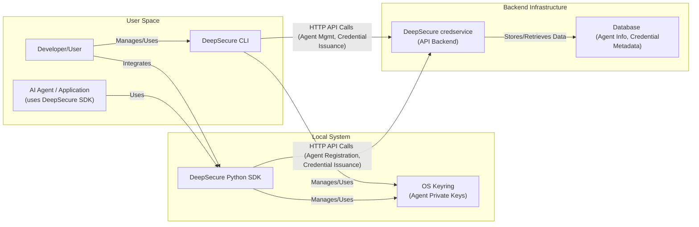

<<<<<<< Updated upstream
# DeepSecure CLI

[](https://badge.fury.io/py/deepsecure-cli)
[](https://opensource.org/licenses/Apache-2.0)
<!-- TODO: Add build status badge e.g., [](https://github.com/yourusername/deepsecure-cli/actions) -->
<!-- TODO: Add code coverage badge -->
=======
# DeepSecure: Simple Security for Your AI Agents & AI-powered Workflows

<!-- Optional: Add a project logo here -->
<!-- e.g., <p align="center"></p> -->

[](https://badge.fury.io/py/deepsecure)
[](https://pypi.org/project/deepsecure/)
[](https://opensource.org/licenses/Apache-2.0)
<!-- TODO: Add Build Status Badge once CI is set up e.g. GitHub Actions -->
<!-- [](https://github.com/YOUR_ORG/YOUR_REPO/actions/workflows/ci.yml) -->
<!-- TODO: Update with your actual repo path for Discussions -->
[](https://github.com/DeepTrail/deepsecure/discussions)
>>>>>>> Stashed changes

**DeepSecure provides effortless, simple and easy secure identity, credentials, and access management for AI agents and applications. Built for developers by developers—open-source and ready to protect your AI agents and AI-powered workflows.**

<<<<<<< Updated upstream
## Why DeepSecure CLI?

Building and deploying AI agents presents unique security challenges, especially around managing their identities and access to sensitive resources. DeepSecure CLI (in conjunction with its backend `credservice`) helps you:
=======
AI agents are revolutionizing productivity, but they also introduce new security challenges. DeepSecure helps you embed strong identities, manage access dynamically, and maintain comprehensive audit trails for your AI agents, ensuring security from local development to deployment. Our vision is to make secure-by-default AI development the standard.

## ✨ Key Features
>>>>>>> Stashed changes

*   **🤖 Effortless Agent Identity:** Automatic agent registration and unique credential issuance.
*   **🔑 Secure Credential Management:** Leverages OS keyring for private key storage by default, promoting secure local key handling.
*   **🛡️ Framework Agnostic:** Designed for easy integration with popular AI agent frameworks (LangChain, CrewAI, and more).
*   **💻 Developer-Friendly CLI:** Intuitive command-line interface for managing agents, issuing credentials, testing, and debugging.
*   **🐍 Python SDK:** Simple Python library for programmatic integration of DeepSecure into your agent's logic.
*   **🌐 Open Source & Community Driven:** Join us in shaping the future of AI agent security!

## 📚 Table of Contents

<<<<<<< Updated upstream
## Key Features (v0.0.8)

*   **Agent Identity Management (`deepsecure agent ...`):**
    *   `register`: Explicitly register new AI agents with the `credservice` backend.
        *   Automatically generates a local Ed25519 key pair if no public key is provided.
        *   Securely stores the generated private key in the system keyring.
        *   Saves public metadata (ID, name, public key) to a local JSON file.
        *   Supports registration using an externally provided public key (private key managed by user).
    *   `list`: List locally known identities and agents registered with `credservice`. Supports table, JSON, and text output.
    *   `describe <agent_id>`: Show detailed information for a specific agent, combining backend data and local identity information (including fingerprint and keyring status).
    *   `delete <agent_id>`: Deactivate agents (soft delete) in `credservice` and optionally purge local keys/metadata from file and keyring. Includes an option to attempt revocation of associated credentials (backend logic for actual revocation is on the roadmap).
*   **Dynamic Credential Issuance (`deepsecure vault issue ...`):**
    *   Issue short-lived, scoped credentials for registered agents.
    *   Requires `--agent-id` for identifying the signing agent.
    *   Performs client-side signing of credential requests using the agent's private key (retrieved from the system keyring).
    *   Communicates with a `credservice` backend that performs mandatory signature verification.
*   **Credential Lifecycle Management (`deepsecure vault ...`):**
    *   `revoke`: Revoke active credentials via `credservice`.
    *   `rotate`: Rotate an agent's long-term identity key (notifies `credservice` of the new public key).
*   **Configuration Management (`deepsecure configure ...`):**
    *   `set-url`, `get-url`: Manage the URL for the `credservice` backend.
    *   `set-token`, `get-token`, `delete-token`: Securely store and manage the `credservice` API token in the system keyring.
    *   `show`: Display current CLI configuration.
*   **Core Python Components (for library use and CLI foundation):**
    *   `IdentityManager`: Handles local agent identity creation, loading (with keyring for private keys), listing, and deletion.
    *   `KeyManager`: Manages cryptographic key pair generation and signing operations.
    *   `AgentClient`: Client for `deepsecure-cli` to interact with `credservice` agent management APIs.
    *   `VaultClient`: Client for `deepsecure-cli` to interact with `credservice` vault APIs (handles client-side signing for credential issuance).
    *   Custom Pydantic schemas and exceptions for robust API interaction.
=======
- [DeepSecure: Simple Security for Your AI Agents \& AI-powered Workflows](#deepsecure-simple-security-for-your-ai-agents--ai-powered-workflows)
  - [✨ Key Features](#-key-features)
  - [📚 Table of Contents](#-table-of-contents)
  - [📖 Overview](#-overview)
  - [🏗️ Architecture](#️-architecture)
  - [🧠 Core Concepts](#-core-concepts)
  - [⚙️ Getting Started](#️-getting-started)
    - [Prerequisites](#prerequisites)
    - [Installation](#installation)
  - [🚀 Quick Start](#-quick-start)
    - [1. Start the `credservice` backend](#1-start-the-credservice-backend)
    - [2. Configure the CLI to connect to your `credservice`](#2-configure-the-cli-to-connect-to-your-credservice)
    - [3. Using the Python SDK (Primary Workflow)](#3-using-the-python-sdk-primary-workflow)
    - [4. Using the DeepSecure CLI (for Testing \& Debugging)](#4-using-the-deepsecure-cli-for-testing--debugging)
  - [🔌 Integrations](#-integrations)
    - [Integrating with AI Agent Frameworks](#integrating-with-ai-agent-frameworks)
    - [Further Integration Opportunities](#further-integration-opportunities)
  - [💻 CLI Command Reference](#-cli-command-reference)
  - [🛠️ Running the Credential Service (Backend)](#️-running-the-credential-service-backend)
  - [🛣️ Roadmap \& Vision](#️-roadmap--vision)
  - [🤝 Contributing](#-contributing)
    - [Development Environment Setup](#development-environment-setup)
  - [💬 Community \& Support](#-community--support)
  - [📜 License](#-license)

## 📖 Overview
>>>>>>> Stashed changes

The rise of sophisticated AI agents and AI-powered workflows brings incredible opportunities for innovation and productivity. However, this rapid advancement also introduces new and complex security challenges. How do you ensure that your AI agents, which may operate autonomously and interact with sensitive data and systems, not limited to SaaS or Cloud services, are doing so securely and with proper authorization? How do you manage their identities and access rights effectively without hindering development velocity?

**DeepSecure is an open-source project designed to address these critical security concerns head-on.**

Built for developers by developers, DeepSecure provides an effortless way to integrate secure identity, credential, and access management specifically tailored for your AI agents and applications. Our vision is to make "secure-by-default" AI development the standard, not an exception.

**What problems does DeepSecure solve?**
*   **Agent Identity & Authentication:** Establishes strong, verifiable identities for each AI agent, ensuring that only legitimate agents can perform actions and access resources.
*   **Secure Credential Management:** Manages the lifecycle of short-lived, ephemeral credentials that agents use, minimizing the risk associated with static, long-lived secrets. It leverages OS-native keyrings for secure local storage of primary agent keys.
*   **Simplified Security for Developers:** Abstracts away the complexities of identity and access management, allowing developers to focus on building AI capabilities with built-in security.
*   **Dynamic Authorization:** (Roadmap) Will enable context-aware access control, allowing you to define precisely what an agent can do.
*   **Comprehensive Audit Trails:** (Roadmap) Aims to provide clear logs of agent identity and access events for monitoring and compliance.

**Who is DeepSecure for?**
*   **Developers building AI agents:** Whether you're using frameworks like LangChain, CrewAI, Microsoft - Agent Squad, AWS - Strands Library, Google - Agent Developement Kit or custom solutions, DeepSecure helps you secure your agents without becoming a security expert.
*   **Startups and teams integrating AI:** If you're leveraging AI to power new features or automate workflows, DeepSecure offers a straightforward path to embedding essential security.
*   **Security-conscious organizations:** For those who want to proactively address the unique security risks posed by autonomous AI systems.

DeepSecure empowers you to innovate rapidly in the AI space, with the confidence that a strong security foundation is in place. We are community-driven and welcome contributions to help shape the future of secure AI development.

## 🏗️ Architecture

The following diagram illustrates the high-level architecture of DeepSecure and how its components interact:



## 🧠 Core Concepts

*   **Agent Identity:** A persistent, unique identity for each AI agent, backed by a public/private key pair. The agent's primary private key is securely stored (default: OS keyring).
*   **Ephemeral Credentials:** Short-lived credentials (an access token paired with an ephemeral public/private key pair) issued to agents for specific tasks, resources, or interactions.
*   **Secure Key Storage:** DeepSecure prioritizes secure local storage for agent private keys using the operating system's native keyring/keychain by default.
*   **Credential Service (`credservice`):** The backend API service responsible for issuing, validating, and revoking ephemeral credentials. This service runs independently.
*   **Origin Binding:** An optional security feature where ephemeral credentials can be "bound" to specific network origins (e.g., IP address, user agent) from which they are allowed to be used.

## ⚙️ Getting Started

### Prerequisites

*   Python 3.9+ (Python 3.9+ recommended as per your existing README)
*   `pip` (Python package installer)
<<<<<<< Updated upstream
*   For secure storage of agent private keys and the `credservice` API token, a system keyring backend should be available:
    *   **macOS:** Usually works out-of-the-box (uses Keychain).
    *   **Windows:** Usually works out-of-the-box (uses Windows Credential Manager).
    *   **Linux:** Often requires setup. Common backends include `SecretService` (requires a D-Bus service like `gnome-keyring-daemon` or `keepassxc`) or `KWallet`. You may need to install Python packages like `keyrings.alt` or `secretstorage`. `deepsecure-cli` will raise an error during operations requiring secure key storage if a backend is not found.

### From PyPI (Recommended)
The easiest way to install DeepSecure CLI (version 0.0.8) is from PyPI:
```bash
pip install deepsecure-cli==0.0.8
=======
*   Access to an OS keyring (macOS Keychain, Linux Secret Service, Windows Credential Vault) for default secure key storage of agent private keys.
*   **Docker and Docker Compose** for [Running the Credential Service (Backend)](#️-running-the-credential-service-backend).
*   Ensure the [CLI is configured to connect to your credservice](#2-configure-the-cli-to-connect-to-your-credservice) (details in Quick Start).

### Installation

Install DeepSecure using pip:

```bash
pip install deepsecure
>>>>>>> Stashed changes
```

## 🚀 Quick Start

Get up and running with DeepSecure in minutes!

### 1. Start the `credservice` backend
Before using the SDK or CLI to issue credentials, you need the backend service running.
Refer to the [Running the Credential Service (Backend)](#️-running-the-credential-service-backend) section for detailed instructions.

### 2. Configure the CLI to connect to your `credservice`
*(You only need to do this once, or when your `credservice` details change.)*
```bash
# Set the URL of your credservice instance (default from Docker Compose is http://localhost:8001)
deepsecure configure set-url http://localhost:8001

# Securely store your credservice API token
# When prompted, enter the token (default from Docker Compose: DEFAULT_QUICKSTART_TOKEN)
deepsecure configure set-token
```

<<<<<<< Updated upstream
### From Source
For development or to contribute:
```bash
git clone https://github.com/yourusername/deepsecure-cli # Replace with your actual repository URL
cd deepsecure-cli
pip install -e .

# With development dependencies
pip install -e ".[dev]"
```

## Quick Start

Here's a quick example of how to get started with `deepsecure-cli`, assuming you have a running `credservice` backend.

1.  **Configure the CLI to connect to your `credservice`:**
    *(You only need to do this once, or when your `credservice` details change.)*
    ```bash
    # Set the URL of your credservice instance
    deepsecure configure set-url http://localhost:8001 # Or your actual credservice URL

    # Securely store your credservice API token (you'll be prompted to paste it)
    deepsecure configure set-token 
    ```

2.  **Register a new AI agent:**
    This command will generate a new Ed25519 key pair for your agent. The private key will be stored securely in your system's keyring, and the public key will be registered with `credservice`.
    ```bash
    deepsecure agent register --name "MyFirstAgent" --description "An agent for quick start testing"
    ```
    *Output will include an `Agent ID` (e.g., `agent-xxxx-xxxx`). Note this ID.*
    ```
    [IdentityManager] Private key for agent agent-xxxx... securely stored/updated in system keyring.
    [IdentityManager] Saved identity metadata for agent-xxxx...
    ✅ Success: Agent 'MyFirstAgent' registered with backend.
      Agent ID: agent-xxxxxxxx-xxxx-xxxx-xxxx-xxxxxxxxxxxx 
      ...
      Local private key stored in system keyring.
      Local public metadata at: /Users/youruser/.deepsecure/identities/agent-xxxxxxxx-xxxx-xxxx-xxxx-xxxxxxxxxxxx.json
    ```

3.  **Issue a short-lived credential for your agent:**
    Replace `<Your_Agent_ID_Here>` with the actual `Agent ID` from the previous step.
    ```bash
    deepsecure vault issue --scope "database:orders:read" --agent-id "<Your_Agent_ID_Here>" --ttl "5m"
    ```
    *Output will include:*
    ```
    ✅ Success: Credential issued successfully! (Backend)

    Credential details:
    ID: cred-yyyyyyyy-yyyy-yyyy-yyyy-yyyyyyyyyyyy
    Agent ID: <Your_Agent_ID_Here>
    Scope: database:orders:read
    Status: issued
    Issued At: <timestamp>
    Expires At: <timestamp>
      Ephemeral Public Key (b64): <ephemeral_public_key_string>
      Ephemeral Private Key (b64): <ephemeral_private_key_string>
      Warning: Handle the ephemeral private key securely...
    ```
    Your agent can now use these ephemeral credential details to interact with target resources. The ephemeral private key is used for client-side cryptographic operations like establishing a secure channel.

## Integrating with AI Agent Frameworks

DeepSecure CLI's core functionality can be integrated into your AI agent's tools to dynamically fetch short-lived, signed credentials, enhancing security by eliminating static secrets.

**Core Integration Pattern:**

1.  **Agent Registration (Out-of-Band):** Before your AI agent runs, ensure it has a registered identity with `credservice` using `deepsecure agent register`. The agent's private key will be stored in the system keyring of the environment where the agent's code executes. The agent's code will need to know its `agent_id`.
2.  **Dynamic Credential Issuance (In-Tool):** Within your agent's tool, when access to a protected resource is needed, use the `deepsecure` Python library components (`VaultClient` from `deepsecure.core.vault_client`) to call the `issue_credential` method.
3.  **Use Ephemeral Credential:** The tool then uses the `credential_id` and `ephemeral_private_key` to interact with the target resource.

### Conceptual Python Example (using `deepsecure.core.vault_client`)

This snippet illustrates how an agent's tool might use the `VaultClient` (the same one used by the `deepsecure vault issue` CLI command) to fetch a credential.

```python
# Ensure deepsecure-cli is installed in your agent's Python environment
# and configured to point to your credservice.

# Note: For library usage, ensure your PYTHONPATH includes the deepsecure-cli project root
# or that deepsecure-cli is installed as a package.
from deepsecure.core.vault_client import client as deepsecure_vault_client
from deepsecure.exceptions import DeepSecureError # Use the base error for broader catch

# This AGENT_ID must correspond to an agent registered via `deepsecure agent register`
# on the machine where this code is running, so its private key is in the keyring.
AGENT_ID_FOR_TOOL = "agent-xxxxxxxx-your-registered-agent-id" 
REQUIRED_SCOPE = "database:orders:read_sensitive"
CREDENTIAL_TTL_STRING = "5m" # e.g., 5 minutes, as expected by CLI's VaultClient

def access_secure_database(query: str) -> str:
    try:
        print(f"Requesting credential for agent '{AGENT_ID_FOR_TOOL}' with scope '{REQUIRED_SCOPE}'...")
        
        # The vault_client instance is a pre-configured singleton.
        # Its issue_credential method handles loading the private key from keyring,
        # signing, and calling the backend.
        credential_data = deepsecure_vault_client.issue_credential(
            agent_id=AGENT_ID_FOR_TOOL,
            scope=REQUIRED_SCOPE,
            ttl=CREDENTIAL_TTL_STRING 
        )
        
        # credential_data is a dictionary matching the CLI's JSON output for `vault issue`
        credential_id = credential_data.get("credential_id")
        # ephemeral_private_key = credential_data.get("ephemeral_private_key_b64")
        
        print(f"Successfully obtained credential ID: {credential_id}")
        
        # Placeholder: Use the credential_id (and potentially ephemeral keys for a secure channel)
        # to make the actual call to the database or internal API.
        # e.g., db_response = db_client.query(query, auth_token=credential_id)
        
        return f"Database query executed with credential {credential_id}. Result: ... (mocked)"

    except DeepSecureError as e: # Catch base DeepSecureError or more specific ones
        print(f"DeepSecure Error obtaining credential: {e}")
        return f"Failed to execute secure database query due to DeepSecure error."
=======
### 3. Using the Python SDK (Primary Workflow)

This is the recommended way to integrate DeepSecure into your AI agents. Credentials (especially private keys) are best handled in memory by the agent process.

```python
import asyncio
from deepsecure import register_agent, issue_credential_ext_async
from deepsecure.core.types import CredentialRequestContext, CredentialRequestExt

async def main():
    # Register your agent. This creates a keypair; private key stored in OS keyring.
    agent_id = "my_sdk_agent_001" 
    agent_identity = await register_agent(agent_id=agent_id, auto_generate_keys=True)
    print(f"Agent registered: {agent_identity.id}. Private key in OS keyring.")

    # Ensure your DeepSecure Credential Service (credservice) is running and CLI is configured.
    try:
        context = CredentialRequestContext(
            resource_id="billing_api_v1",
            action="read_invoices",
            # origin_context={"ip": "192.168.1.100"} # Optional: for origin-bound credentials
        )
        request_ext = CredentialRequestExt(context=context)

        # Issue an ephemeral credential
        cred_response = await issue_credential_ext_async(
            agent_id=agent_identity.id,
            request=request_ext,
            ttl=3600 # seconds
        )

        print("\nEphemeral Credential Issued:")
        print(f"  Access Token: {cred_response.access_token[:30]}...")
        print(f"  Public Key (Ephemeral): {cred_response.public_key_ephemeral}")
        # The ephemeral private key is in cred_response.private_key_ephemeral
        # Handle it securely in memory for the agent's operation.
        print("  (Ephemeral Private Key is in response; manage securely in memory)")

>>>>>>> Stashed changes
    except Exception as e:
        print(f"\nError issuing credential: {e}")
        print("  Ensure credservice is running & CLI/SDK is configured (URL, client ID/secret).")
```
**Note:** The Python SDK manages agent identity keys. For ephemeral credentials, the SDK returns the full credential (including the private key), which your application code must handle securely (ideally, only in memory for its lifetime).

### 4. Using the DeepSecure CLI (for Testing & Debugging)

<<<<<<< Updated upstream
## Command Overview (v0.0.8)

The `deepsecure-cli` provides the following core command groups and commands:

| Command Group | Description                                       | Commands                                        | Status      | Core Responsibilities (Current v0.0.8)                                                                                                                                                              |
|---------------|---------------------------------------------------|-------------------------------------------------|-------------|-----------------------------------------------------------------------------------------------------------------------------------------------------------------------------------------------------|
| `agent`       | Manage AI agent identities & lifecycle            | `register`, `list`, `describe`, `delete`          | Implemented | • Register new agents with `credservice`. <br> • Generate local Ed25519 key pairs, storing private keys in system keyring. <br> • Manage local metadata files. <br> • List & describe agents. <br> • Deactivate (soft delete) agents in `credservice` & purge local identity. |
| `vault`       | Manage secure credentials for AI agents           | `issue`, `revoke`, `rotate`                     | Implemented | • Issue dynamic, short-lived credentials signed by a registered agent's private key (from keyring). <br> • Revoke active credentials via `credservice`. <br> • Rotate an agent's long-term identity key (notifies `credservice`). |
| `configure`   | Configure `deepsecure-cli` local settings       | `set-url`, `get-url`, `set-token`, `get-token`, `delete-token`, `show` | Implemented | • Manage `credservice` URL. <br> • Securely store/retrieve API token in system keyring. <br> • Display current configuration.                 |
| `version`     | Display CLI version                               |                                                 | Implemented | • Shows the installed version of `deepsecure-cli`.                                                                                                                                                       |

Use `deepsecure <command-group> --help` or `deepsecure <command-group> <command> --help` for more details on specific commands and their options.

## Security Considerations

*   **`credservice` API Token:** The API token used to authenticate the CLI to the `credservice` backend (`DEEPSECURE_CREDSERVICE_API_TOKEN`) is a powerful secret.
    *   **Recommendation:** Use `deepsecure configure set-token` to store it securely in your system's keyring for local development. Avoid placing it directly in shell profiles or plaintext files.
    *   For headless environments (CI/CD, servers), use secure environment variable injection mechanisms.
*   **Agent Private Keys:** When `deepsecure agent register` generates keys, the private key is stored in your system's keyring. Ensure your system keyring is adequately protected (e.g., by your user login password).
*   **Ephemeral Private Keys:** The `deepsecure vault issue` command outputs an ephemeral private key. This key is highly sensitive and is intended for immediate use by the agent.
    *   **Never log or store this ephemeral private key.**
    *   It should be held in memory by the agent process only for the duration it's needed and then discarded.
*   **Principle of Least Privilege:** Always use narrowly defined scopes when issuing credentials with `deepsecure vault issue --scope ...`.
*   **Short TTLs:** Use the shortest practical Time-To-Live (`--ttl`) for ephemeral credentials.

## Roadmap

DeepSecure CLI aims to be a comprehensive security and governance platform for AI agents. Future development will focus on expanding capabilities in the following areas:

*   **Advanced Audit & Risk Management:**
    *   `deepsecure audit start, tail`: Centralized, queryable audit trails.
    *   `deepsecure risk score, list`: Agent risk scoring and monitoring.
*   **Granular Policy Enforcement:**
    *   `deepsecure policy init, apply, get`: Define and apply runtime policies.
*   **Secure Execution Environments:**
    *   `deepsecure sandbox run`: Isolated environments for agent tasks.
*   **Proactive Security Scanning & Hardening:**
    *   `deepsecure scan local, live`: Credential scanning.
    *   `deepsecure harden server`: Tools for securing MCP server deployments.
*   **Deployment and Operational Tooling:**
    *   `deepsecure deploy secure`: Package and deploy agents securely.
*   **Visibility and Governance Dashboards:**
    *   `deepsecure scorecard`: Security posture assessment.
    *   `deepsecure inventory list`: Discovery of AI services and agent resources.
*   **Enhanced Developer Experience:**
    *   `deepsecure ide init, suggest`: Deeper IDE integration.
    *   Mature, stable Python library facade (e.g., `from deepsecure import DeepSecureClient`).
*   **Feature Enhancements:**
    *   Full implementation of `--revoke-credentials` during `deepsecure agent delete` (including backend logic for revoking credentials).
    *   `deepsecure agent update` command for modifying registered agent details.
    *   Accurate `total` count for pagination in `deepsecure agent list` from backend.

Contributions in these areas are welcome! Please see our [Contributing Guidelines](#contributing).

## Contributing

Contributions are highly welcome to make DeepSecure CLI a robust and comprehensive tool for the community!

1.  **Found a Bug or Have a Feature Request?** Please [open an issue](https://github.com/yourusername/deepsecure-cli/issues) on our GitHub repository (replace `yourusername/deepsecure-cli` with the actual path).
2.  **Want to Contribute Code?**
    *   Please fork the repository and submit a pull request against the `main` or `dev` branch.
    *   Ensure your contributions adhere to good coding practices and include tests where applicable.
    *   For major changes, it's best to open an issue first to discuss your proposed approach.
3.  **Development Setup:** See the [Development](#development) section below.

*(A more detailed `CONTRIBUTING.md` file will be added to outline coding standards, testing procedures, and the contribution workflow.)*

## Development

Setup your development environment:
```bash
# Clone the repository (if not already done)
# git clone https://github.com/yourusername/deepsecure-cli.git
# cd deepsecure-cli

# Create and activate a virtual environment
python -m venv .venv
source .venv/bin/activate # On Windows: .venv\Scripts\activate

# Install in editable mode with development dependencies
pip install -e ".[dev]"
```

Run tests:
=======
The CLI is great for initial setup, testing integrations, and direct management.

**Step 1: Register an Agent (if not done via SDK)**

This command will generate a new Ed25519 key pair for your agent. The private key will be stored securely in your system's keyring, and the public key will be registered with `credservice`.
```bash
deepsecure agent register --name "MyFirstAgent" --description "An agent for quick start testing"
```
*Output will include an `Agent ID` (e.g., `agent-xxxx-xxxx`). Note this ID.*
```text
[IdentityManager] Private key for agent agent-xxxx... securely stored/updated in system keyring.
[IdentityManager] Saved identity metadata for agent-xxxx...
✅ Success: Agent 'MyFirstAgent' registered with backend.
  Agent ID: agent-xxxxxxxx-xxxx-xxxx-xxxx-xxxxxxxxxxxx
  ...
  Local private key stored in system keyring.
  Local public metadata at: /Users/youruser/.deepsecure/identities/agent-xxxxxxxx-xxxx-xxxx-xxxx-xxxxxxxxxxxx.json
```

**Step 2: Issue an Ephemeral Credential**

Replace `<Your_Agent_ID_Here>` with the actual `Agent ID` from the previous step.
```bash
deepsecure vault issue --scope "database:orders:read" --agent-id "<Your_Agent_ID_Here>" --ttl "5m"
```
*Output will include:*
```text
✅ Success: Credential issued successfully! (Backend)

Credential details:
ID: cred-yyyyyyyy-yyyy-yyyy-yyyy-yyyyyyyyyyyy
Agent ID: <Your_Agent_ID_Here>
Scope: database:orders:read
Status: issued
Issued At: <timestamp>
Expires At: <timestamp>
  Ephemeral Public Key (b64): <ephemeral_public_key_string>
  Ephemeral Private Key (b64): <ephemeral_private_key_string>
  Warning: Handle the ephemeral private key securely...
```
Your agent can now use these ephemeral credential details to interact with target resources. The ephemeral private key is used for client-side cryptographic operations like establishing a secure channel.

**CLI Output Behavior:**
*   **Default (Text) Output:** For security, the ephemeral private key is **NOT** displayed. Only the public key and a warning are shown.
*   **JSON Output (`--output json`):** Provides the full `CredentialResponse` including the ephemeral private key. Use this for debugging or if you need to programmatically consume the full credential from the CLI, handling the private key with appropriate security measures.

## 🔌 Integrations

DeepSecure is designed to work seamlessly within your existing AI development ecosystem.

### Integrating with AI Agent Frameworks

We aim for effortless integration with popular AI agent frameworks, promoting "secure-by-default" development practices.

*   **Supported Frameworks (e.g., LangChain, CrewAI, Microsoft Agent Squad, AWS Strands, Google ADK):** We are actively developing `deepsecure.init(agent_framework="<framework_name>")` helper functions.
    *   These functions will simplify agent registration, secure credential issuance, and overall identity management within these frameworks, allowing you to focus on your agent's core logic.
*   Check the `deepsecure/integrations` directory in our repository and join the conversation on [GitHub Discussions](https://github.com/DeepTrail/deepsecure/discussions) for the latest status, to request support for new frameworks, or to share your own integration experiences.

_This is an active area of development, and contributions or feedback are highly welcome!_

### Further Integration Opportunities

Looking ahead, we envision DeepSecure integrating with a broader range of enterprise systems to provide comprehensive security for AI agents:

*   **Key Management Systems (KMS):** We plan to explore integrations with existing enterprise KMS solutions. This would allow organizations to leverage their established key management infrastructure for storing and managing the primary keys of AI agents, offering an alternative or complementary approach to the default OS keyring storage.
*   **Identity Providers (IdP):** Future integrations could involve connecting DeepSecure with your existing Identity Providers (e.g., Okta, Azure AD, Keycloak). This could enable scenarios where agent identities are federated or managed in conjunction with existing enterprise identity systems, potentially streamlining user access management to agent-related resources or linking agent actions back to broader enterprise identity frameworks.

We believe these future integrations will further enhance DeepSecure's capability to secure AI agents within complex enterprise environments. Your input on priorities and specific systems for these integrations is highly valued! Please share your needs and ideas on [GitHub Discussions](https://github.com/DeepTrail/deepsecure/discussions).

## 💻 CLI Command Reference

The `deepsecure` CLI offers commands for agent and credential lifecycle management.

*   Access help: `deepsecure --help`, `deepsecure agent --help`, `deepsecure vault --help`.
*   **Key Agent Commands:**
    *   `register`: Create and register a new agent identity.
    *   `list`: View registered agents.
    *   `describe <agent_id>`: Get details for a specific agent.
    *   `delete <agent_id>`: Deactivate an agent. Use `--purge-local-keys` to also remove its keys from the local OS keyring.
*   **Key Vault Commands:**
    *   `issue`: Request a new ephemeral credential for a registered agent.
    *   `revoke --credential-id <credential_id>`: Revoke an active ephemeral credential.
    *   `rotate <agent-id>`: Rotate the long-lived identity key for a specified agent.

(Consider expanding this or linking to a separate, more detailed CLI documentation page if needed.)

## 🛠️ Running the Credential Service (Backend)

To fully test DeepSecure (issuing credentials via SDK or CLI), the **DeepSecure Credential Service (`credservice`)** must be running. This backend handles credential minting and validation.

The `credservice` is located in the `credservice/` directory of this repository.

**Start the `credservice` backend using Docker Compose:**
Open a terminal, navigate to the `credservice` directory within your cloned `deepsecure` repository, and run:
```bash
cd credservice
docker-compose up -d
cd ..
```
This command will build the `credservice` Docker image (the first time) and start both the `credservice` application and its PostgreSQL database in the background.
*   `credservice` will be available at `http://localhost:8001`.
*   The default API token for `credservice` (as set in `credservice/docker-compose.yml`) is `DEFAULT_QUICKSTART_TOKEN`.

Remember to [configure the CLI to connect to this service](#2-configure-the-cli-to-connect-to-your-credservice).

(Refer to `credservice/README.md` for more detailed setup instructions if available, e.g., for non-Docker setup or advanced configuration.)

## 🛣️ Roadmap & Vision

DeepSecure is on a mission to provide a holistic, developer-centric security platform for the AI agent ecosystem. We're excited about the journey ahead and believe that community collaboration is key to building impactful solutions.

**We're actively seeking your feedback and contributions on our evolving roadmap!** Here are some key areas we're exploring or currently working on:

*   **Seamless Framework Integrations:** Deepening our support for popular AI agent frameworks (like LangChain, CrewAI, Microsoft - Agent Squad, AWS - Strands Library, Google - Agent Developement Kit ) to make secure development even more intuitive.
*   **Interoperability with Agentic Protocols:** Exploring integrations with emerging AI agent communication standards (e.g., MCP, A2A) to ensure DeepSecure works well within the broader agent ecosystem.
*   **Granular Access Control:** Implementing advanced authorization policies (potentially using Open Policy Agent - OPA) for fine-grained control over agent permissions.
*   **Actionable Audit Trails:** Enhancing our logging capabilities to provide secure, detailed, and easily understandable audit trails for all identity and access events.
*   **Developer Experience Enhancements:**
    *   **Management Dashboard:** Building a user-friendly interface for easier monitoring and management of agents and credentials.
    *   **Expanded Key Management Options:** Investigating support for Hardware Security Modules (HSMs) and other Key Management Services (KMS).

**This roadmap is driven by you!** Your insights, use cases, and contributions are invaluable in shaping the future of DeepSecure. Please share your thoughts, suggestions, and what you'd like to see:

*   **Join the discussion:** Head over to [GitHub Discussions](https://github.com/DeepTrail/deepsecure/discussions) to talk about these roadmap items or propose new ones.
*   **Suggest specific features or report issues:** Use [GitHub Issues](https://github.com/DeepTrail/deepsecure/issues) for more concrete proposals or to let us know if something isn't working as expected.

Let's build a more secure AI future, together!

## 🤝 Contributing

DeepSecure is open source, and your contributions are vital! Help us build the future of AI agent security.

*   🌟 **Star our GitHub Repository!**
*   🐛 **Report Bugs or Feature Requests:** Use [GitHub Issues](https://github.com/DeepTrail/deepsecure/issues). <!-- TODO: Update link -->
*   💡 **Suggest Features:** Share ideas on [GitHub Issues](https://github.com/DeepTrail/deepsecure/issues) or [GitHub Discussions](https://github.com/DeepTrail/deepsecure/discussions). <!-- TODO: Update link -->
*   📝 **Improve Documentation:** Help us make our guides clearer.
*   💻 **Write Code:** Tackle bugs, add features, improve integrations.

**Getting Started with Code Contributions:**
1.  Fork the repository.
2.  Create a feature or bugfix branch.
3.  Commit your changes with clear messages.
4.  Push to your fork and open a Pull Request against our `main` branch.

Please look for or help create a `CONTRIBUTING.md` file for detailed guidelines on coding standards, and the PR process. For development setup, see the [Development Environment Setup](#development-environment-setup) section below.

### Development Environment Setup

To set up your development environment for DeepSecure:

1.  **Clone the repository (if you haven't already):**
    ```bash
    git clone https://github.com/DeepTrail/deepsecure.git # Or your fork
    cd deepsecure
    ```

2.  **Create and activate a Python virtual environment:**
    We recommend using a virtual environment to manage project dependencies.
    ```bash
    python -m venv .venv
    source .venv/bin/activate  # On Windows use: .venv\Scripts\activate
    ```

3.  **Install dependencies:**
    Install the core package in editable mode along with development and test dependencies. These are often specified in `pyproject.toml` under `[project.optional-dependencies]` (e.g., `dev`, `test`).
    ```bash
    pip install -e ".[dev,test]" # Adjust if your dependency groups are named differently
    ```

4.  **Set up pre-commit hooks (Optional but Recommended):**
    If the project uses pre-commit hooks for linting and formatting:
    ```bash
    pip install pre-commit
    pre-commit install
    ```

**Running Tests:**

Ensure your `credservice` backend is running if tests require it (see [Running the Credential Service (Backend)](#️-running-the-credential-service-backend)).

To run the test suite (typically using `pytest`):
>>>>>>> Stashed changes
```bash
pytest
```

<<<<<<< Updated upstream
Build package:
```bash
python -m build
```

Check package:
```bash
twine check dist/*
```
### Backend Service (`credservice`) for End-to-End Testing

Many `deepsecure-cli` commands (especially `agent` and `vault` groups) interact with a backend service component called `credservice`. For full end-to-end testing of these commands during development, you will need to run a local instance of the `credservice`. 

Refer to the `credservice/README.md` (or its setup instructions within this repository) for details on how to configure and run it. Typically, this involves setting up a PostgreSQL database and running the FastAPI application using Uvicorn:
```bash
# Example (from within the credservice directory)
# Ensure credservice/.env file is configured with DATABASE_URL and BACKEND_API_TOKEN
cd credservice
uvicorn app.main:app --reload --port 8001 
```
Ensure your `deepsecure-cli` (in a separate terminal) is configured to point to this local `credservice` instance:
```bash
deepsecure configure set-url http://localhost:8001
deepsecure configure set-token # And enter the token matching credservice/.env
```

## Support

*   **Questions & Issues:** Please [open an issue](https://github.com/yourusername/deepsecure-cli/issues) on our GitHub repository (replace `yourusername/deepsecure-cli` with the actual path).
*   **(Future):** _Link to community chat (e.g., Discord, Slack) if one is set up._

## License

Licensed under the [Apache License 2.0](LICENSE).
=======
You might also run specific tests:
```bash
pytest tests/commands/test_agent.py  # Example for a specific file
pytest tests/commands/test_agent.py::test_register_agent # Example for a specific test function
```

Now you're ready to start developing!

## 💬 Community & Support

*   **[GitHub Discussions](https://github.com/DeepTrail/deepsecure/discussions):** <!-- TODO: Update link --> The primary forum for questions, sharing use cases, brainstorming ideas, and general discussions about DeepSecure and AI agent security. This is where we want to build our community!
*   **[GitHub Issues](https://github.com/DeepTrail/deepsecure/issues):** <!-- TODO: Update link --> For bug reports and specific, actionable feature requests.

We're committed to fostering an open and welcoming community.

## 📜 License

DeepSecure is licensed under the [Apache License 2.0](LICENSE).
>>>>>>> Stashed changes
