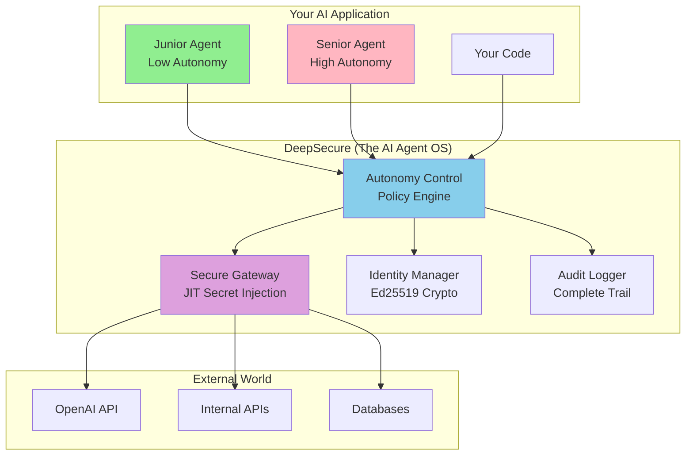

<!-- # DeepSecure: The AI Agent Autonomy Control Platform -->

<div align="center">
  <h1 style="display: flex; align-items: center;">
    
    <span style="margin-left: 15px;">DeepSecure: The AI Agent Autonomy Control Platform</span>
  </h1>
  <a href="https://pypi.org/project/deepsecure/">
    
  </a>
  <a href="https://pepy.tech/projects/deepsecure">
    
  </a>
  <a href="https://pypi.org/project/deepsecure/">
    
  </a>
  <a href="https://opensource.org/licenses/Apache-2.0">
    
  </a>
  <a href="https://deepwiki.com/DeepTrail/deepsecure"></a>
  <br/>
  <a href="https://github.com/DeepTrail/deepsecure/stargazers">
    
  </a>
  <a href="https://github.com/DeepTrail/deepsecure/discussions">
    
  </a>
  <a href="https://github.com/DeepTrail/deepsecure/pulls">
    
  </a>
  <a href="https://x.com/imaxxs">
    
  </a>
  <a href="https://x.com/0xdeeptrail">
    
  </a>
  <a href="https://www.linkedin.com/company/deeptrail">
    
  </a>
</div>

<br/>

<div align="center">

**🎚️ Build AI agents with adjustable autonomy levels. From safe prototypes to trusted production agents with enterprise-grade security by default. Ship features fast while DeepSecure handles all the complex security automatically.**

[**🎯 60-Second Demo**](#-60-second-autonomy-demo) [**📖 Documentation**](docs/) [**🔬 Examples**](examples/) [**💬 Community**](https://discord.gg/SUbswk8T)

</div>

## 🎚️ The Autonomy Slider: Your AI Agent Superpower

**The Problem:** You want to build powerful AI agents, but security feels like a blocker. Static API keys everywhere, no control over agent permissions, zero audit trail - and you're shipping features, not managing credentials.

**The DeepSecure Solution:** An **autonomy slider** that lets you dial AI agent permissions up or down while getting enterprise security automatically.

### 🟢 **Low Autonomy** - Safe Prototyping
```python
# Perfect for testing and experimentation
agent = client.agent("prototype-agent", autonomy="low")
# ✅ Read-only access to specific APIs
# ✅ Rate limited to 10 requests/hour  
# ✅ Cannot delegate to other agents
# ✅ Complete audit trail automatically
```

### 🟡 **Medium Autonomy** - Production Workflows
```python
# Balanced permissions for real applications
agent = client.agent("workflow-agent", autonomy="medium")
# ✅ Call approved external APIs (OpenAI, internal services)
# ✅ Rate limited to 100 requests/hour
# ✅ Limited delegation to junior agents
# ✅ Policy enforcement without code changes
```

### 🔴 **High Autonomy** - Senior AI Agents
```python
# Trusted agents with full delegation capabilities
agent = client.agent("senior-agent", autonomy="high")
# ✅ Access all approved services with high rate limits
# ✅ Create and manage junior agents
# ✅ Delegate tasks with cryptographic proof
# ✅ Enterprise-grade security & compliance ready
```

**The Game-Changer:** You focus on building intelligent behavior. DeepSecure handles identity, credentials, policies, delegation, and audit trails automatically.

## 🎯 60-Second Autonomy Demo

```bash
# 🚀 Step 1: Install and start your secure agent infrastructure
pip install deepsecure && docker-compose up -d

# 🎚️ Step 2: Create agents with different autonomy levels
deepsecure agent create --name "junior-agent" --autonomy low
deepsecure agent create --name "senior-agent" --autonomy high

# 💻 Step 3: Use agents in your code with automatic security
```

```python
import deepsecure

client = deepsecure.Client()

# Junior agent: Safe, limited operations
junior = client.agent("junior-agent")
result = junior.call_openai("Summarize this document")  # ✅ Allowed, rate-limited

# Senior agent: Full autonomy with secure delegation
senior = client.agent("senior-agent")
delegation_token = senior.delegate_to(
    target_agent="junior-agent",
    permissions=["read_docs", "call_openai"],
    duration="2hours",
    max_cost="$10"
)
```

**🎉 What you just built:**
- ✅ **Multi-level AI agent hierarchy** with automatic security guardrails
- ✅ **Zero hardcoded secrets** - JIT secret injection through secure gateway
- ✅ **Cryptographic delegation** with complete audit trails
- ✅ **Production-ready compliance** from day 1
- ✅ **Cost and rate limit controls** per agent automatically

## 🔥 From Agent Chaos to Autonomy Control

| **Traditional AI Agent Development** | **DeepSecure Autonomy Framework** |
|-------------------------------------|-----------------------------------|
| 🔑 **API keys scattered everywhere** | 🛡️ **JIT secret injection - agents never see keys** |
| 🤖 **All agents have same permissions** | 🎚️ **Granular autonomy levels per agent** |
| 🚫 **No delegation between agents** | 🔄 **Secure delegation with cryptographic proof** |
| 📊 **Zero visibility into agent actions** | 📊 **Complete audit trail with agent identity** |
| 🏭 **Security blocks production deployment** | 🚀 **Enterprise-ready zero-trust from day 1** |
| ⏳ **Weeks to set up proper auth** | ⚡ **5 minutes to production-grade security** |

## 🏗️ How It Works: The AI Agent Operating System

DeepSecure is like **Docker for AI agents** - it abstracts away all the complex security infrastructure so you can focus on building intelligent behavior.

### 🧠 Control Plane: The Agent Manager
- **Identity Management**: Every agent gets a cryptographic identity (Ed25519)
- **Policy Engine**: Autonomy levels translate to fine-grained permissions
- **Delegation System**: Secure agent-to-agent task delegation
- **Audit System**: Complete activity logs for compliance

### 🚀 Data Plane: The Security Gateway  
- **JIT Secret Injection**: Secrets injected at request time, never stored in agents
- **Policy Enforcement**: Real-time permission checks based on autonomy level
- **Split-Key Architecture**: No single component can access complete secrets
- **Request Proxying**: All external API calls go through secure gateway



## ⚡ Installation & Setup

### Prerequisites
- **Python 3.9+** and **pip**
- **Docker and Docker Compose** for backend services
- **OS keyring** (macOS Keychain, Windows Credential Store, Linux keyring) for secure key storage

### 1. Install DeepSecure
```bash
pip install deepsecure
```

### 2. Start Your AI Agent Infrastructure
```bash
# Clone and start the secure backend
git clone https://github.com/DeepTrail/deepsecure.git
cd deepsecure
docker-compose up -d

# Configure CLI connection
deepsecure configure set-url http://localhost:8000
deepsecure health  # Verify connection
```

### 3. Create Your First Autonomous Agent
```bash
# Create agents with different autonomy levels
deepsecure agent create --name "my-first-agent" --autonomy medium

# Store secrets (admin operation, done once)
deepsecure vault store OPENAI_API_KEY

# Your agent can now securely access OpenAI with automatic rate limits
```

## 🎚️ Autonomy Levels Explained

### 🟢 **Low Autonomy** - Perfect for Learning & Prototyping

**Use Cases:** Testing, learning, proof-of-concepts, untrusted environments

**What it provides:**
- Read-only access to specific, approved APIs
- Low rate limits (10-50 requests/hour)
- Cannot create or delegate to other agents  
- Restricted to pre-defined resource access patterns
- Complete audit logging for all actions

**Example Policy:**
```yaml
autonomy_level: low
max_requests_per_hour: 10
allowed_actions: ["read_file", "call_openai_chat"]
allowed_resources: ["/data/readonly/*", "https://api.openai.com/v1/chat/completions"]
delegation_allowed: false
can_modify_policies: false
```

### 🟡 **Medium Autonomy** - Production Applications

**Use Cases:** Production workflows, customer-facing agents, business applications

**What it provides:**
- Access to multiple approved APIs and services
- Reasonable rate limits (100-500 requests/hour)
- Can delegate limited tasks to low-autonomy agents
- Time-bounded access tokens with automatic refresh
- Cost controls and budget limits per agent

**Example Policy:**
```yaml
autonomy_level: medium
max_requests_per_hour: 100
max_cost_per_day: "$50"
allowed_actions: ["read_file", "write_file", "call_external_api", "delegate_task"]
allowed_resources: ["https://api.openai.com/*", "https://internal-api.company.com/safe/*"]
delegation_allowed: true
delegation_max_ttl: "4hours"
can_create_agents: false
```

### 🔴 **High Autonomy** - Senior Agents & Enterprise

**Use Cases:** Senior agents managing teams, enterprise workflows, trusted autonomous systems

**What it provides:**
- Access to most or all approved company services
- High rate limits (1000+ requests/hour)
- Can create, manage, and delegate to junior agents
- Long-lived sessions with automatic key rotation
- Advanced delegation chains with cryptographic proof
- Can modify policies for agents they create (with approval workflows)

**Example Policy:**
```yaml
autonomy_level: high
max_requests_per_hour: 1000
max_cost_per_day: "$500"
allowed_actions: ["*"]
allowed_resources: ["https://api.openai.com/*", "https://internal-api.company.com/*"]
delegation_allowed: true
delegation_max_ttl: "24hours"
can_create_agents: true
can_modify_policies: true
requires_approval_for: ["high_cost_operations", "data_deletion"]
```

## 🔬 Real-World Examples

### Example 1: Customer Support Agent Hierarchy
```python
# Create a senior customer support agent
senior_support = client.agent("senior-support", autonomy="high")

# Senior agent creates specialized junior agents for different tasks
ticket_analyzer = senior_support.create_agent("ticket-analyzer", autonomy="low")
knowledge_searcher = senior_support.create_agent("knowledge-searcher", autonomy="medium")

# Handle customer request with automatic delegation
def handle_customer_request(ticket):
    # Analyze ticket sentiment and category (low autonomy agent)
    analysis = ticket_analyzer.analyze_ticket(ticket)
    
    # Search knowledge base for solutions (medium autonomy agent)  
    solutions = knowledge_searcher.find_solutions(analysis.category)
    
    # Senior agent makes final decision and responds
    response = senior_support.craft_response(analysis, solutions)
    return response
```

### Example 2: Financial Trading System
```python
# Different agents with appropriate autonomy for financial operations
market_monitor = client.agent("market-monitor", autonomy="low")      # Read market data only
risk_analyzer = client.agent("risk-analyzer", autonomy="medium")     # Analyze and recommend  
portfolio_manager = client.agent("portfolio-manager", autonomy="high") # Execute trades

# Secure delegation chain with automatic audit
def trading_workflow(market_signal):
    # Low autonomy: Monitor markets safely
    market_data = market_monitor.get_market_data(market_signal.symbol)
    
    # Medium autonomy: Analyze with cost controls
    risk_assessment = risk_analyzer.analyze_risk(
        market_data, 
        max_analysis_cost="$5"
    )
    
    # High autonomy: Execute if risk is acceptable
    if risk_assessment.risk_score < 0.3:
        trade_result = portfolio_manager.execute_trade(
            symbol=market_signal.symbol,
            amount=risk_assessment.recommended_amount,
            max_cost="$100"
        )
    
    # Complete audit trail automatically maintained
    return trade_result
```

### Example 3: Content Creation Pipeline
```python
# Multi-agent content creation with escalating autonomy
researcher = client.agent("content-researcher", autonomy="low")
writer = client.agent("content-writer", autonomy="medium") 
editor = client.agent("content-editor", autonomy="high")

def create_article(topic):
    # Research phase: Safe, read-only operations
    research = researcher.gather_information(
        topic=topic,
        max_sources=10,
        max_cost="$2"
    )
    
    # Writing phase: Generate content with moderate access
    draft = writer.create_article(
        research=research,
        word_count=1000,
        max_cost="$10"
    )
    
    # Editing phase: Full access to publishing systems
    final_article = editor.edit_and_publish(
        draft=draft,
        target_platform="company_blog",
        schedule_time="tomorrow_9am"
    )
    
    return final_article
```

## 🚀 Advanced Features

### 🔄 **Cryptographic Delegation**
```python
# Senior agent securely delegates tasks with mathematical proof
delegation_token = senior_agent.delegate_to(
    target_agent="junior-agent",
    resources=["https://api.specific-service.com/read-only/*"],
    permissions=["read", "analyze"],
    max_requests=50,
    expires_in="2hours",
    max_cost="$5"
)

# Junior agent uses delegation token - all actions audited
result = junior_agent.perform_task(delegation_token=delegation_token)
```

### 🔐 **Split-Key Secret Architecture**  
- Secrets are split using Shamir's Secret Sharing
- No single component ever has complete API keys
- Just-in-time reassembly during API calls
- Automatic memory cleanup after use

### 📊 **Complete Observability**
```python
# Get detailed insights into agent behavior
agent_metrics = client.get_agent_metrics("my-agent")
print(f"API calls today: {agent_metrics.api_calls_today}")
print(f"Cost today: ${agent_metrics.cost_today}")
print(f"Delegation requests: {agent_metrics.delegations_created}")
print(f"Policy violations: {agent_metrics.policy_violations}")
```

### 🏢 **Enterprise Integration**
- **Identity Providers**: LDAP, Active Directory, SAML, OAuth2
- **Secret Backends**: HashiCorp Vault, AWS Secrets Manager, Azure Key Vault
- **Monitoring**: Prometheus metrics, ELK stack integration
- **Compliance**: SOC2, GDPR, HIPAA audit trails

## 📚 Documentation & Resources

| Resource | Description |
|----------|-------------|
| [**🎚️ Autonomy Guide**](docs/autonomy-guide.md) | Complete guide to setting agent autonomy levels |
| [**🔧 CLI Reference**](docs/cli-reference.md) | All commands and configuration options |
| [**📖 SDK Documentation**](docs/sdk/) | Python SDK with full API reference |
| [**🏗️ Architecture Deep Dive**](docs/design/deepsecure-technical-overview.md) | Technical architecture and security model |
| [**🚀 Production Deployment**](docs/deployment/) | Deploy DeepSecure in your infrastructure |
| [**🔌 Framework Integrations**](docs/integrations/) | LangChain, CrewAI, AutoGen integration guides |

## 🔬 Example Projects

Explore our comprehensive example collection:

| Example | Description | Autonomy Level |
|---------|-------------|----------------|
| [**AI Assistant Hierarchy**](examples/01_assistant_hierarchy.py) | Senior assistant managing junior specialists | High → Medium → Low |
| [**LangChain Secure Agents**](examples/05_langchain_secure_tools.py) | LangChain agents with autonomy controls | Medium |
| [**CrewAI Team Security**](examples/03_crewai_secure_tools.py) | Multi-agent crew with delegation | High |
| [**Financial Trading System**](examples/09_financial_trading.py) | Risk-controlled trading agents | High |
| [**Content Creation Pipeline**](examples/10_content_pipeline.py) | Research → Write → Edit workflow | Low → Medium → High |

## 🤝 Contributing

DeepSecure is open source and your contributions are vital! Help us build the future of AI agent autonomy control.

**Ways to Contribute:**
- 🌟 **Star our repository** to show support
- 🐛 **Report bugs** via [GitHub Issues](https://github.com/DeepTrail/deepsecure/issues)
- 💡 **Suggest features** for new autonomy controls
- 📝 **Improve documentation** and examples
- 💻 **Contribute code** for new integrations

**Development Setup:**
```bash
git clone https://github.com/DeepTrail/deepsecure.git
cd deepsecure
make install-dev  # Install development dependencies
make test         # Run test suite
```

For detailed contribution guidelines, see [CONTRIBUTING.md](CONTRIBUTING.md).

## 🫂 Community & Support

**💬 Discord Community**: Join our [Discord server](https://discord.gg/SUbswk8T) for real-time discussions and support

**📖 GitHub Discussions**: Share use cases, ask questions, and brainstorm ideas on [GitHub Discussions](https://github.com/DeepTrail/deepsecure/discussions)

**🐛 GitHub Issues**: Report bugs and request features via [GitHub Issues](https://github.com/DeepTrail/deepsecure/issues)

**📧 Enterprise Support**: Contact [enterprise@deeptrail.com](mailto:enterprise@deeptrail.com) for commercial support and custom integrations

## 📜 License

This project is licensed under the [Apache 2.0 License](LICENSE).

---

<div align="center">

## 🎚️ Ready to Control Your AI Agent Autonomy?

**Transform your AI agents from security nightmares into autonomous, trustworthy team members in minutes.**

[**🚀 Get Started Now**](#-installation--setup) • [**📖 Read the Docs**](docs/) • [**💬 Join Community**](https://discord.gg/SUbswk8T)

---

**⭐ Star us on GitHub if DeepSecure empowers your AI agents!**

*Built with ❤️ for developers who want to ship AI features fast without sacrificing security*

</div>