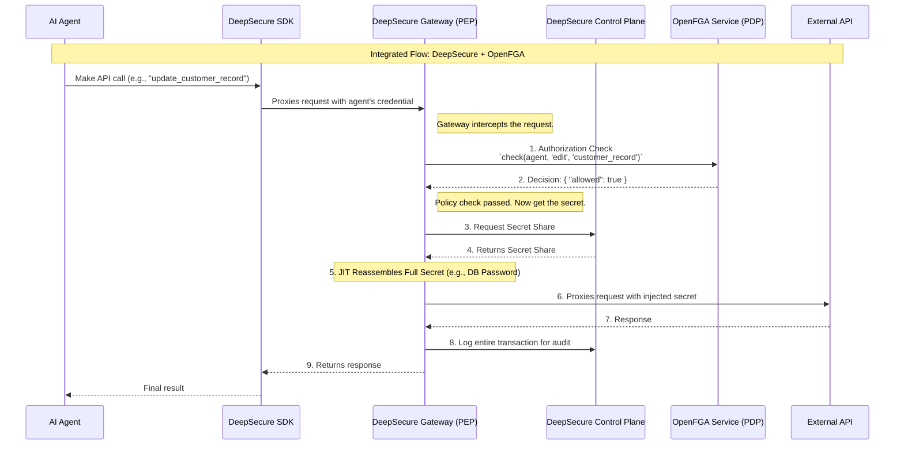

### DeepSecure vs OpenFGA

### **Executive Summary: Complementary, Not Competitive**

The simplest way to think about it is:

*   **OpenFGA / Zanzibar** is a highly specialized and powerful **authorization decision engine**. It answers the question: "*Is user X allowed to perform action Y on resource Z?*"
*   **DeepSecure** is a complete **agent security and governance platform**. It not only answers the authorization question but also handles agent identity, secure credential and secret management, policy enforcement, and provides an auditable request path.

They are not competitors. In fact, **DeepSecure could use OpenFGA as its underlying policy engine** to create an incredibly powerful, enterprise-grade security solution.

---

### **Similarities: Shared Architectural DNA**

Both DeepSecure and OpenFGA/Zanzibar are built on modern, cloud-native security principles.

1.  **Separation of Concerns**: Both systems externalize authorization logic from the application code. This prevents security logic from being scattered across multiple services and allows it to be managed centrally.
2.  **Centralized Policy Management**: Both provide a single source of truth for defining who can do what. In DeepSecure, it's the Control Plane managing YAML policies; in OpenFGA, it's the store of relationship tuples.
3.  **Designed for High Performance**: Both are architected to provide low-latency authorization checks to avoid becoming a bottleneck for the applications they protect. Zanzibar is famous for its massive scale and low latency at Google.
4.  **Policy Decision vs. Enforcement (PDP vs. PEP)**: Both architectures fundamentally separate the *decision* from the *enforcement*.
    *   **OpenFGA *is* the Policy Decision Point (PDP)**.
    *   In DeepSecure, the **`deeptrail-control` service is the PDP**, and the **`deeptrail-gateway` is the Policy Enforcement Point (PEP)**.

### **Key Differences: Authorization Engine vs. Security Platform**

The differences are where the complementary nature becomes clear.

| Feature | OpenFGA / Zanzibar | DeepSecure Architecture |
| :--- | :--- | :--- |
| **Core Model** | **Relationship-Based Access Control (ReBAC)**. Models the relationships between users and objects as a graph. Highly flexible. | **Hybrid Model**. Uses resource-based policies, task-based permissions, and cryptographic delegation (Macaroons) tailored for agentic workflows. |
| **Primary Scope** | **Pure Authorization (AuthZ)**. It only answers "yes" or "no" to an access check. | **AuthZ + Authentication (AuthN) + Secret Management**. Manages the full lifecycle: agent identity, authentication, access control, and secret delivery. |
| **Enforcement** | **External to the system**. OpenFGA returns a decision, but the calling application is responsible for enforcing it. This can be complex and error-prone. | **Built-in and Non-Bypassable**. The `deeptrail-gateway` **is** the enforcement point. Since it's the only component holding the real secrets, agents *must* go through it, guaranteeing policy enforcement. |
| **Secret Management** | **Out of scope**. OpenFGA has no concept of API keys, database passwords, or other secrets. | **A core pillar**. The split-key architecture and Just-in-Time (JIT) secret injection are central to DeepSecure's value, eliminating secrets from the agent's environment. |
| **Delegation** | Modeled via relationships. You can model `user A delegates to user B`, but the mechanism for creating and passing that delegation is up to the developer. | **Cryptographic & First-Class**. Uses Macaroons to create verifiable, chain-of-custody delegation tokens with attenuated (narrowed) permissions that are enforced at the gateway. |
| **Audit Trail** | Logs access checks (`check` API calls). | Logs every agent action that passes through the gateway, including the full context of the request, the policy decision, and the outcome. Provides a complete, auditable transaction log. |

### **How DeepSecure and OpenFGA Work Together: The Best of Both Worlds**

This is the most powerful takeaway. DeepSecure's architecture is perfectly designed to **integrate OpenFGA as its policy decision engine**. This would combine OpenFGA's world-class authorization model with DeepSecure's robust enforcement and secret management.

Here’s how that integrated architecture would work:

**Benefits of this Integrated Approach:**

1.  **Unmatched Flexibility in Policy**: Developers can use OpenFGA's powerful modeling language to define complex authorization scenarios (roles, hierarchies, attribute-based rules) while DeepSecure handles the entire execution layer.
2.  **Guaranteed Enforcement**: Developers get the safety of knowing that OpenFGA's decisions are being enforced by a non-bypassable gateway, removing the risk of incorrect implementation in the application code.
3.  **Seamless Secret Management**: The "holy grail" is achieved: authorization is decoupled from secret management. When OpenFGA grants access, DeepSecure automatically and securely delivers the necessary credential just-in-time.
4.  **Rich Auditability**: The DeepSecure audit log can be enriched with the specific OpenFGA relationship or policy that permitted the action, providing an incredibly detailed and compliant audit trail. 