# 1. Introduction

The adoption of AI agents unlocks immense potential but also introduces a new class of complex and high-stakes security risks. When agents can act autonomously, delegate tasks, and handle sensitive data, the potential for catastrophic failure is enormous. A robust security model must be grounded in these real-world failure modes.

# 2. The Challenge: Securing High-Stakes Agent Workflows

The following scenarios illustrate the critical challenges that the DeepTrail architecture is explicitly designed to prevent.

### 2.1. Use Case: The Rogue Trading Agent

A financial firm deploys a "Quantitative Analyst Agent" to monitor market data and identify trading opportunities. When an opportunity is found, it delegates the execution of a trade to a specialized "Trading Agent."

*   **The Insecure Reality:** The Trading Agent is given a static, long-lived API key to the brokerage. The "permission" to trade is simply encoded in the application logic (e.g., an `if` statement).
*   **The Failure Mode:** A vulnerability in the agent's code or its environment allows an attacker to gain control. The attacker can now use the hard-coded, overly-permissive API key to execute fraudulent trades, manipulate market positions, or exfiltrate sensitive trading algorithms. The blast radius is catastrophic.

### 2.2. Use Case: The Pivoting Data Analyst

A "Marketing Analyst Agent" is granted access to a customer database to generate email campaign lists. To perform its analysis, it delegates a data processing task to a generic "Data Analysis Agent."

*   **The Insecure Reality:** The Marketing Agent passes its own database credential to the Data Analysis Agent. This credential has read access to the entire `customers` table.
*   **The Failure Mode:** The Data Analysis Agent, now holding the powerful database credential, is compromised. The attacker uses this credential to "pivot" and access other tables in the same database, such as `employee_salaries` or `financial_records`, which were never intended to be accessible to any agent.

### 2.3. Use Case: The Over-Privileged OAuth Token

An agent is authorized via OAuth 2.0 to help a user organize their files. It is granted the `https://www.googleapis.com/auth/drive.readonly` scope to view files in Google Drive.

*   **The Insecure Reality:** The agent is given a long-lived OAuth 2.0 access token and refresh token, which it stores locally. The developer's responsibility is to manage this token securely.
*   **The Failure Mode:** An attacker steals the OAuth tokens from the agent's environment. Because the token is a bearer token, the attacker can now use it from anywhere to access all of the user's Google Drive files. Worse, if the initial authorization flow was poorly configured, the token might also grant unintended access to other services like Gmail or Google Calendar.

## 3. Our Solution: The DeepTrail Architectural Principles

Our architecture is designed to address these challenges by answering four fundamental security questions for every agent action:

1.  **Who?** - Establishes a verifiable, unique identity for every agent.
2.  **What?** - Defines the specific resources or tools the agent is permitted to access.
3.  **How?** - Enforces the conditions under which access is granted (e.g., rate limits, data masking).
4.  **When?** - Controls the time-bound nature of access through ephemeral, automatically-expiring credentials.

These principles are embodied in a unified architecture built on four pillars:

1.  **DeepTrail CLI:** A command-line interface for developers and administrators to manage agent identities, define security policies, and review audit logs.
2.  **Deeptrail Control (Control Plane):** A central service that manages agent identities, stores security policies, and serves as the authoritative source for issuing credentials and recording audit events.
3.  **Deeptrail Gateway (Data Plane):** A lightweight, stateless proxy that acts as a Policy Enforcement Point (PEP). It intercepts agent requests, validates their credentials, and enforces the security policies defined in the Control Plane.
4.  **DeepSecure SDK:** A developer-friendly library that abstracts away all the security complexity. It automatically handles agent authentication, credential renewal, and communication with the gateway.

## 4. High-Level Architecture

The system is composed of two primary components: the **Control Plane** (`deeptrail-control`) and the **Data Plane** (`deeptrail-gateway`), which work together to secure agent actions without placing a burden on the developer.

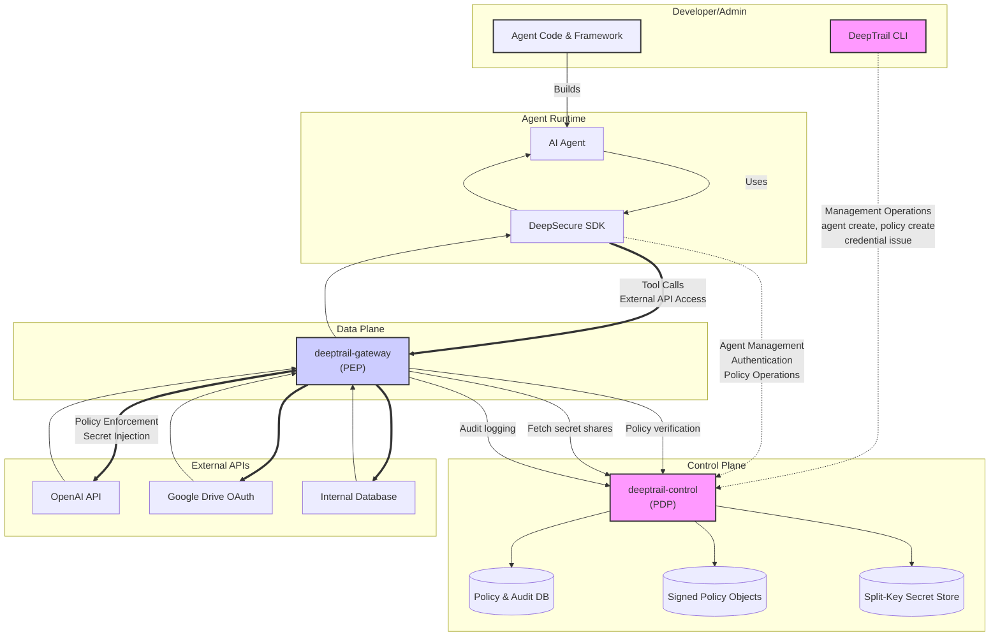

### 4.1 Dual-Flow Architecture Explained

The architecture implements two distinct operational flows, each optimized for its specific purpose:

#### **Management Flow** (Direct to Control Plane)
- **Operations**: Agent creation, policy management, authentication, credential issuance
- **CLI Commands**: `deepsecure agent create`, `deepsecure policy create`, `deepsecure vault issue`
- **SDK Methods**: `client.agents.create()`, `client.authenticate()`, policy operations
- **Routing**: Direct communication between CLI/SDK and `deeptrail-control`
- **Rationale**: Admin operations need immediate consistency and don't require policy enforcement

#### **Runtime Flow** (Through Gateway)
- **Operations**: AI agent tool calls, external API access, secret injection
- **Examples**: OpenAI API calls, Google Drive access, database queries
- **SDK Methods**: All agent runtime operations requiring secrets or external services
- **Routing**: SDK → `deeptrail-gateway` → External APIs
- **Rationale**: Runtime operations require policy enforcement, secret injection, and audit logging

This separation provides:
- **🚀 Performance**: Management operations avoid gateway latency
- **🛡️ Security**: Runtime operations get full policy enforcement and secret protection  
- **📊 Observability**: Complete audit trails for all agent actions
- **⚖️ Scalability**: Gateway can scale independently for high-throughput agent workloads

## 4.2 Enhanced Security: Delegation + Split-Key Integration

Building on the core architecture, DeepSecure now integrates **macaroon-based delegation** with **split-key secret storage** to provide enterprise-grade security with cryptographic guarantees.

### 4.2.1 Delegation Architecture

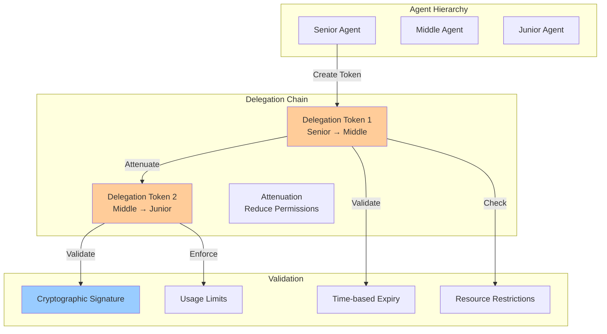

### 4.2.2 Split-Key Secret Storage

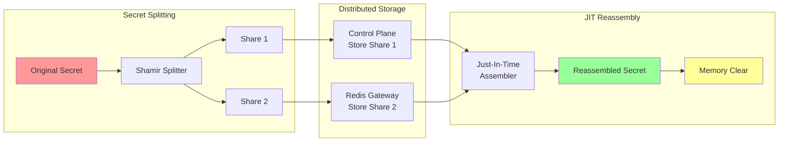

### 4.1.3 Combined Security Model

The integration provides multiple layers of protection:

1. **Cryptographic Delegation**: Macaroon tokens with mathematical attenuation
2. **Defense-in-Depth Secrets**: No single component can access complete secrets
3. **JIT Access**: Secrets exist in memory only during active operations
4. **Audit Trail**: Complete delegation chain and secret access logging

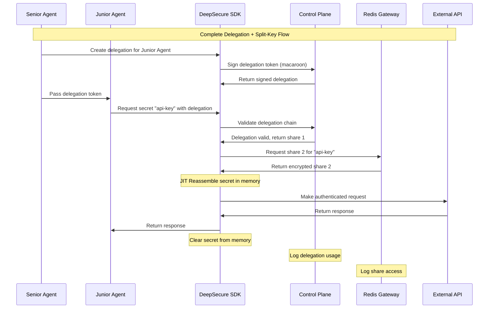

### 4.1.4 Performance and Security Metrics

Integration testing demonstrates exceptional performance:

- **JIT Latency**: ~2.1ms average (target: <10ms)
- **Delegation Validation**: ~1.8ms average (target: <5ms)
- **Concurrent Operations**: 100+ agents simultaneously
- **Security**: Cryptographically proven resistance to single-component compromise

## 5. Architectural Principles & Trade-offs

The separation of the Control Plane and Data Plane is a deliberate architectural choice designed to optimize for security, scalability, and developer experience. To understand this choice, it's useful to consider the alternatives.

**Alternative 1: The "Smart SDK" Model**

An alternative approach would be to embed all security logic directly into the `deepsecure` SDK. In this model, the SDK itself would be responsible for fetching secrets from a vault, evaluating policies locally, and making direct calls to external APIs.

*   **Trade-offs:**
    *   **Pro:** Simpler initial deployment (fewer moving parts).
    *   **Con (Critical):** **Security is optional and unenforceable.** A developer could bypass the SDK, or a vulnerability in the agent could allow an attacker to extract the long-lived credentials the SDK is holding.
    *   **Con:** **Language-dependent.** Every new language would require a complete port of all security and policy logic, making it difficult to support a polyglot environment.
    *   **Con:** **Inconsistent Enforcement.** Policy updates would only take effect when the agent's SDK is updated and restarted, leading to inconsistent security postures across a fleet of agents.

**Alternative 2: The Gateway-Centric Model (Our Choice)**

By externalizing the enforcement logic to the `deeptrail-gateway`, we gain significant advantages.

*   **Trade-offs:**
    *   **Pro (Critical):** **Security is non-bypassable.** Since the gateway is the only component with access to the real API keys, the agent *must* go through it. Policy enforcement is guaranteed.
    *   **Pro:** **Language-agnostic enforcement.** The gateway secures any agent that can make an HTTP request, regardless of the language it's written in. A new language only requires a thin SDK for authentication, not a full security stack.
    *   **Pro:** **Centralized and real-time policy updates.** A policy change in `deeptrail-control` is reflected instantly on the gateway for all agents.
    *   **Con:** Higher initial operational overhead (requires deploying the gateway service). This is a trade-off we accept for the immense security benefits.

**Technology Choices**

*   **`deeptrail-control` (FastAPI):** Chosen for its high performance, asynchronous capabilities, and automatic data validation and documentation via Pydantic and OpenAPI. This makes it ideal for a robust, developer-friendly control plane API.
*   **JWTs for Credentials:** We use short-lived JWTs as the primary credential format. They are lightweight, stateless, and widely supported. Their short lifespan drastically reduces the risk of credential theft, as a stolen token becomes useless within minutes.

## 6. Security Model Deep Dive

The security of the DeepTrail platform is built on two core concepts: a decentralized policy architecture and a powerful delegation model using Macaroons.

### 6.1. Policy Engine Architecture: Decentralized Enforcement

To avoid the performance and resilience issues of a purely centralized policy architecture, we separate the **Policy Decision Point (PDP)** from the **Policy Enforcement Point (PEP)**.

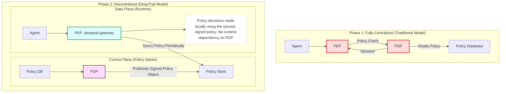

*   **Policy Decision Point (PDP):** This logic resides within `deeptrail-control`. It is the source of truth for all policies and is responsible for creating, updating, and signing policy documents. It does *not* participate in the runtime request path.
*   **Policy Enforcement Point (PEP):** This logic is embedded within the `deeptrail-gateway`. The gateway periodically syncs the signed policy objects from the control plane. When an agent makes a request, the gateway can make an immediate authorization decision locally by evaluating the request against its cached, signed policy. This is highly performant and resilient.

### 6.2. Authenticated Delegation Model (Macaroons)

Simple identity is not enough for complex agent workflows. We need a way for one agent to securely delegate a subset of its authority to another. For this, we use **Macaroons**.

Macaroons are a form of bearer credential (like a JWT) but with a critical superpower: they support **contextual, chain-of-custody confinement.**

1.  **Issuance:** `deeptrail-control` issues a "root" macaroon (as a JWT) to an agent, granting it a set of permissions.
2.  **Attenuation:** That agent can then "attenuate" the macaroon by adding caveats to it *without talking to the control plane*. A caveat is a restriction that narrows the credential's scope. For example, an agent with access to all of Google Drive can create an attenuated macaroon that only grants read-only access to a specific file (`caveat: file_id = '12345'`).
3.  **Decentralized Verification:** Once an agent has a macaroon, it can be verified by any component that shares the root key (like the `deeptrail-gateway`) without needing to call back to the central `deeptrail-control` service for every single transaction. This makes the system more resilient and scalable.
*   **Attenuation (Secure Delegation):** This is the most powerful feature. An agent holding a macaroon can create a new, more restricted version of it by adding further constraints (e.g., "this new token is only valid for the next 5 minutes" or "this new token can only be used to read file `report.txt`"). It can then delegate this "attenuated" macaroon to another agent to perform a sub-task. The delegate can *never* exceed the permissions of the original macaroon.

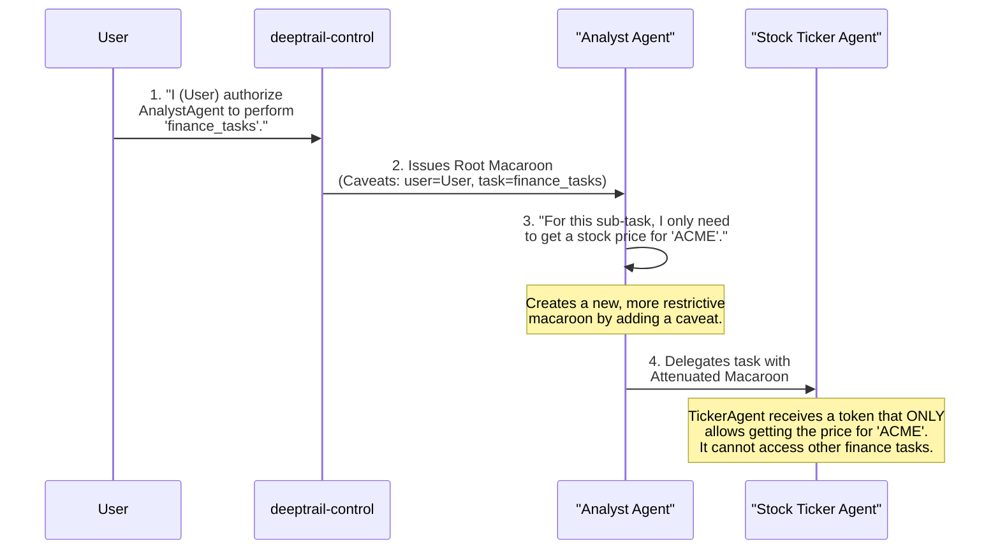

This chain of delegation creates a secure, auditable, and least-privilege workflow that is essential for complex, multi-agent systems.

### 6.3. Supported Policy Types

The policy engine is designed to support different kinds of authorization logic.

*   **Resource-Based Policies:** These policies are attached to a specific resource (like an API endpoint or a database) and define who can do what.
    *   *Example:* "The `BillingAgent` can `POST` to `/api/v1/invoices`, but the `AnalyticsAgent` can only `GET`."
*   **Action/Task-Based Policies:** These policies are defined around a specific business task and can encompass multiple resources.
    *   *Example:* "The `OnboardNewUser` task requires permission to write to the `users` database, call the `SendWelcomeEmail` API, and create a folder in Google Drive."

### 6.4. Split-Key Credential Architecture

DeepTrail employs a split-key architecture for high-value secrets (e.g., API keys, OAuth refresh tokens) to reduce the risk of credential exfiltration. This architecture ensures that no single component—neither `deeptrail-gateway` nor `deeptrail-control`—ever holds the entire secret in memory or storage.

**How it works:**

*   **At Registration Time:** When an admin registers a new API key via the CLI or UI, the secret is split into two shares using Shamir’s Secret Sharing or a deterministic XOR split.
*   **Storage:**
    *   Share A is stored in `deeptrail-control`’s encrypted secrets vault.
    *   Share B is stored in a lightweight key store accessible only by the `deeptrail-gateway`.
*   **At Runtime:**
    1.  When a gateway receives a validated request, it retrieves its share (B), then calls `deeptrail-control` for the other half (A).
    2.  The two shares are reassembled just-in-time in memory for the outbound API request.
    3.  The reconstructed secret is never logged or persisted and is immediately cleared from memory after use.

This architecture provides defense-in-depth:

*   A compromise of either component alone is insufficient to extract secrets.
*   Gateway compromise yields no credentials.
*   Secrets are never persisted in complete form at rest.

### 6.5. Agent Identity with Ed25519 Key Pairs

DeepTrail supports persistent, verifiable cryptographic identities for agents using Ed25519 key pairs. These identities enable secure challenge-response authentication, non-repudiation, and decentralized attestation.

**Identity Model:**

*   Each agent has a long-term Ed25519 key pair.
*   The public key is registered with `deeptrail-control` at agent creation.
*   The private key remains with the agent (or a TPM/HSM if supported).

**Authentication Flow:**

1.  The agent receives a nonce challenge from `deeptrail-control`.
2.  It signs the challenge using its Ed25519 private key.
3.  The control plane verifies the signature using the agent's registered public key.

**Benefits:**

*   **Immutable cryptographic identity** (resistant to impersonation).
*   Enables **decentralized credential issuance** (e.g., signing macaroons or policy fragments).
*   Future compatibility with **SPIFFE, mTLS, or WebAuthn**.

### 6.6. Policy Definition Syntax

To make policies concrete, they are defined in a clear, readable YAML format. This allows for easy version control, auditing, and management by both developers and security teams.

**Example Policy File (`policy.yml`):**

```yaml
# policy.yml
# This policy governs the capabilities of the "StockTickerAgent".

# The agent this policy applies to.
agent_id: "agent-f47ac10b-58cc-4372-a567-0e02b2c3d479"
description: "Policy for the agent that retrieves stock prices."

# List of allowed actions (tools) the agent can use.
allowed_actions:
  - "get_stock_price"

# Resource-specific constraints.
resource_constraints:
  - resource: "api.financialdata.com/v1/quotes"
    conditions:
      # The agent can only call this API endpoint 20 times per minute.
      - type: "rate_limit"
        value: "20/minute"

# Task-based permissions for delegation.
allowed_tasks:
  - "retrieve_and_analyze_market_data"
```

### 6.7. Agent Identity Bootstrapping

A critical aspect of the agent lifecycle is establishing trust on "Day 0." When a new agent workload starts, it must securely prove its underlying platform identity to `deeptrail-control` to register its long-term Ed25519 public key.

DeepTrail solves this by using a pluggable **Attestor Model**. `deeptrail-control` is configured to trust a specific platform's identity mechanism. When an agent first connects, it presents a platform-specific identity token, which `deeptrail-control` validates.

Supported attestors include:

*   **Kubernetes:** The agent presents its projected Service Account Token (SAT). `deeptrail-control` verifies the token against the Kubernetes API server.
*   **AWS:** The agent provides its IAM Role ARN, which `deeptrail-control` verifies using the `sts:GetCallerIdentity` API call.
*   **GCP:** The agent presents an identity token for its Google Service Account, which `deeptrail-control` validates against Google's OAuth2 certs.

This process ensures that only workloads running in a trusted, verifiable location can successfully bootstrap an agent identity.

## 7. Operational & Deployment Model

The DeepTrail platform is designed to be deployed and operated within a customer's own cloud environment, ensuring that sensitive data and credentials never leave their control.

### 7.1. Secrets Backend Integration

To avoid reinventing security primitives, `deeptrail-control` is designed to integrate with standard, hardened secret management systems rather than implementing its own vault from scratch. The `Split-Key Credential Architecture` works by storing one share of the secret in the chosen backend.

This provides customers with flexibility and allows them to leverage their existing security infrastructure.

Supported backends include:

*   **HashiCorp Vault**
*   **AWS Secrets Manager**
*   **Google Cloud Secret Manager**
*   **Azure Key Vault**

The `deeptrail-gateway` itself is stateless and requires no direct access to these backends; it retrieves secret shares from `deeptrail-control` at runtime.

### 7.2. Deployment Strategy

*   **Packaging:** Both `deeptrail-control` and `deeptrail-gateway` are packaged as lightweight, stateless Docker containers.
*   **Orchestration:** They are designed for deployment in container orchestration platforms like Kubernetes, using standard Helm charts or Kubernetes manifests. The components can also be run as standalone services using Docker Compose for smaller environments.

### 7.3. Scalability & Performance

*   **Stateless Components:** Both core services are stateless, allowing them to be scaled horizontally by simply increasing the replica count to handle increased load.
*   **Performance:** The `deeptrail-gateway` is designed for high performance, adding minimal latency (typically <10ms) to proxied requests. Policy decisions are cached at the gateway for a short duration (e.g., 5 seconds) to reduce calls to `deeptrail-control` for high-throughput scenarios.

### 7.4. Failure Modes

*   **Control Plane Unavailability:** If `deeptrail-control` becomes unavailable, the system "fails closed." The `deeptrail-gateway` will deny any request for a new credential or a policy it doesn't have cached. This ensures that an outage in the control plane does not lead to a security failure.
*   **Gateway Unavailability:** If a `deeptrail-gateway` instance fails, traffic is automatically routed to other healthy replicas by the load balancer (e.g., Kubernetes Service), ensuring high availability for agent operations.

## 8. Key Workflows & Use Cases

This section details the primary workflows from the perspective of both the developer and the system components.

### 8.1. Agent Credential Issuance Flow

This is the flow for how an agent gets its initial identity credential.

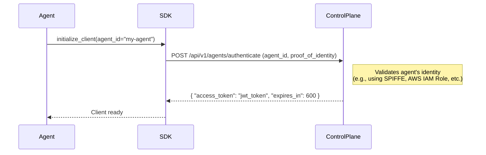

### 8.2. Secured API Call Flow (via Gateway)

This shows how a standard agent action, like calling an external API, is secured.

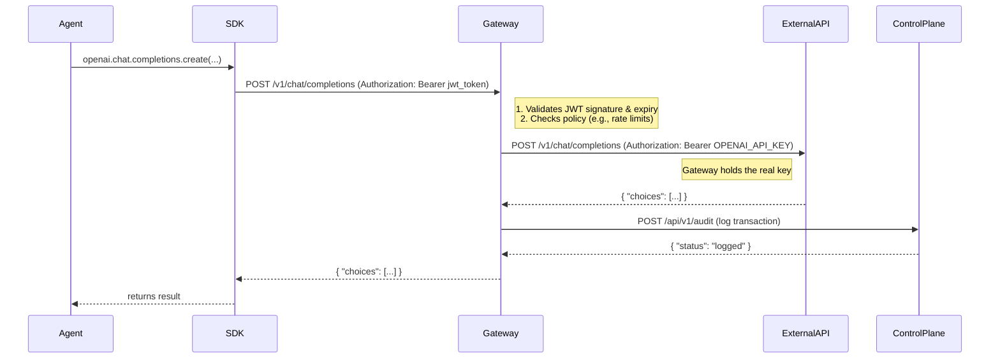

### 8.3. Use Case: Delegated Stock Price Retrieval

This use case demonstrates how DeepTrail simplifies the developer workflow and enables secure delegation.

**The Goal:** A financial analysis agent needs to get the current stock price for a given ticker symbol. It does so by delegating the task to a specialized `StockTickerAgent`.

#### The Old Way: Insecure & Complex

Without DeepTrail, the developer must manually handle the API key, which gets passed around between components, increasing the risk of exposure.

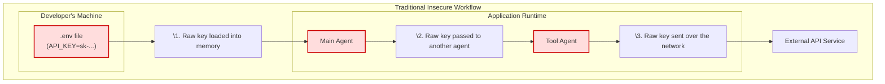

**End-User & Developer Workflow (Before DeepTrail):**

*   **End-User:** "Get the current price for NVDA."
*   **Developer Workflow:**
    1.  Hard-code the `FINANCIAL_API_KEY` into an environment variable or a config file.
    2.  The main agent's code loads this key.
    3.  The main agent calls the `StockTickerAgent`, passing the API key as a parameter.
    4.  The `StockTickerAgent` uses the key to call the financial data API.

#### The DeepTrail Way: Secure & Simple

With DeepTrail, the agent never handles the API key. It operates on short-lived, narrowly-scoped credentials, and the gateway injects the real key just-in-time.

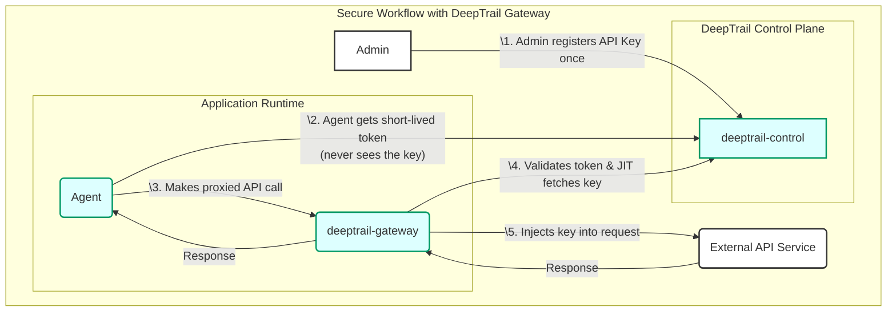

**End-User & Developer Workflow (With DeepTrail):**

*   **End-User:** "Get the current price for NVDA."
*   **Developer Workflow:**
    1.  The developer writes the agent logic. No API keys are ever seen or handled.
    2.  Main Agent Code: `price = stock_ticker_tool.get_price("NVDA")`
*   **Behind the Scenes (The DeepTrail Security Flow):**
    1.  The `deepsecure` SDK automatically intercepts the call.
    2.  It requests a short-lived, attenuated credential from `deeptrail-control` that is *only* valid for the `get_price` action on the `stock_ticker_tool`.
    3.  The SDK uses this highly-restricted credential to call the `deeptrail-gateway`.
    4.  The gateway validates the credential and, if valid, uses its own master API key to get the data from the financial API.
    5.  The result is returned to the agent.
*   **Security Win:** The real API key never leaves the gateway. The delegated credential given to the tool is useless for any other purpose.

### 8.4. Handling OAuth 2.0 Flows

The gateway can act as an OAuth 2.0 proxy, abstracting the complexity from the developer.

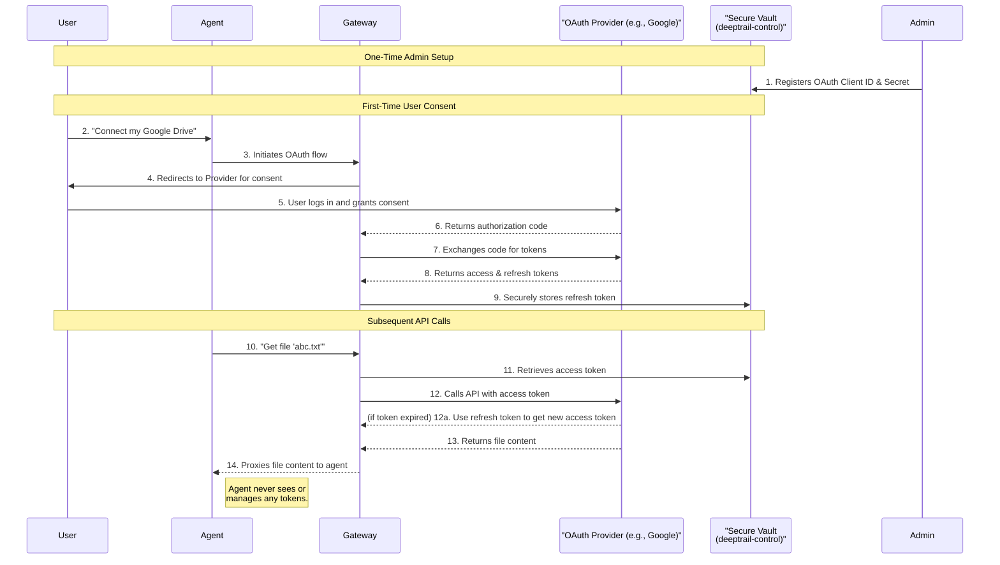

**The Flow:**

1.  **Admin Setup:** An administrator registers the application's OAuth `client_id` and `client_secret` with `deeptrail-control`.
2.  **User Consent:** A user grants the DeepTrail application access to their Google Drive via a standard OAuth consent screen. `deeptrail-control` stores the `access_token` and `refresh_token` associated with the user.
3.  **Agent Request:** An agent, acting on behalf of the user, needs to read a file. It makes a request to `deeptrail-gateway`: `GET /google-drive/files/12345`.
4.  **Gateway as Proxy:** The gateway receives the request. It looks up the user's stored OAuth credentials.
5.  **Secure API Call:** The gateway uses the stored `access_token` to call the real Google Drive API and retrieve the file.
6.  **Automatic Refresh:** The gateway automatically handles the token refresh process using the `refresh_token` when the `access_token` expires, ensuring the agent maintains seamless access without ever handling the OAuth tokens directly.

## 9. Evaluation Framework & Measuring Success

To ensure the architecture is not just theoretically sound but practically effective, we will evaluate it against a defined framework.

*   **Developer Experience:**
    *   **Metric:** Time-to-first-secured-API-call for a new developer.
    *   **Method:** Onboard new developers and measure the time it takes them to run a secure agent using the `deepsecure` SDK, comparing it to the time it takes them to do so using traditional `.env` file methods.
*   **Security Effectiveness:**
    *   **Metric:** Number of simulated attack paths successfully blocked by the platform.
    *   **Method:** Develop a "red team" suite of tests that attempt to execute the failure modes described in "The Challenge" section (e.g., steal a credential and use it outside its scope). Success is defined by the gateway blocking 100% of these attempts.
*   **Performance Overhead:**
    *   **Metric:** p95 and p99 latency overhead introduced by the `deeptrail-gateway`.
    *   **Method:** Run a load test of 10,000 requests per minute, measuring the latency of direct API calls versus calls proxied through the gateway. The target overhead is <15ms at p99.
*   **Auditability:**
    *   **Metric:** Completeness score (1-5) of the generated audit trail for a complex, multi-step agent task.
    *   **Method:** Define a "golden" audit log for a complex workflow. Run the agent and compare the generated log against the golden standard for completeness, clarity, and correctness.

## 10. Summary of Advantages

This architecture provides a unique combination of benefits that address the core challenges of building and operating AI agents securely:

*   **For Developers:**
    *   **Radically Simplified Workflow:** Eliminates the need to handle secrets, manage tokens, or write complex security logic.
    *   **Framework Agnostic:** The gateway-based approach works with any agentic framework (LangChain, CrewAI, etc.) by simply redirecting API calls.
*   **For Security Teams:**
    *   **Centralized Visibility & Control:** A single pane of glass to define, enforce, and audit policies for all agent activity.
    *   **Zero-Trust Principles:** Agents are never trusted by default; they must authenticate and are granted only the minimum necessary privileges for a limited time.
*   **For the Business:**
    *   **Reduced Risk:** Drastically reduces the risk of credential leakage and unauthorized agent actions.
    *   **Accelerated Innovation:** Enables developers to build and deploy powerful agent-based applications faster and more securely.

## 11. Future Roadmap & Extensibility

The DeepTrail architecture is designed to be extensible. Key areas for future development include:

*   **Non-Python Agent Support:** Design SDKs or client libraries for other popular languages (e.g., Node.js, Go) to broaden the ecosystem.
*   **Advanced Policy Types:** Introduce more sophisticated policy types, such as those requiring multi-factor approval for highly sensitive actions.

## 12. Glossary

*   **Attenuation:** The process of taking a credential (like a Macaroon) and adding a new, more restrictive caveat to it. This creates a new, less-permissive credential that can be delegated to another party without giving them the original's full power.
*   **Delegation:** The act of one agent giving another agent a credential that allows the second agent to perform a task on behalf of the first.
*   **Macaroon:** A type of bearer token that is ideal for decentralized delegation. It embeds its own caveats (permissions and constraints), which can be verified offline by any party that shares a root key with the issuer.
*   **PEP (Policy Enforcement Point):** The component that enforces a policy decision. In our architecture, the `deeptrail-gateway` acts as the PEP, blocking or allowing requests based on the policies it receives.
*   **PDP (Policy Decision Point):** The component that makes a policy decision. It is the source of truth for policies. In our architecture, `deeptrail-control` acts as the PDP.
*   **Split-Key Architecture:** A security mechanism where a secret is split into multiple shares, and each share is stored in a different location. A compromise of a single location is not enough to reconstruct the full secret.

## 13. Appendix A: Detailed Implementation Use Cases

This appendix provides detailed illustrations of how the DeepTrail security model applies to a variety of common agent-based scenarios. These examples demonstrate how the architecture enforces security and maintains auditability across different agent types and tasks.

### 13.1. Use Case: AI Agent for Web Browsing

**Scenario:** A user employs an AI agent to perform tasks such as scheduling appointments, retrieving information, and managing online payments. The agent’s access must be restricted to specific websites, with clear limitations on the actions it can perform, such as transaction amounts.

**DeepTrail Implementation:**
1.  **Credential Issuance:** `deeptrail-control` issues a short-lived JWT to the agent containing its unique identity and the authorized scope defined in the policy.
2.  **Gateway Enforcement:** For web browsing, the agent's traffic is routed through the `deeptrail-gateway`. The gateway inspects the agent's requests, validating its JWT. It enforces policies such as only allowing access to `https://calendar.example.com` or blocking payment requests that exceed a predefined limit.
3.  **Audit:** All actions, whether permitted or denied by the gateway, are sent to the `deeptrail-control` audit log, tied to the agent's immutable identity.

**Credential Structure (JWT Claims):**
*   `sub` (Subject): `agent-id-12345`
*   `aud` (Audience): `deeptrail-gateway`
*   `scope`: `web:access`
*   `allowed_domains`: `["calendar.example.com", "payments.example.com"]`
*   `max_payment_usd`: `100`
*   `exp`: (Timestamp for 10 minutes from now)

**Why It Matters:** The structured credential, enforced by the gateway, ensures the agent cannot access unauthorized websites or perform unintended actions. This protects sensitive user data and ensures the user retains control over their online interactions.

### 13.2. Use Case: API-Only Data Manager

**Scenario:** An organization uses an AI agent to aggregate and analyze data from internal APIs (e.g., operations, inventory). The agent’s access must be restricted to specific APIs and limited to non-destructive actions.

**DeepTrail Implementation:**
1.  **Policy Definition:** An administrator defines a policy in `deeptrail-control` stating that agents with the `data-aggregator` role can only perform `GET` requests on the `/api/v1/inventory` endpoint.
2.  **Gateway Enforcement:** The agent makes its API call to the `deeptrail-gateway`, presenting its JWT. The gateway validates the token and checks the request against the policy. It forwards valid `GET` requests to the real inventory API but blocks any `POST` or `DELETE` attempts.
3.  **Credential Management:** Policies in `deeptrail-control` ensure that the JWTs issued to these agents have a short expiry (e.g., 1 hour) and are automatically refreshed by the SDK, reducing the risk of stale credentials.

**Credential Structure (JWT Claims):**
*   `sub`: `agent-id-67890`
*   `role`: `data-aggregator`
*   `scope`: `api:read`
*   `allowed_resources`: `["/api/v1/inventory"]`
*   `allowed_methods`: `["GET"]`
*   `exp`: (Timestamp for 1 hour from now)

**Why It Matters:** The agent’s restricted scope, enforced by the gateway, ensures it cannot alter or access sensitive data unintentionally. Detailed access logs provide accountability and enable quick responses to anomalous behavior.

### 13.3. Use Case: Remote Virtual Environment via SSH

**Scenario:** A developer uses an AI agent to manage a remote development environment over SSH. The agent’s activities must be confined to a specific directory (`/home/dev/project-a`) and restricted from executing destructive commands (e.g., `rm -rf`).

**DeepTrail Implementation:**
1.  **SSH Certificate Issuance:** The developer's `deepsecure` CLI requests an SSH credential for the agent. `deeptrail-control` acts as an SSH Certificate Authority (CA) and issues a short-lived SSH certificate, embedding the agent's identity and restrictions within the certificate's metadata.
2.  **Server-Side Enforcement:** The remote SSH server is configured to trust the `deeptrail-control` CA. The `sshd_config` on the server maps the certificate's principal (`project-a-dev-agent`) to a specific, sandboxed user account and potentially a restricted shell (`r-shell`) that limits available commands.
3.  **Session Audit:** The native SSH session logging on the server provides a clear audit trail of all commands executed by the agent's identity.

**Credential Structure (SSH Certificate):**
*   **Key ID:** `agent-id-abcde`
*   **Principal:** `project-a-dev-agent`
*   **Validity:** (Short-lived, e.g., 8 hours)
*   **Source Address:** (Optionally restricted to the agent's known IP)

**Why It Matters:** This approach ensures that even if the agent is compromised, the potential damage is strictly limited to the intended development directory. It leverages battle-tested SSH protocol features, enforced at the remote host level.

### 13.4. Use Case: Agent-to-Agent Delegation

**Scenario:** A "User Assistant Agent" needs to access a user’s calendar to find an open slot for a meeting. Instead of accessing the calendar API directly, it delegates this task to a specialized "Calendar Agent."

**DeepTrail Implementation:**
1.  **Initial Credential:** The User Assistant Agent holds a JWT issued by `deeptrail-control` allowing broad user-delegated actions.
2.  **Delegated Credential (Macaroon):** Using its primary JWT, the User Assistant Agent asks `deeptrail-control` to issue a new, more restrictive credential (a macaroon-style JWT) for the Calendar Agent. This new token has its scope dramatically reduced.
3.  **Delegated Access:** The Calendar Agent uses this highly-restricted, short-lived token to call the `deeptrail-gateway`. The gateway validates the token's signature and its attenuated scope, allowing the call to the calendar API to proceed. An attempt to use the same token for any other purpose would be denied.
4.  **Audit Trail:** The audit log shows a clear chain of delegation (`delegation_chain` claim), from the user to the User Assistant Agent, and finally to the Calendar Agent.

**Credential Structure (Delegated JWT):**
*   `sub`: `calendar-agent-xyz`
*   `scope`: `calendar:read_free_busy`
*   `delegation_chain`: `["user-id-123", "assistant-agent-abc"]`
*   `exp`: (Timestamp for 5 minutes from now)

**Why It Matters:** This model enables the principle of least privilege at a granular level. The Calendar Agent gets the minimum possible permission needed to do its job, for the minimum possible time. The User Assistant Agent never has to share its own, more powerful credential. 
