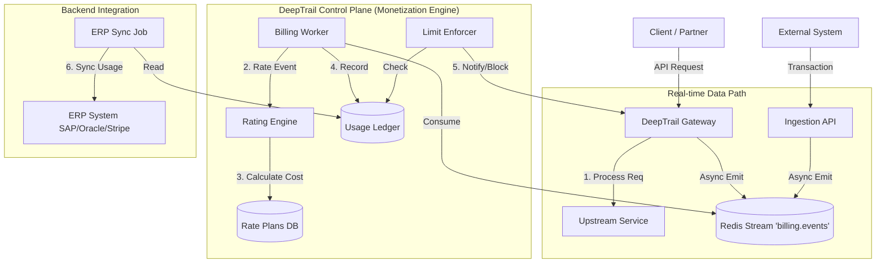

# DeepTrail Edge Monetization Services Design

## Overview

This document outlines the architecture and design for the **DeepTrail Edge Monetization Services**. This system enables flexible, real-time monetization of API traffic and external transactions, fully integrated with backend ERP/Sales systems.

The goal is to transform DeepTrail from a security gateway into a comprehensive **API Business Platform** that supports:
1.  **Real-time Interaction**
2.  **Flexible Business Models**
3.  **Advanced Rating (Volume & Attributes)**
4.  **Automated Limits & Notifications**
5.  **Integrated Developer Workflows**
6.  **Universal Backend/ERP Integration**

---

## 1. Architecture: Real-time Integration

To achieve high-performance, real-time interaction without adding latency to the API datapath, we utilize an **Asynchronous Event Sourcing** pattern.

### 1.1 High-Level Architecture



### 1.2 Components

1.  **MonetizationMiddleware (Gateway)**:
    *   **Role**: Zero-blocking interceptor.
    *   **Action**: Captures request start/end time, status, size, and identity.
    *   **Output**: Pushes a lightweight `BillableEvent` to Redis.
    *   **Latency Impact**: < 2ms.

2.  **Ingestion API (Control Plane)**:
    *   **Role**: Endpoint for non-API transactions (e.g., "Offline Storage Used", "Support Ticket Opened").
    *   **Endpoint**: `POST /v1/monetization/events`.

3.  **Billing Worker**:
    *   **Role**: Scalable consumer group reading from `billing.events`.
    *   **Action**: Hydrates events with Account data, calls Rating Engine.

---

## 2. Business Models: Flexible Plans

We support a wide range of business models through a composable schema.

### 2.1 Data Models

**RatePlan**
Defines the overall monetization strategy for a product or package.
```yaml
RatePlan:
  id: "plan_123"
  name: "Gold Tier API Access"
  currency: "USD"
  billing_period: "monthly" # monthly, weekly, daily
  setup_fee: 0.00
  recurring_fee: 49.00
  freemium_duration_days: 14
```

**FeeSchedule (The Core Logic)**
Defines how individual usage is charged. Supports tiered, volume, and attribute-based logic.
```yaml
FeeSchedule:
  plan_id: "plan_123"
  metric: "api_calls" # or "compute_seconds", "tokens", "custom_attribute"
  model: "tiered" # flat, tiered, volume, stairstep
  tiers:
    - { start: 0, end: 10000, price: 0.00 } # Free tier
    - { start: 10001, end: 100000, price: 0.01 }
    - { start: 100001, end: null, price: 0.008 } # Volume discount
```

**RevenueShare**
Enables platform business models (e.g., App Store).
```yaml
RevenueShare:
  plan_id: "plan_123"
  type: "percentage" # percentage, fixed
  value: 70.0 # Partner gets 70%
  payee_account_id: "acct_partner_001"
```

---

## 3. Rating Engine: Volume & Attribute Rating

The Rating Engine is the "Calculator" that runs inside the Billing Worker. It determines the cost of a `BillableEvent` based on the active `RatePlan`.

### 3.1 Logic Flow
1.  **Identify**: Resolve `agent_id` to `BillingAccount` and active `RatePlan`.
2.  **Extract**: Get the value for the metric defined in `FeeSchedule` (e.g., `request.bytes`).
3.  **Evaluate Custom Attributes**:
    *   *Scenario*: Charge based on transaction value.
    *   *Logic*: If `FeeSchedule.metric` is `transaction.amount`, extract value from `event.metadata['amount']`.
4.  **Calculate**: Apply tier logic.
5.  **Result**: Generate a `RatedTransaction` (e.g., `$0.05` for this call).

### 3.2 External Transactions
Transactions from other systems are treated identically to Gateway events once ingested.
*   **Example**: A background job processes a 1GB video.
*   **Event**: `{ "type": "video_process", "size_gb": 1.0 }`
*   **Plan**: "$0.10 per GB".
*   **Result**: Engine rates this at $0.10.

---

## 4. Automation: Limits & Notifications

Automated governance ensures customers stay within budget and systems stay healthy.

### 4.1 LimitEnforcer
*   **Quotas**: Hard limits (e.g., "10,000 calls/month").
    *   *Implementation*: Redis-backed counters decremented in real-time by `MonetizationMiddleware`.
    *   *Action*: Returns `429 Too Many Requests` immediately at Gateway.
*   **Budgets**: Soft limits (e.g., "$500/month").
    *   *Implementation*: Async check by Rating Engine.
    *   *Action*: When budget > 90%, trigger notification. When > 100%, optionally disable API key.

### 4.2 NotificationService
*   **Triggers**:
    *   Quota approaching (50%, 80%, 100%).
    *   Billing event failure.
    *   Invoice generated.
*   **Channels**: Webhooks, Email, Slack.

---

## 5. Workflows: Partner & Self-Service

### 5.1 Onboarding Workflow
1.  **User Signs Up**: Creates DeepTrail Identity.
2.  **Select Plan**: User calls `POST /v1/monetization/subscriptions` with `plan_id`.
3.  **Provisioning**:
    *   DeepTrail creates `BillingAccount`.
    *   **ERP Adapter** syncs customer to Backend ERP (e.g., creates Salesforce Account).
    *   Keys are provisioned with initial quotas.

### 5.2 Developer Portal (Self-Service)
*   **Dashboard**: View real-time usage charts (powered by Usage Ledger).
*   **Billing**: View current estimated cost, download past invoices (fetched via ERP Adapter).
*   **Plan Management**: Upgrade/Downgrade plans (triggers ERP updates).

---

## 6. Backend Integration: ERP Adapter

This is the interface that enables "Integrate with any backend".

### 6.1 The ERPAdapter Pattern

We define an abstract base class `ERPAdapter` that isolates the core logic from specific vendor implementations.

```python
class ERPAdapter(ABC):
    
    @abstractmethod
    async def sync_customer(self, account: BillingAccount) -> str:
        """
        Create or update customer in ERP. 
        Returns: ERP internal ID.
        """
        pass

    @abstractmethod
    async def push_usage(self, batch: List[RatedTransaction]):
        """
        Push rated usage records to ERP for invoicing.
        """
        pass

    @abstractmethod
    async def get_invoice_status(self, invoice_id: str) -> str:
        """
        Check payment status.
        """
        pass
```

### 6.2 Supported Backends (Strategy)
1.  **Generic/Webhook**: Default adapter that POSTs JSON to a user-defined URL (for custom internal systems).
2.  **Stripe**: Adapter using Stripe Metered Billing API.
3.  **SAP/Oracle**: Adapters using SOAP/REST APIs for enterprise.
4.  **Logging/File**: For testing and simple record keeping.

### 6.3 Integration Lifecycle
*   **Real-time**: Usage is aggregated in DeepTrail (e.g., hourly).
*   **Batch Push**: `ERP Sync Job` pushes aggregated usage to ERP.
*   **Reconciliation**: ERP generates invoice; DeepTrail reflects status (Paid/Due) in Dashboard.

