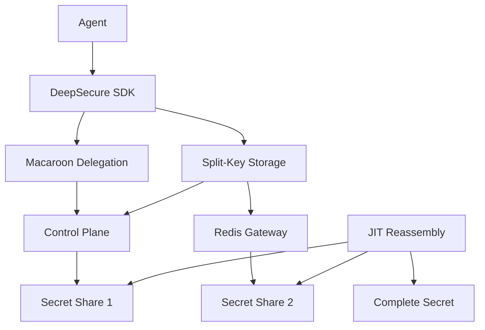

# DeepSecure Deployment Guide: Delegation + Split-Key Integration

## Overview

This guide covers the deployment of DeepSecure's advanced security features combining **macaroon-based delegation** with **split-key secret storage**. These features provide enterprise-grade security for AI agent workflows with cryptographic delegation chains and defense-in-depth secret protection.

## Prerequisites

### System Requirements
- Python 3.8+ with `pip`
- Docker and Docker Compose (for Redis container)
- Network access for control plane and gateway communication
- Minimum 4GB RAM for production deployments

### Required Dependencies
```bash
# Core dependencies
pip install deepsecure cryptography sslib

# Framework integrations (optional)
pip install langchain crewai

# Development and testing
pip install pytest pytest-asyncio redis
```

## Architecture Quick Reference



## Step 1: Environment Setup

### 1.1 Redis Container Setup

Deploy Redis for encrypted secret share storage:

```bash
# Create docker-compose.yml
cat > docker-compose.yml << EOF
version: '3.8'
services:
  redis:
    image: redis:7-alpine
    container_name: deepsecure-redis
    ports:
      - "6380:6379"  # Custom port mapping
    volumes:
      - redis_data:/data
    command: redis-server --appendonly yes
    restart: unless-stopped

volumes:
  redis_data:
EOF

# Start Redis container
docker-compose up -d redis

# Verify Redis is running
docker-compose ps
redis-cli -p 6380 ping  # Should return PONG
```

### 1.2 Control Plane Configuration

Configure the control plane for delegation and split-key features:

```bash
# Set environment variables
export DEEPSECURE_CONTROL_URL="http://localhost:8000"
export DEEPSECURE_REDIS_URL="redis://localhost:6380"
export DEEPSECURE_SPLIT_KEY_ENABLED="true"
export DEEPSECURE_DELEGATION_ENABLED="true"

# Initialize control plane
deepsecure control start --split-key --delegation
```

### 1.3 Gateway Configuration

Configure the gateway for JIT secret reassembly:

```bash
# Gateway configuration file
cat > gateway-config.yaml << EOF
split_key:
  enabled: true
  redis_url: "redis://localhost:6380"
  threshold: 2
  jit_timeout: 30  # seconds

delegation:
  enabled: true
  max_chain_depth: 5
  default_ttl: 3600  # 1 hour
  validation_strict: true

security:
  audit_enabled: true
  metrics_enabled: true
  encryption_key_rotation: 86400  # 24 hours
EOF

# Start gateway
deepsecure gateway start --config gateway-config.yaml
```

## Step 2: Secret Storage with Split-Key

### 2.1 Store Secrets with Split-Key Protection

```python
import deepsecure
from cryptography.fernet import Fernet
import redis

# Initialize client with split-key support
client = deepsecure.Client(
    control_url="http://localhost:8000",
    split_key_enabled=True,
    redis_url="redis://localhost:6380"
)

# Store secrets with automatic splitting
client.store_secret(
    name="openai-api-key",
    value="sk-1234567890abcdef",
    agent_id="research-agent",
    split_key=True  # Enables 2-of-2 Shamir splitting
)

# Verify storage (shares are distributed)
print("Secret stored with split-key protection")
```

### 2.2 JIT Secret Retrieval

```python
# Agent retrieves secret (automatic JIT reassembly)
def secure_openai_call(client):
    # SDK automatically combines shares from control plane + Redis
    secret = client.get_secret("openai-api-key")
    
    # Secret exists in memory only during this operation
    api_key = secret.value
    
    # Use the API key
    response = openai.ChatCompletion.create(
        model="gpt-4",
        messages=[{"role": "user", "content": "Hello"}],
        api_key=api_key
    )
    
    # Secret is immediately cleared from memory
    return response
```

## Step 3: Delegation Setup

### 3.1 Create Delegation Policies

```python
# Define delegation policy
delegation_policy = {
    "delegator": "senior-agent",
    "delegatee": "junior-agent",
    "permissions": ["read:customer-data", "write:reports"],
    "resources": ["customer-db", "report-api"],
    "time_limit": 3600,  # 1 hour
    "usage_limit": 100,  # max 100 operations
    "attenuation": {
        "rate_limit": "10/minute",
        "data_masking": ["ssn", "credit_card"]
    }
}

# Create delegation token
token = client.create_delegation(
    policy=delegation_policy,
    signing_key="delegation-key"
)

print(f"Delegation token: {token}")
```

### 3.2 Use Delegation in Agent Workflows

```python
# Delegating agent
senior_agent = client.with_agent("senior-agent")
delegation_token = senior_agent.delegate_to(
    target_agent="junior-agent",
    permissions=["read:customer-data"],
    time_limit=1800  # 30 minutes
)

# Delegated agent uses token
junior_agent = client.with_agent("junior-agent")
junior_agent.use_delegation(delegation_token)

# Junior agent can now access delegated resources
customer_data = junior_agent.get_secret("customer-db-password")
```

## Step 4: Framework Integration

### 4.1 LangChain Integration

```python
from langchain.tools import Tool
import deepsecure

# Create secure tool factory
def create_secure_search_tool(client: deepsecure.Client):
    def search_function(query: str) -> str:
        # JIT secret retrieval with delegation validation
        api_key = client.get_secret("search-api-key").value
        
        # Delegation is automatically validated
        if not client.validate_delegation():
            raise PermissionError("Delegation expired or invalid")
            
        # Perform search with delegated permissions
        return f"Search results for: {query}"
    
    return Tool(
        name="Secure Search",
        description="Search with delegation validation",
        func=search_function
    )

# Use in LangChain agent
agent_client = client.with_agent("research-agent")
search_tool = create_secure_search_tool(agent_client)
```

### 4.2 CrewAI Integration

```python
from crewai import Agent, Task, Crew
import deepsecure

# Create secure CrewAI agents
def create_secure_crew():
    client = deepsecure.Client()
    
    # Research agent with delegation capabilities
    researcher = Agent(
        role="Senior Researcher",
        goal="Research topics with delegated access",
        tools=[create_secure_search_tool(client.with_agent("researcher"))],
        delegation_enabled=True
    )
    
    # Analysis agent that receives delegations
    analyst = Agent(
        role="Data Analyst", 
        goal="Analyze data with delegated permissions",
        tools=[create_secure_analysis_tool(client.with_agent("analyst"))],
        accepts_delegation=True
    )
    
    return Crew(agents=[researcher, analyst])
```

## Step 5: Monitoring and Operations

### 5.1 Health Checks

```bash
# Check system health
deepsecure status --all

# Verify split-key operation
deepsecure test split-key --secret-name test-secret

# Verify delegation chain
deepsecure test delegation --chain-depth 3

# Redis connectivity
redis-cli -p 6380 ping
```

### 5.2 Monitoring Metrics

```python
# Collect performance metrics
metrics = client.get_metrics()
print(f"Split-key operations: {metrics['split_key']['operations']}")
print(f"Average JIT latency: {metrics['split_key']['avg_latency_ms']}ms")
print(f"Delegation validations: {metrics['delegation']['validations']}")
print(f"Active delegation chains: {metrics['delegation']['active_chains']}")
```

### 5.3 Audit and Compliance

```python
# Audit delegation chains
audit_report = client.generate_audit_report(
    start_date="2024-01-01",
    end_date="2024-12-31",
    include_delegation_chains=True,
    include_split_key_operations=True
)

# Export compliance report
client.export_compliance_report(
    format="json",
    output_file="deepsecure-audit-2024.json"
)
```

## Step 6: Production Deployment

### 6.1 High Availability Setup

```yaml
# docker-compose.prod.yml
version: '3.8'
services:
  redis-primary:
    image: redis:7-alpine
    ports:
      - "6380:6379"
    volumes:
      - redis_primary:/data
    command: redis-server --appendonly yes --replica-of redis-secondary 6379
    
  redis-secondary:
    image: redis:7-alpine
    ports:
      - "6381:6379"
    volumes:
      - redis_secondary:/data
    command: redis-server --appendonly yes
    
  control-plane:
    image: deepsecure/control:latest
    environment:
      - SPLIT_KEY_ENABLED=true
      - DELEGATION_ENABLED=true
      - REDIS_URL=redis://redis-primary:6379
    depends_on:
      - redis-primary
      
  gateway:
    image: deepsecure/gateway:latest
    environment:
      - SPLIT_KEY_ENABLED=true
      - REDIS_URL=redis://redis-primary:6379
    depends_on:
      - redis-primary
      - control-plane
```

### 6.2 Security Hardening

```bash
# Enable TLS for Redis
redis-cli CONFIG SET tls-port 6380
redis-cli CONFIG SET port 0  # Disable non-TLS

# Configure firewall rules
ufw allow from 10.0.0.0/8 to any port 6380  # Redis access
ufw allow from 10.0.0.0/8 to any port 8000  # Control plane
ufw deny 6380  # Block external Redis access
ufw deny 8000  # Block external control plane access

# Rotate encryption keys
deepsecure rotate-keys --split-key --delegation
```

### 6.3 Backup and Recovery

```bash
# Backup Redis data (encrypted shares)
docker exec deepsecure-redis redis-cli BGSAVE
docker cp deepsecure-redis:/data/dump.rdb ./backups/redis-$(date +%Y%m%d).rdb

# Backup control plane configuration
deepsecure backup --include-policies --include-agents --output backup-$(date +%Y%m%d).tar.gz

# Test recovery procedure
deepsecure restore --backup backup-20241201.tar.gz --verify-integrity
```

## Step 7: Migration from Legacy Systems

### 7.1 Migration Assessment

```python
# Assess existing secret storage
migration_report = client.assess_migration(
    current_system="hashicorp_vault",
    target_system="split_key",
    security_level="enterprise"
)

print(f"Secrets to migrate: {migration_report['total_secrets']}")
print(f"Estimated migration time: {migration_report['estimated_hours']} hours")
```

### 7.2 Gradual Migration

```python
# Migrate secrets incrementally
migration_plan = client.create_migration_plan(
    batch_size=10,
    parallel_operations=3,
    rollback_enabled=True
)

# Execute migration with rollback capability
client.execute_migration(migration_plan, dry_run=True)  # Test first
client.execute_migration(migration_plan, dry_run=False)  # Execute
```

## Troubleshooting

### Common Issues

1. **Redis Connection Refused**
   ```bash
   # Check Redis is running on correct port
   docker-compose ps
   netstat -tlnp | grep 6380
   
   # Verify port mapping
   docker port deepsecure-redis
   ```

2. **Split-Key Reassembly Failures**
   ```python
   # Verify both shares exist
   control_share = client.get_share_from_control_plane("secret-name")
   redis_share = client.get_share_from_redis("secret-name")
   
   # Check share integrity
   client.verify_share_integrity(control_share, redis_share)
   ```

3. **Delegation Token Validation Errors**
   ```python
   # Verify token signature
   is_valid = client.verify_delegation_signature(token)
   
   # Check token expiration
   token_info = client.inspect_delegation_token(token)
   print(f"Expires: {token_info['expires_at']}")
   ```

### Performance Tuning

```python
# Optimize JIT performance
client.configure_jit_cache(
    cache_size=1000,
    ttl_seconds=300,
    preload_frequently_used=True
)

# Tune delegation validation
client.configure_delegation(
    cache_validation_results=True,
    validation_timeout=5000,  # 5 seconds
    max_concurrent_validations=100
)
```

## Security Best Practices

1. **Network Security**
   - Use VPN or private networks for component communication
   - Enable TLS for all Redis connections
   - Implement network segmentation

2. **Key Management**
   - Rotate delegation signing keys regularly
   - Use hardware security modules (HSMs) for root keys
   - Implement key escrow for disaster recovery

3. **Monitoring**
   - Set up alerts for failed delegation validations
   - Monitor JIT latency metrics
   - Track unusual delegation patterns

4. **Access Control**
   - Implement role-based access for administration
   - Use principle of least privilege
   - Regular access reviews and audits

## Conclusion

This deployment guide provides a comprehensive foundation for implementing DeepSecure's delegation + split-key integration. The combination of macaroon-based delegation and Shamir's secret sharing provides enterprise-grade security while maintaining developer productivity.

For additional support:
- Review the integration test results in `docs/design/phase4_integration_testing_report.md`
- Check the examples in `examples/07_multi_agent_communication.py` and related files
- Contact support for enterprise deployment assistance 