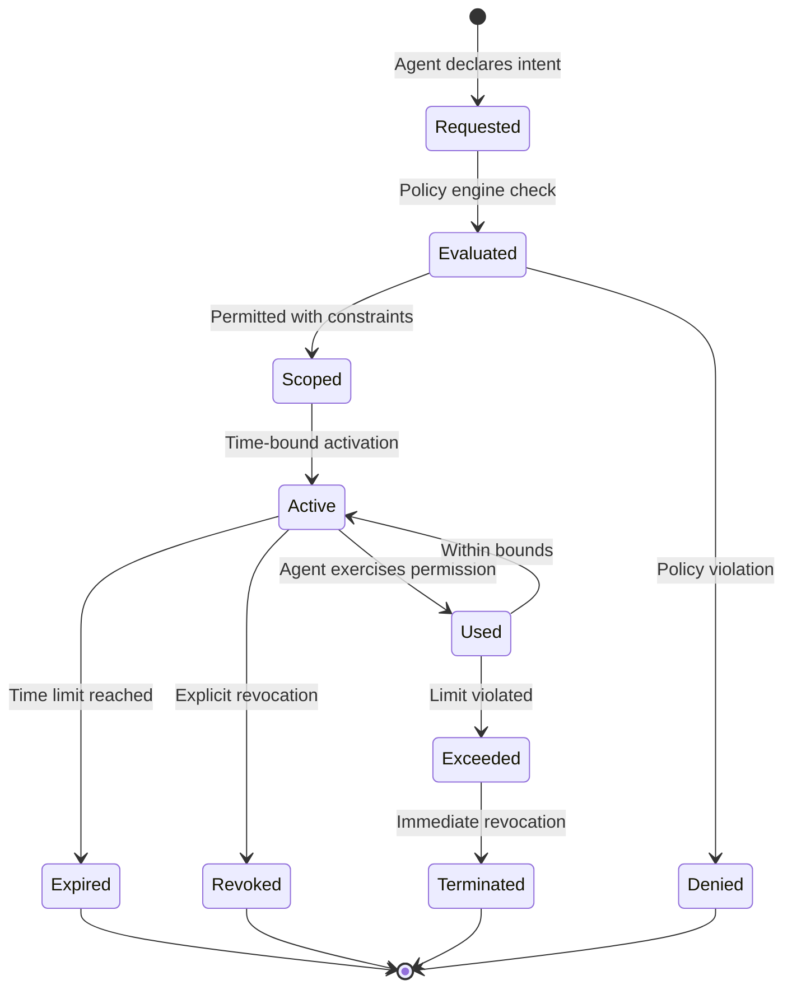
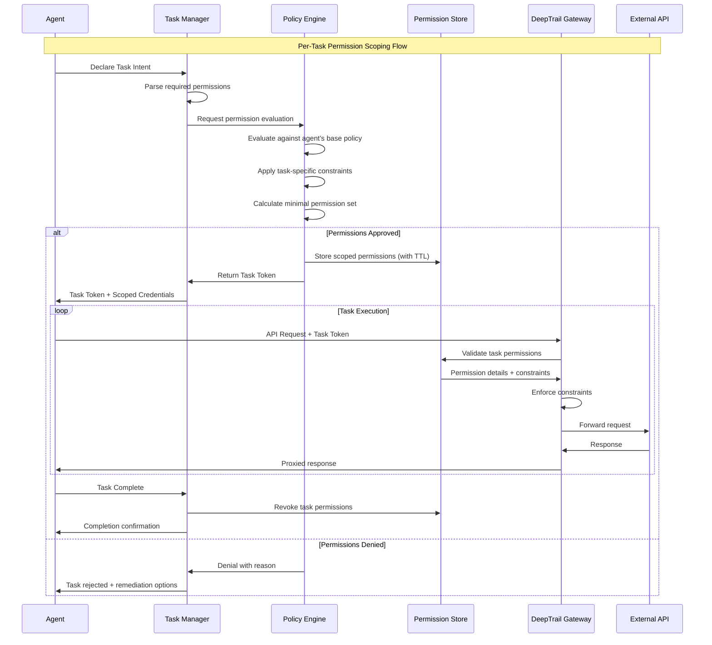
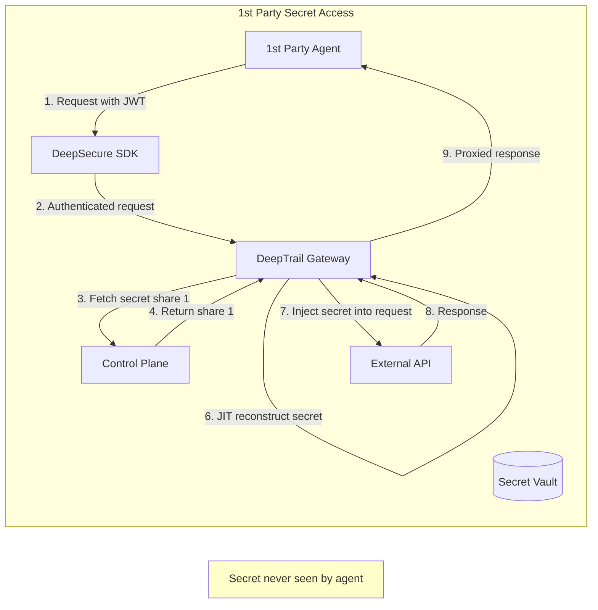
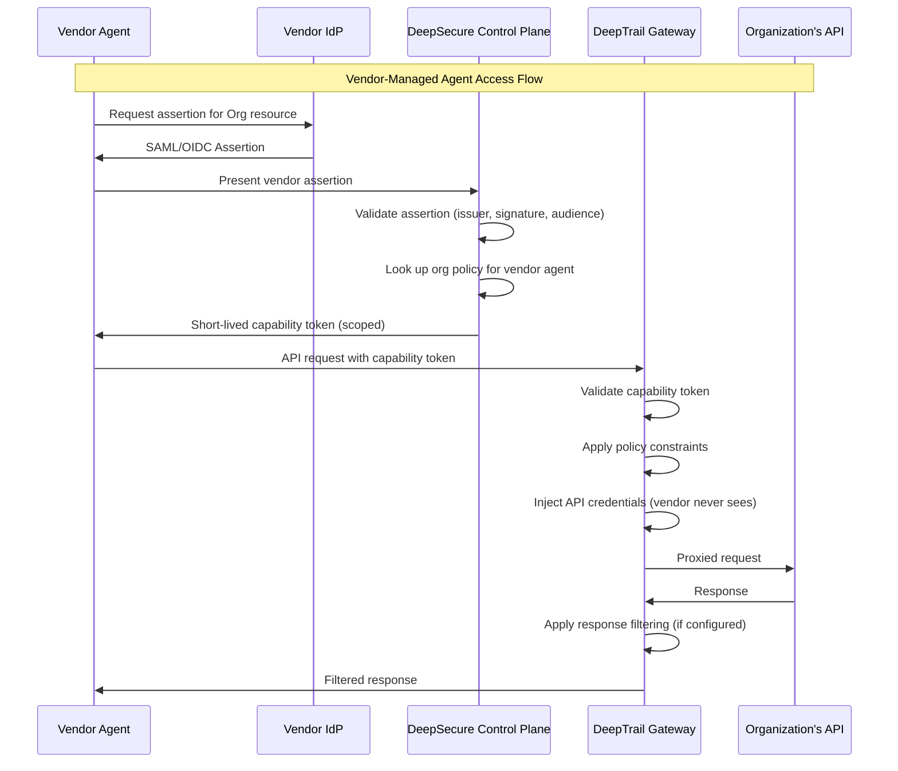
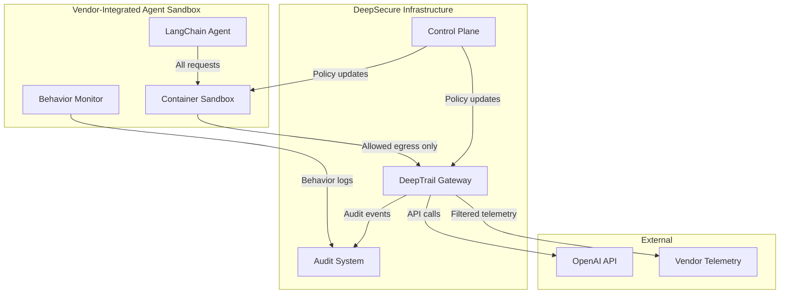
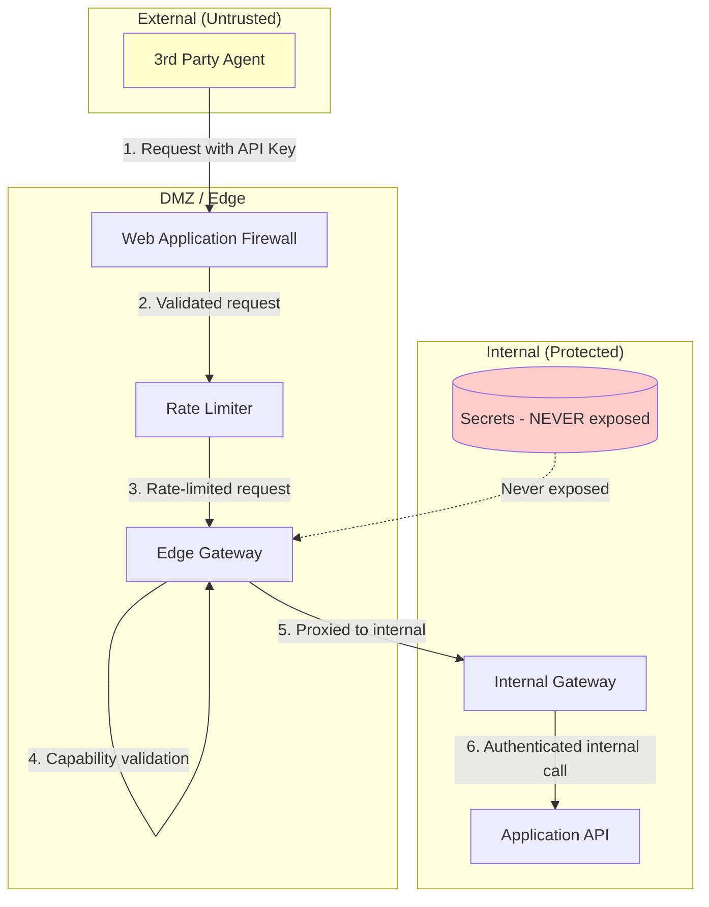

# Comprehensive Least-Privilege Design for AI Agent Permissions

## Executive Summary

This document presents a comprehensive architecture for implementing **Least-Privilege Access Control** in AI agent systems. It synthesizes academic research on agent permissions, per-task privilege scoping, and permission hierarchies with the existing DeepSecure platform architecture to provide a unified framework for securing AI agents across different trust domains.

The design addresses four distinct agent party models:
1. **1st Party Agents** - Organization-owned and operated agents
2. **2nd Party Vendor-Managed Agents** - Vendor-operated agents configured by the organization
3. **2nd Party Vendor-Integrated Agents** - Organization-operated agents using vendor software
4. **3rd Party Agents** - External/untrusted agents with limited interaction

---

## Table of Contents

1. [Introduction & Problem Statement](#1-introduction--problem-statement)
2. [Core Principles of Least Privilege for AI Agents](#2-core-principles-of-least-privilege-for-ai-agents)
3. [Permission Tree and Hierarchy Architecture](#3-permission-tree-and-hierarchy-architecture)
4. [Per-Task Dynamic Permission Scoping](#4-per-task-dynamic-permission-scoping)
5. [Agent Party Classification Model](#5-agent-party-classification-model)
6. [1st Party Agent Architecture](#6-1st-party-agent-architecture)
7. [2nd Party Vendor-Managed Agent Architecture](#7-2nd-party-vendor-managed-agent-architecture)
8. [2nd Party Vendor-Integrated Agent Architecture](#8-2nd-party-vendor-integrated-agent-architecture)
9. [3rd Party Agent Architecture](#9-3rd-party-agent-architecture)
10. [Unified Permission Enforcement Architecture](#10-unified-permission-enforcement-architecture)
11. [Implementation Roadmap](#11-implementation-roadmap)
12. [Security Analysis](#12-security-analysis)
13. [Appendix: API Specifications](#appendix-a-api-specifications)

---

## 1. Introduction & Problem Statement

### 1.1 The AI Agent Permission Challenge

AI agents represent a fundamental shift in software architecture—from passive programs that respond to explicit user commands to autonomous systems that can:
- **Plan and execute** multi-step workflows independently
- **Access external resources** (APIs, databases, file systems)
- **Delegate tasks** to other agents or sub-systems
- **Make decisions** that have real-world consequences

This autonomy introduces unprecedented security challenges:

| Traditional Applications | AI Agents |
|-------------------------|-----------|
| Static permission sets | Dynamic, context-dependent permissions |
| Human-initiated actions | Autonomous action chains |
| Predictable execution paths | Non-deterministic behavior |
| Single-tenant isolation | Multi-agent collaboration |
| Explicit trust boundaries | Implicit and transitive trust |

### 1.2 Why Traditional IAM Fails for AI Agents

Traditional Identity and Access Management (IAM) systems were designed for:
- **Static roles** assigned at provisioning time
- **Human users** who can make real-time judgment calls
- **Session-based** access with human-controlled duration
- **Explicit permission requests** visible to users

AI agents break these assumptions because they:
1. **Require dynamic permissions** that change based on task context
2. **Operate autonomously** without human oversight for each action
3. **Execute rapidly** (hundreds of actions per second)
4. **Delegate** authority to other agents in unpredictable chains

### 1.3 The Least-Privilege Imperative

The **principle of least privilege** states that any entity should have only the minimum permissions necessary to perform its intended function. For AI agents, this translates to:

> **Per-Task Least Privilege**: An agent should receive only the permissions required for its current task, scoped to the specific resources needed, valid only for the duration of that task, and automatically revoked upon completion.

This document defines an architecture to achieve this goal across all agent trust domains.

---

## 2. Core Principles of Least Privilege for AI Agents

### 2.1 Foundational Principles

The architecture is built on six foundational principles:

```
┌─────────────────────────────────────────────────────────────────────────┐
│                    LEAST PRIVILEGE PRINCIPLES FOR AI AGENTS              │
├─────────────────────────────────────────────────────────────────────────┤
│                                                                          │
│  1. MINIMAL SCOPE         2. TEMPORAL BOUNDS        3. EXPLICIT INTENT  │
│  ┌─────────────────┐      ┌─────────────────┐      ┌─────────────────┐  │
│  │ Grant only what │      │ Permissions     │      │ Permissions     │  │
│  │ is needed for   │      │ expire when     │      │ explicitly tied │  │
│  │ current task    │      │ task completes  │      │ to declared     │  │
│  └─────────────────┘      └─────────────────┘      │ purpose         │  │
│                                                     └─────────────────┘  │
│                                                                          │
│  4. MONOTONIC             5. AUDITABLE             6. NON-BYPASSABLE    │
│     ATTENUATION              PROVENANCE               ENFORCEMENT        │
│  ┌─────────────────┐      ┌─────────────────┐      ┌─────────────────┐  │
│  │ Delegated       │      │ Complete chain  │      │ Enforcement at  │  │
│  │ permissions     │      │ of custody for  │      │ infrastructure  │  │
│  │ can only        │      │ every action    │      │ layer, not      │  │
│  │ decrease        │      │ and permission  │      │ application     │  │
│  └─────────────────┘      └─────────────────┘      └─────────────────┘  │
│                                                                          │
└─────────────────────────────────────────────────────────────────────────┘
```

### 2.2 The Permission Lifecycle

Permissions in an agent system follow a strict lifecycle:



### 2.3 Permission Dimensions

Every permission in the system is defined across five dimensions:

| Dimension | Description | Example |
|-----------|-------------|---------|
| **Subject** | The agent requesting access | `agent-analytics-001` |
| **Action** | The operation to perform | `read`, `write`, `execute`, `delegate` |
| **Resource** | The target of the action | `api.openai.com/v1/chat/completions` |
| **Context** | Environmental constraints | Time window, IP range, delegator chain |
| **Purpose** | The declared intent | "Summarize customer feedback" |

---

## 3. Permission Tree and Hierarchy Architecture

### 3.1 Permission Hierarchy Model

Permissions are organized in a hierarchical tree structure that enables:
- **Inheritance**: Parent permissions automatically grant child permissions
- **Scoping**: Permissions can be narrowed but never expanded
- **Organization**: Clear visual and logical permission structure

```
Permission Tree Structure
═══════════════════════════════════════════════════════════════════

                              ┌────────────────┐
                              │   ORGANIZATION │
                              │   (root)       │
                              └───────┬────────┘
                                      │
              ┌───────────────────────┼───────────────────────┐
              │                       │                       │
       ┌──────▼──────┐         ┌──────▼──────┐         ┌──────▼──────┐
       │  PLATFORM   │         │   SERVICE   │         │    DATA     │
       │  ADMIN      │         │   ACCESS    │         │   ACCESS    │
       └──────┬──────┘         └──────┬──────┘         └──────┬──────┘
              │                       │                       │
    ┌─────────┴─────────┐     ┌───────┴───────┐       ┌───────┴───────┐
    │                   │     │               │       │               │
┌───▼───┐         ┌─────▼─┐ ┌─▼────┐    ┌─────▼─┐  ┌──▼───┐     ┌─────▼──┐
│AGENT  │         │POLICY │ │OPENAI│    │GOOGLE │  │USERS │     │PRODUCTS│
│MANAGE │         │MANAGE │ │API   │    │DRIVE  │  │TABLE │     │TABLE   │
└───┬───┘         └───────┘ └──┬───┘    └───────┘  └──┬───┘     └────────┘
    │                          │                       │
┌───┴───┐               ┌──────┴──────┐         ┌──────┴──────┐
│CREATE │               │             │         │             │
│DELETE │          ┌────▼───┐   ┌─────▼────┐  ┌─▼───┐   ┌─────▼────┐
│UPDATE │          │ CHAT   │   │EMBEDDINGS│  │READ │   │READ_PII  │
│READ   │          │COMPLETE│   │          │  │     │   │(requires │
└───────┘          └────────┘   └──────────┘  └─────┘   │ audit)   │
                                                        └──────────┘
```

### 3.2 Permission Node Definition

Each node in the permission tree is defined by the following structure:

```yaml
# Permission Node Schema
permission_node:
  id: "urn:deepsecure:permission:service:openai:chat_completions"
  parent: "urn:deepsecure:permission:service:openai"
  name: "chat_completions"
  display_name: "OpenAI Chat Completions"
  description: "Permission to call OpenAI's chat completion API"
  
  # Inheritance settings
  inheritance:
    enabled: true
    propagate_to_children: true
    inherit_from_parent: true
  
  # Constraints that can be applied
  applicable_constraints:
    - type: "rate_limit"
      unit: "requests_per_minute"
      max_value: 1000
    - type: "model_restriction"
      allowed_values: ["gpt-4", "gpt-4-turbo", "gpt-3.5-turbo"]
    - type: "max_tokens"
      max_value: 128000
  
  # Audit requirements
  audit:
    required: true
    log_request: true
    log_response: false  # Don't log sensitive response content
    retention_days: 90
  
  # Risk classification
  risk_level: "medium"  # low, medium, high, critical
  requires_approval: false
  requires_mfa: false
```

### 3.3 Permission Composition

Permissions can be composed through several mechanisms:

#### 3.3.1 Union Composition (OR)

```yaml
# Agent has either permission A OR permission B
composed_permission:
  type: "union"
  permissions:
    - "urn:deepsecure:permission:service:openai:chat_completions"
    - "urn:deepsecure:permission:service:anthropic:messages"
```

#### 3.3.2 Intersection Composition (AND)

```yaml
# Agent must have both permissions to proceed
composed_permission:
  type: "intersection"
  permissions:
    - "urn:deepsecure:permission:data:users:read"
    - "urn:deepsecure:permission:audit:pii_access"
```

#### 3.3.3 Exclusion Composition (NOT)

```yaml
# Agent has permission A but explicitly denied B
composed_permission:
  type: "exclusion"
  granted:
    - "urn:deepsecure:permission:data:products:*"
  denied:
    - "urn:deepsecure:permission:data:products:delete"
```

### 3.4 Permission Inheritance Rules

```
INHERITANCE RULES
═══════════════════════════════════════════════════════════════════

Rule 1: GRANT PROPAGATION
─────────────────────────
When a parent permission is granted, all child permissions
are implicitly granted (unless explicitly denied).

    GRANTED: service:openai:*
         └── IMPLICIT: service:openai:chat_completions ✓
         └── IMPLICIT: service:openai:embeddings ✓
         └── IMPLICIT: service:openai:images ✓

Rule 2: DENY PROPAGATION
─────────────────────────
When a parent permission is denied, all child permissions
are implicitly denied (cannot be overridden by grant).

    DENIED: data:users:write
         └── IMPLICIT DENIED: data:users:write:email ✗
         └── IMPLICIT DENIED: data:users:write:password ✗

Rule 3: DENY TAKES PRECEDENCE
─────────────────────────────
In conflict between grant and deny at the same level,
deny always takes precedence.

    GRANTED: service:openai:*
    DENIED: service:openai:images
         └── Result: chat_completions ✓, embeddings ✓, images ✗

Rule 4: SPECIFIC OVERRIDES GENERAL
──────────────────────────────────
A more specific permission overrides a more general one.

    DENIED: service:*
    GRANTED: service:openai:chat_completions
         └── Result: Only chat_completions is allowed ✓
```

---

## 4. Per-Task Dynamic Permission Scoping

### 4.1 Task-Based Permission Model

The core innovation of this architecture is **per-task least privilege**—permissions are dynamically scoped to the specific task an agent is performing.

```
STATIC PERMISSIONS (Traditional)          DYNAMIC PERMISSIONS (Per-Task)
═══════════════════════════════           ══════════════════════════════

Agent: analytics-agent                    Agent: analytics-agent
Permissions:                              Task: "Summarize Q3 sales"
  - openai:chat:*                         
  - data:sales:read:*                     Scoped Permissions:
  - data:customers:read:*                   - openai:chat:completions
  - storage:write:reports                     └─ model: gpt-4
                                              └─ max_tokens: 4000
Always has full access                        └─ rate: 10/min
to all granted resources     vs             - data:sales:read
                                              └─ date_range: Q3_2025
                                              └─ fields: [amount, region]
                                            - storage:write:reports
                                              └─ path: /reports/q3-summary.md
                                            
                                          Permissions expire when task completes
```

### 4.2 Task Definition Schema

Each task is defined with explicit permission requirements:

```yaml
# Task Definition Schema
task:
  id: "task-20250108-summary-q3-sales"
  name: "Summarize Q3 Sales Performance"
  agent_id: "agent-analytics-001"
  
  # Task metadata
  initiated_by: "user-john-doe"  # Or another agent
  initiated_at: "2025-01-08T10:30:00Z"
  deadline: "2025-01-08T11:00:00Z"  # 30-minute time box
  
  # Declared intent
  intent:
    description: "Generate a summary report of Q3 2025 sales performance"
    output_type: "document"
    output_destination: "storage://reports/q3-summary.md"
  
  # Required permissions for this task
  required_permissions:
    - permission: "urn:deepsecure:service:openai:chat_completions"
      constraints:
        model: "gpt-4"
        max_tokens: 4000
        temperature: 0.3
      justification: "Need LLM to generate natural language summary"
    
    - permission: "urn:deepsecure:data:sales:read"
      constraints:
        date_range:
          start: "2025-07-01"
          end: "2025-09-30"
        columns: ["amount", "region", "product_category"]
        row_limit: 10000
      justification: "Need sales data for Q3 analysis"
    
    - permission: "urn:deepsecure:storage:reports:write"
      constraints:
        path_pattern: "/reports/q3-*.md"
        max_size_bytes: 1048576  # 1MB
      justification: "Need to save generated report"
  
  # What happens when task completes
  on_completion:
    revoke_permissions: true
    generate_audit_report: true
    notify: ["user-john-doe"]
```

### 4.3 Permission Scoping Pipeline



### 4.4 Constraint Types

The following constraints can be applied to scope permissions:

```yaml
constraint_types:
  # Temporal Constraints
  temporal:
    - type: "time_bound"
      description: "Permission valid only within time window"
      example:
        valid_from: "2025-01-08T10:00:00Z"
        valid_until: "2025-01-08T11:00:00Z"
    
    - type: "duration"
      description: "Permission valid for specific duration"
      example:
        duration_seconds: 3600
    
    - type: "business_hours"
      description: "Permission valid only during business hours"
      example:
        timezone: "America/New_York"
        hours: "09:00-17:00"
        days: ["Mon", "Tue", "Wed", "Thu", "Fri"]
  
  # Volume Constraints
  volume:
    - type: "rate_limit"
      description: "Maximum requests per time unit"
      example:
        requests: 100
        per: "minute"
    
    - type: "row_limit"
      description: "Maximum rows returned from data queries"
      example:
        max_rows: 10000
    
    - type: "token_limit"
      description: "Maximum tokens for LLM calls"
      example:
        max_input_tokens: 8000
        max_output_tokens: 4000
    
    - type: "cost_limit"
      description: "Maximum cost for this task"
      example:
        max_cost_usd: 10.00
  
  # Data Constraints
  data:
    - type: "column_filter"
      description: "Only specific columns accessible"
      example:
        allowed_columns: ["id", "name", "email"]
        denied_columns: ["ssn", "password_hash"]
    
    - type: "row_filter"
      description: "Only rows matching condition accessible"
      example:
        filter: "department = 'sales' AND region = 'west'"
    
    - type: "data_masking"
      description: "Automatically mask sensitive fields"
      example:
        mask_fields:
          email: "partial"  # john***@example.com
          phone: "full"     # ***-***-****
  
  # Contextual Constraints
  contextual:
    - type: "ip_restriction"
      description: "Only from specific IP ranges"
      example:
        allowed_ranges: ["10.0.0.0/8", "192.168.1.0/24"]
    
    - type: "delegation_depth"
      description: "Maximum delegation chain length"
      example:
        max_depth: 3
    
    - type: "purpose_binding"
      description: "Permission bound to declared purpose"
      example:
        purpose: "q3_sales_analysis"
        audit_purpose_adherence: true
```

---

## 5. Agent Party Classification Model

### 5.1 The Four-Party Model

Agents are classified into four trust domains based on ownership, operation, and integration patterns:

```
AGENT PARTY CLASSIFICATION
═══════════════════════════════════════════════════════════════════

┌─────────────────────────────────────────────────────────────────────────┐
│                                                                          │
│  TRUST LEVEL:  HIGH ◄────────────────────────────────────────► LOW      │
│                                                                          │
│  ┌──────────────┐  ┌──────────────┐  ┌──────────────┐  ┌──────────────┐ │
│  │              │  │              │  │              │  │              │ │
│  │  1ST PARTY   │  │  2ND PARTY   │  │  2ND PARTY   │  │  3RD PARTY   │ │
│  │              │  │  VENDOR      │  │  VENDOR      │  │              │ │
│  │              │  │  MANAGED     │  │  INTEGRATED  │  │              │ │
│  │              │  │              │  │              │  │              │ │
│  └──────┬───────┘  └──────┬───────┘  └──────┬───────┘  └──────┬───────┘ │
│         │                 │                 │                 │         │
│         │                 │                 │                 │         │
│  ┌──────▼───────┐  ┌──────▼───────┐  ┌──────▼───────┐  ┌──────▼───────┐ │
│  │ Owned by:    │  │ Owned by:    │  │ Owned by:    │  │ Owned by:    │ │
│  │ Organization │  │ Vendor       │  │ Organization │  │ Third Party  │ │
│  │              │  │              │  │              │  │              │ │
│  │ Operated by: │  │ Operated by: │  │ Operated by: │  │ Operated by: │ │
│  │ Organization │  │ Vendor       │  │ Organization │  │ Third Party  │ │
│  │              │  │              │  │              │  │              │ │
│  │ Integrated:  │  │ Integrated:  │  │ Integrated:  │  │ Integrated:  │ │
│  │ Full         │  │ Contracted   │  │ Licensed SW  │  │ API/Protocol │ │
│  └──────────────┘  └──────────────┘  └──────────────┘  └──────────────┘ │
│                                                                          │
│  EXAMPLES:                                                               │
│  ┌──────────────┐  ┌──────────────┐  ┌──────────────┐  ┌──────────────┐ │
│  │ Internal     │  │ Salesforce   │  │ LangChain    │  │ Customer's   │ │
│  │ AI assistant │  │ Einstein     │  │ agent in     │  │ agent via    │ │
│  │ you built    │  │ Agent        │  │ your infra   │  │ public API   │ │
│  └──────────────┘  └──────────────┘  └──────────────┘  └──────────────┘ │
│                                                                          │
└─────────────────────────────────────────────────────────────────────────┘
```

### 5.2 Trust Domain Characteristics

| Characteristic | 1st Party | 2nd Party (Managed) | 2nd Party (Integrated) | 3rd Party |
|---------------|-----------|---------------------|----------------------|-----------|
| **Code Ownership** | Organization | Vendor | Vendor | Unknown |
| **Runtime Control** | Full | None | Full | None |
| **Data Visibility** | Full | Contracted | Full | None |
| **Audit Capability** | Complete | Via vendor | Complete | Limited |
| **Identity Source** | Internal | Vendor assertion | Internal | External assertion |
| **Permission Model** | Direct grant | Policy-based | Policy-based | Capability tokens |
| **Secret Access** | Direct (scoped) | Proxy-mediated | Direct (scoped) | Never |
| **Delegation Rights** | Full (attenuated) | Limited | Full (attenuated) | None |

### 5.3 Decision Framework

Use this decision tree to classify agents:

```
START: Who owns the agent's source code?
│
├─► Your Organization
│   │
│   └─► Who operates the agent's runtime?
│       │
│       ├─► Your Organization ───────────────────► 1ST PARTY
│       │
│       └─► External Vendor ─────────────────────► 2ND PARTY VENDOR-MANAGED
│
└─► External Entity
    │
    └─► Does the agent run in your infrastructure?
        │
        ├─► Yes (Licensed software) ─────────────► 2ND PARTY VENDOR-INTEGRATED
        │
        └─► No (External service/API) ───────────► 3RD PARTY
```

---

## 6. 1st Party Agent Architecture

### 6.1 Overview

1st Party agents are owned, developed, and operated entirely by the organization. They have the highest trust level and the most flexible permission model.

### 6.2 Identity Model

```yaml
# 1st Party Agent Identity
agent_identity:
  party_type: "first_party"
  agent_id: "agent-internal-analytics-001"
  
  # Cryptographic identity
  identity:
    type: "ed25519_keypair"
    public_key: "base64_encoded_public_key"
    private_key_storage: "os_keyring"  # Or HSM, TPM
    key_rotation_policy: "90_days"
  
  # Bootstrapping
  bootstrap:
    method: "platform_attestation"
    supported_platforms:
      - kubernetes_service_account
      - aws_iam_role
      - azure_managed_identity
      - gcp_service_account
    attestation_validation: "control_plane"
  
  # Organization metadata
  metadata:
    team: "data-analytics"
    environment: "production"
    created_by: "user-jane-smith"
    created_at: "2025-01-01T00:00:00Z"
```

### 6.3 Permission Model

1st Party agents use **Direct Grant with Delegation**:

```yaml
# 1st Party Permission Policy
policy:
  agent_id: "agent-internal-analytics-001"
  party_type: "first_party"
  
  # Base permissions (standing permissions)
  base_permissions:
    - permission: "urn:deepsecure:service:openai:*"
      constraints:
        models: ["gpt-4", "gpt-4-turbo", "gpt-3.5-turbo"]
        rate_limit: "1000/hour"
    
    - permission: "urn:deepsecure:data:analytics:*"
      constraints:
        environments: ["production", "staging"]
  
  # Delegation capabilities
  delegation:
    allowed: true
    max_depth: 3
    allowed_delegates:
      - "agent-internal-*"  # Can delegate to other internal agents
    attenuation_required: true
    audit_delegations: true
  
  # Task acquisition
  task_permissions:
    dynamic_scoping: true
    approval_required_for:
      - risk_level: "critical"
      - data_classification: "pii"
    auto_approve_for:
      - risk_level: "low"
      - data_classification: "public"
```

### 6.4 Secret Access Model

1st Party agents can access secrets directly (but scoped):



### 6.5 Audit Requirements

```yaml
audit_policy:
  party_type: "first_party"
  
  # What to log
  log_events:
    - authentication_attempts
    - permission_requests
    - task_initiation
    - task_completion
    - delegation_events
    - api_calls
    - policy_violations
  
  # Retention
  retention:
    standard_logs: 90_days
    security_events: 365_days
    compliance_logs: 7_years
  
  # Real-time alerting
  alerts:
    - event: "permission_denied"
      threshold: 10
      window: "5_minutes"
      action: "notify_security_team"
    
    - event: "unusual_api_pattern"
      detection: "ml_anomaly"
      action: "flag_for_review"
```

---

## 7. 2nd Party Vendor-Managed Agent Architecture

### 7.1 Overview

Vendor-Managed agents are owned and operated by an external vendor (e.g., Salesforce Einstein, HubSpot AI) but configured and authorized by the organization. The organization has no direct runtime control.

### 7.2 Trust Challenges

```
VENDOR-MANAGED TRUST CHALLENGES
═══════════════════════════════════════════════════════════════════

Challenge 1: IDENTITY ASSERTION
───────────────────────────────
Organization cannot directly verify the agent's identity.
Must trust vendor's assertion that "Agent X is calling on behalf of Org Y"

Challenge 2: PERMISSION ENFORCEMENT
───────────────────────────────────
Organization cannot enforce permissions at runtime.
Must rely on contractual agreements and vendor's enforcement.

Challenge 3: DATA HANDLING
──────────────────────────
Data leaves organization's infrastructure.
Must trust vendor's data handling and retention policies.

Challenge 4: AUDIT GAPS
───────────────────────
Cannot guarantee complete audit trail.
Vendor may not provide sufficient logging granularity.
```

### 7.3 Identity Model

Vendor-Managed agents use **Federated Identity with Vendor Assertion**:

```yaml
# 2nd Party Vendor-Managed Agent Identity
agent_identity:
  party_type: "second_party_vendor_managed"
  vendor_id: "vendor-salesforce"
  agent_id: "salesforce-einstein-agent-001"
  
  # Identity is asserted by vendor
  identity:
    type: "vendor_assertion"
    vendor_identity_provider: "https://login.salesforce.com"
    assertion_format: "saml_2.0"  # or "oidc"
    assertion_validation:
      issuer: "https://login.salesforce.com"
      audience: "urn:deepsecure:org:acme-corp"
      signature_algorithm: "RS256"
      signing_certificate: "base64_encoded_cert"
  
  # Organization mapping
  organization_binding:
    tenant_id: "acme-corp-salesforce-tenant"
    configured_by: "admin-sarah-jones"
    configured_at: "2025-01-01T00:00:00Z"
    contract_reference: "MSA-2025-001"
  
  # Trust settings
  trust_policy:
    assertion_max_age: 300  # 5 minutes
    require_fresh_assertion: true
    allowed_scopes: ["crm_read", "crm_write", "email_send"]
```

### 7.4 Permission Model

Vendor-Managed agents use **Policy-Based Access with Vendor Mediation**:

```yaml
# 2nd Party Vendor-Managed Permission Policy
policy:
  agent_id: "salesforce-einstein-agent-001"
  party_type: "second_party_vendor_managed"
  
  # Permissions are expressed as capabilities to be enforced by vendor
  capability_grants:
    - capability: "crm_contact_read"
      resources:
        - type: "salesforce_object"
          object: "Contact"
          fields: ["Id", "Name", "Email", "Phone"]
          filter: "AccountId IN (SELECT Id FROM Account WHERE OwnerId = :current_user)"
      constraints:
        rate_limit: "1000/hour"
        data_masking:
          Phone: "partial"
    
    - capability: "email_send"
      resources:
        - type: "salesforce_email"
          template_ids: ["template-001", "template-002"]
      constraints:
        daily_limit: 1000
        require_approval_for:
          - recipient_count: "> 100"
  
  # What we expose to vendor
  exposed_secrets:
    method: "oauth_token_exchange"
    tokens:
      - name: "crm_api_token"
        scope: "api.read api.write"
        ttl_seconds: 3600
        refresh_enabled: true
  
  # Delegation is NOT allowed for vendor-managed agents
  delegation:
    allowed: false
    reason: "Cannot verify delegation chain integrity"
```

### 7.5 Secret Access Model

Vendor-Managed agents NEVER receive raw secrets. Access is mediated through token exchange:



### 7.6 Audit Requirements

```yaml
audit_policy:
  party_type: "second_party_vendor_managed"
  
  # Enhanced logging for vendor agents
  log_events:
    - vendor_assertion_received
    - capability_token_issued
    - api_calls_through_gateway
    - policy_enforcement_decisions
    - response_filtering_applied
    - session_termination
  
  # Vendor audit integration
  vendor_audit_integration:
    enabled: true
    vendor_audit_endpoint: "https://api.salesforce.com/audit/events"
    correlation_id_header: "X-Deepsecure-Correlation-Id"
    reconciliation_frequency: "daily"
    reconciliation_alerts:
      - mismatch_threshold: 5
        action: "alert_security_team"
  
  # Compliance reporting
  compliance:
    generate_vendor_access_report: true
    report_frequency: "monthly"
    include_metrics:
      - total_api_calls
      - unique_data_accessed
      - policy_violations
      - credential_refresh_count
```

---

## 8. 2nd Party Vendor-Integrated Agent Architecture

### 8.1 Overview

Vendor-Integrated agents use vendor software (e.g., LangChain, CrewAI, AutoGen) but run entirely within the organization's infrastructure. The organization has full runtime control but limited code visibility.

### 8.2 Trust Characteristics

```
VENDOR-INTEGRATED TRUST PROFILE
═══════════════════════════════════════════════════════════════════

✓ FULL RUNTIME CONTROL
  Organization controls where and how the agent runs.
  Can enforce network policies, resource limits, etc.

✓ COMPLETE AUDIT CAPABILITY
  All actions occur within organization's infrastructure.
  Full visibility into inputs, outputs, and side effects.

✓ DIRECT IDENTITY MANAGEMENT
  Organization issues and manages agent identities.
  No dependency on vendor for identity assertions.

⚠ LIMITED CODE VISIBILITY
  Vendor software is a "black box" to some degree.
  May have unknown behaviors or vulnerabilities.

⚠ DEPENDENCY RISK
  Relies on vendor for updates and security patches.
  Supply chain attacks possible.

⚠ LICENSE CONSTRAINTS
  Usage may be tracked by vendor.
  Telemetry may be sent to vendor.
```

### 8.3 Identity Model

Vendor-Integrated agents use **Organization-Managed Identity with Vendor Attestation**:

```yaml
# 2nd Party Vendor-Integrated Agent Identity
agent_identity:
  party_type: "second_party_vendor_integrated"
  agent_id: "agent-langchain-researcher-001"
  
  # Organization-managed cryptographic identity
  identity:
    type: "ed25519_keypair"
    public_key: "base64_encoded_public_key"
    private_key_storage: "os_keyring"
    key_rotation_policy: "90_days"
  
  # Bootstrapping (same as 1st party)
  bootstrap:
    method: "platform_attestation"
    supported_platforms:
      - kubernetes_service_account
      - aws_iam_role
  
  # Vendor software attestation
  vendor_attestation:
    vendor_id: "vendor-langchain"
    software_name: "langchain"
    software_version: "0.1.0"
    verified_hash: "sha256:abc123..."
    last_verification: "2025-01-08T00:00:00Z"
    vulnerability_scan: "passed"
  
  # Sandbox requirements
  sandbox_policy:
    required: true
    type: "container_isolation"
    network_policy: "egress_through_gateway_only"
    filesystem_policy: "read_only_except_tmp"
    resource_limits:
      cpu: "2"
      memory: "4Gi"
      ephemeral_storage: "10Gi"
```

### 8.4 Permission Model

Vendor-Integrated agents use **Policy-Based Access with Sandbox Enforcement**:

```yaml
# 2nd Party Vendor-Integrated Permission Policy
policy:
  agent_id: "agent-langchain-researcher-001"
  party_type: "second_party_vendor_integrated"
  
  # Base permissions (similar to 1st party, but with additional scrutiny)
  base_permissions:
    - permission: "urn:deepsecure:service:openai:chat_completions"
      constraints:
        models: ["gpt-4", "gpt-3.5-turbo"]
        rate_limit: "500/hour"
        # Additional constraints for vendor software
        output_validation: true
        input_sanitization: true
    
    - permission: "urn:deepsecure:data:research:read"
      constraints:
        max_result_size: "10MB"
        pii_handling: "mask_always"
  
  # Vendor telemetry control
  vendor_telemetry:
    allowed: true
    destinations:
      - "api.langchain.com"
      - "telemetry.langchain.com"
    blocked_data:
      - "api_keys"
      - "user_data"
      - "internal_urls"
    require_proxy: true  # Telemetry must go through gateway for inspection
  
  # Delegation (allowed but with additional constraints)
  delegation:
    allowed: true
    max_depth: 2  # Lower than 1st party
    allowed_delegates:
      - "agent-internal-*"
      - "agent-langchain-*"
    require_sandbox_for_delegates: true
```

### 8.5 Secret Access Model

Vendor-Integrated agents can access secrets through the gateway, but with enhanced monitoring:



### 8.6 Sandbox Enforcement

```yaml
sandbox_policy:
  party_type: "second_party_vendor_integrated"
  
  # Container isolation
  container:
    image_allowlist:
      - "deepsecure/langchain-base:*"
      - "deepsecure/crewai-base:*"
    image_signing_required: true
    privileged: false
    capabilities_drop: ["ALL"]
    capabilities_add: []  # None
    seccomp_profile: "runtime/default"
    apparmor_profile: "deepsecure-agent"
  
  # Network isolation
  network:
    egress_policy: "gateway_only"
    allowed_egress:
      - destination: "deeptrail-gateway.internal"
        ports: [443]
    dns_policy: "internal_only"
    block_metadata_service: true  # Prevent SSRF to cloud metadata
  
  # Filesystem isolation
  filesystem:
    root: "read_only"
    writable_paths:
      - "/tmp"
      - "/var/run/deepsecure"
    volume_mounts:
      - name: "agent-workspace"
        mount_path: "/workspace"
        read_only: false
        size_limit: "1Gi"
  
  # Resource limits
  resources:
    cpu_limit: "2"
    memory_limit: "4Gi"
    ephemeral_storage_limit: "10Gi"
    process_limit: 100
    file_descriptor_limit: 1024
  
  # Behavior monitoring
  monitoring:
    syscall_auditing: true
    network_flow_logging: true
    file_access_logging: true
    anomaly_detection: true
```

---

## 9. 3rd Party Agent Architecture

### 9.1 Overview

3rd Party agents are external agents with no trust relationship. They may be:
- Customers' agents accessing your API
- Partner agents in a multi-tenant environment
- Unknown agents discovered through public APIs

### 9.2 Zero-Trust Principles

```
3RD PARTY ZERO-TRUST PRINCIPLES
═══════════════════════════════════════════════════════════════════

PRINCIPLE 1: ASSUME BREACH
──────────────────────────
Every 3rd party agent interaction is potentially malicious.
Design all controls assuming the agent will attempt to:
- Exceed authorized access
- Exfiltrate data
- Pivot to internal resources
- Impersonate other agents

PRINCIPLE 2: NEVER TRUST, ALWAYS VERIFY
───────────────────────────────────────
- No standing permissions
- Every request requires fresh authorization
- Capabilities are cryptographically bound and non-transferable
- Time-limited access only

PRINCIPLE 3: MINIMAL EXPOSURE
─────────────────────────────
- Expose only public APIs
- No internal network access
- No secret exposure (even proxied)
- Rate limit aggressively

PRINCIPLE 4: COMPLETE ISOLATION
───────────────────────────────
- Separate infrastructure for 3rd party access
- No shared resources with internal agents
- Dedicated audit and monitoring
```

### 9.3 Identity Model

3rd Party agents use **Capability Tokens with External Assertion**:

```yaml
# 3rd Party Agent Identity
agent_identity:
  party_type: "third_party"
  
  # External identity (we don't control)
  external_identity:
    provider: "external"
    identifier: "customer-agent-xyz"
    organization: "external-corp"
  
  # Our internal representation
  internal_binding:
    bound_identity_id: "3p-external-corp-customer-agent-xyz"
    created_at: "2025-01-08T00:00:00Z"
    created_by: "system"
  
  # Trust level
  trust:
    level: "untrusted"
    verification_status: "unverified"
    risk_score: 0.8  # High risk
  
  # Access method
  access_method:
    type: "api_key"  # or "oauth_client_credentials"
    rate_limit_tier: "external"
    quota:
      daily_requests: 1000
      monthly_requests: 25000
```

### 9.4 Permission Model

3rd Party agents use **Capability Tokens with Cryptographic Binding**:

```yaml
# 3rd Party Permission Policy
policy:
  party_type: "third_party"
  
  # No standing permissions - everything is capability-based
  standing_permissions: []
  
  # Capability acquisition
  capability_acquisition:
    method: "token_exchange"
    token_format: "macaroon"
    
    # Available capabilities (must be explicitly requested and granted)
    available_capabilities:
      - capability_id: "public_api_read"
        description: "Read public API endpoints"
        resources:
          - "/api/v1/public/*"
        methods: ["GET"]
        constraints:
          rate_limit: "100/minute"
          max_response_size: "1MB"
      
      - capability_id: "data_export"
        description: "Export data for authorized customers"
        resources:
          - "/api/v1/export/{customer_id}"
        methods: ["POST"]
        constraints:
          rate_limit: "10/hour"
          requires_customer_consent: true
          max_export_size: "100MB"
  
  # Capability constraints
  capability_constraints:
    max_concurrent: 5
    max_ttl_seconds: 300
    binding: "cryptographic"  # Capability is bound to requestor
    non_transferable: true
    audit_all_uses: true
  
  # Delegation is NEVER allowed
  delegation:
    allowed: false
```

### 9.5 Secret Access Model

3rd Party agents NEVER have access to any secrets:



### 9.6 Isolation Architecture

```yaml
isolation_policy:
  party_type: "third_party"
  
  # Network isolation
  network:
    zone: "dmz"
    entry_point: "edge-gateway.public.example.com"
    no_internal_network_access: true
    
    # Dedicated infrastructure
    infrastructure:
      separate_load_balancers: true
      separate_compute: true
      separate_databases: false  # Share read replicas only
  
  # Request isolation
  request:
    max_request_size: "1MB"
    max_response_size: "10MB"
    timeout_seconds: 30
    
    # Content inspection
    inspection:
      request_body: true
      response_body: true
      block_suspicious_patterns: true
  
  # Data isolation
  data:
    row_level_security: true
    column_masking: true
    pii_redaction: true
    
    # Multi-tenant isolation
    tenant_isolation:
      method: "row_level_security"
      tenant_id_source: "capability_token"
  
  # Monitoring
  monitoring:
    enhanced_logging: true
    anomaly_detection: true
    threat_intelligence: true
    automatic_blocking: true
    block_threshold: "high_confidence"
```

---

## 10. Unified Permission Enforcement Architecture

### 10.1 Architecture Overview

The unified architecture provides consistent permission enforcement across all agent party types:

```
UNIFIED PERMISSION ENFORCEMENT ARCHITECTURE
═══════════════════════════════════════════════════════════════════

                    ┌─────────────────────────────────────────────┐
                    │           AGENT REQUESTS                     │
                    │  (All Party Types: 1st, 2nd-M, 2nd-I, 3rd)  │
                    └───────────────────┬─────────────────────────┘
                                        │
                    ┌───────────────────▼─────────────────────────┐
                    │         AUTHENTICATION LAYER                 │
                    │  ┌─────────────────────────────────────────┐│
                    │  │ Ed25519 │ Vendor  │ Capability │  API   ││
                    │  │  Keys   │Assertion│   Token    │  Key   ││
                    │  │(1st,2ndI)│ (2ndM) │   (3rd)    │ (3rd)  ││
                    │  └─────────────────────────────────────────┘│
                    └───────────────────┬─────────────────────────┘
                                        │
                    ┌───────────────────▼─────────────────────────┐
                    │         PARTY TYPE ROUTER                    │
                    │  Determines enforcement path based on        │
                    │  authenticated party type                    │
                    └───┬───────────┬───────────┬─────────────┬───┘
                        │           │           │             │
           ┌────────────▼─┐   ┌─────▼─────┐   ┌─▼───────────┐│┌──▼──────────┐
           │   1ST PARTY  │   │ 2ND PARTY │   │ 2ND PARTY   │││  3RD PARTY  │
           │  ENFORCEMENT │   │  MANAGED  │   │ INTEGRATED  │││ ENFORCEMENT │
           │              │   │ENFORCEMENT│   │ ENFORCEMENT │││             │
           │ - Direct JWT │   │- Capability│   │- JWT+Sandbox│││- Capability │
           │ - Full policy│   │  tokens   │   │- Full policy│││  tokens     │
           │ - Delegation │   │- Mediated │   │- Limited    │││- Minimal    │
           │   enabled    │   │  access   │   │  delegation │││  access     │
           └──────┬───────┘   └─────┬─────┘   └──────┬──────┘│└──────┬──────┘
                  │                 │                │       │       │
                  └─────────────────┴────────────────┴───────┴───────┘
                                        │
                    ┌───────────────────▼─────────────────────────┐
                    │        POLICY DECISION POINT (PDP)           │
                    │  ┌─────────────────────────────────────────┐│
                    │  │ Permission   │ Constraint │ Delegation  ││
                    │  │ Evaluation   │ Evaluation │ Chain       ││
                    │  │              │            │ Verification││
                    │  └─────────────────────────────────────────┘│
                    └───────────────────┬─────────────────────────┘
                                        │
                    ┌───────────────────▼─────────────────────────┐
                    │      POLICY ENFORCEMENT POINT (PEP)          │
                    │           DeepTrail Gateway                  │
                    │  ┌─────────────────────────────────────────┐│
                    │  │ Request  │ Secret    │ Response │ Audit ││
                    │  │ Filtering│ Injection │ Filtering│Logging││
                    │  └─────────────────────────────────────────┘│
                    └───────────────────┬─────────────────────────┘
                                        │
                    ┌───────────────────▼─────────────────────────┐
                    │           EXTERNAL RESOURCES                 │
                    │     (APIs, Databases, File Systems)          │
                    └─────────────────────────────────────────────┘
```

### 10.2 Control Plane Enhancements

#### 10.2.1 New API Endpoints

```yaml
# New Control Plane API Endpoints
new_endpoints:
  
  # Permission Tree Management
  - path: "/api/v1/permissions/tree"
    methods: ["GET"]
    description: "Retrieve the full permission tree"
    
  - path: "/api/v1/permissions/tree/{node_id}"
    methods: ["GET", "PUT", "DELETE"]
    description: "Manage specific permission nodes"
    
  - path: "/api/v1/permissions/tree/{node_id}/children"
    methods: ["GET", "POST"]
    description: "Manage child permissions"
  
  # Task Management
  - path: "/api/v1/tasks"
    methods: ["POST"]
    description: "Create a new task with permission requirements"
    
  - path: "/api/v1/tasks/{task_id}"
    methods: ["GET", "DELETE"]
    description: "Get task details or cancel task"
    
  - path: "/api/v1/tasks/{task_id}/complete"
    methods: ["POST"]
    description: "Mark task complete and revoke permissions"
  
  # Party-Specific Endpoints
  - path: "/api/v1/agents/vendor-managed"
    methods: ["POST", "GET"]
    description: "Register/list vendor-managed agents"
    
  - path: "/api/v1/agents/vendor-managed/{agent_id}/capabilities"
    methods: ["POST", "GET"]
    description: "Issue/list capability tokens for vendor agent"
    
  - path: "/api/v1/agents/third-party"
    methods: ["POST", "GET"]
    description: "Register/list third-party agents"
    
  - path: "/api/v1/agents/third-party/{agent_id}/capabilities"
    methods: ["POST"]
    description: "Issue capability token for third-party agent"
  
  # Dynamic Permission Scoping
  - path: "/api/v1/permissions/scope"
    methods: ["POST"]
    description: "Request dynamically scoped permissions for task"
    
  - path: "/api/v1/permissions/scope/{scope_id}"
    methods: ["GET", "DELETE"]
    description: "Get/revoke scoped permissions"
```

#### 10.2.2 New Database Schema

```sql
-- Permission Tree Table
CREATE TABLE permission_nodes (
    id UUID PRIMARY KEY DEFAULT gen_random_uuid(),
    parent_id UUID REFERENCES permission_nodes(id),
    urn VARCHAR(512) UNIQUE NOT NULL,
    name VARCHAR(256) NOT NULL,
    display_name VARCHAR(512),
    description TEXT,
    risk_level VARCHAR(20) DEFAULT 'medium',
    requires_approval BOOLEAN DEFAULT FALSE,
    audit_required BOOLEAN DEFAULT TRUE,
    created_at TIMESTAMP DEFAULT NOW(),
    updated_at TIMESTAMP DEFAULT NOW()
);

-- Task Definitions Table
CREATE TABLE tasks (
    id UUID PRIMARY KEY DEFAULT gen_random_uuid(),
    agent_id VARCHAR(256) NOT NULL,
    name VARCHAR(512) NOT NULL,
    description TEXT,
    initiated_by VARCHAR(256) NOT NULL,
    initiated_at TIMESTAMP DEFAULT NOW(),
    deadline TIMESTAMP,
    status VARCHAR(50) DEFAULT 'pending',
    completed_at TIMESTAMP,
    created_at TIMESTAMP DEFAULT NOW()
);

-- Task Permission Requirements
CREATE TABLE task_permissions (
    id UUID PRIMARY KEY DEFAULT gen_random_uuid(),
    task_id UUID REFERENCES tasks(id) ON DELETE CASCADE,
    permission_urn VARCHAR(512) NOT NULL,
    constraints JSONB,
    justification TEXT,
    approved BOOLEAN DEFAULT FALSE,
    approved_by VARCHAR(256),
    approved_at TIMESTAMP
);

-- Agent Party Type Table
CREATE TABLE agent_party_types (
    agent_id VARCHAR(256) PRIMARY KEY,
    party_type VARCHAR(50) NOT NULL,
    vendor_id VARCHAR(256),
    trust_level VARCHAR(50) DEFAULT 'standard',
    sandbox_required BOOLEAN DEFAULT FALSE,
    delegation_allowed BOOLEAN DEFAULT TRUE,
    max_delegation_depth INTEGER DEFAULT 3,
    created_at TIMESTAMP DEFAULT NOW(),
    updated_at TIMESTAMP DEFAULT NOW()
);

-- Capability Tokens Table (for 2nd/3rd party)
CREATE TABLE capability_tokens (
    id UUID PRIMARY KEY DEFAULT gen_random_uuid(),
    agent_id VARCHAR(256) NOT NULL,
    capabilities JSONB NOT NULL,
    constraints JSONB,
    issued_at TIMESTAMP DEFAULT NOW(),
    expires_at TIMESTAMP NOT NULL,
    revoked BOOLEAN DEFAULT FALSE,
    revoked_at TIMESTAMP,
    revoked_reason TEXT
);

-- Scoped Permissions Table (for per-task permissions)
CREATE TABLE scoped_permissions (
    id UUID PRIMARY KEY DEFAULT gen_random_uuid(),
    task_id UUID REFERENCES tasks(id) ON DELETE CASCADE,
    agent_id VARCHAR(256) NOT NULL,
    permission_urn VARCHAR(512) NOT NULL,
    constraints JSONB,
    valid_from TIMESTAMP DEFAULT NOW(),
    valid_until TIMESTAMP NOT NULL,
    usage_count INTEGER DEFAULT 0,
    max_usage INTEGER,
    revoked BOOLEAN DEFAULT FALSE
);
```

### 10.3 Gateway Enhancements

#### 10.3.1 Party-Type Aware Middleware

```python
# Enhanced Policy Enforcement for Party Types
class PartyAwarePolicyEnforcement(BaseHTTPMiddleware):
    """
    Middleware that enforces party-type-specific policies.
    """
    
    async def dispatch(self, request: Request, call_next):
        # Get agent information from JWT validation
        agent_id = getattr(request.state, "agent_id", None)
        party_type = getattr(request.state, "party_type", None)
        
        # Route to appropriate enforcement
        if party_type == "first_party":
            result = await self._enforce_first_party(request)
        elif party_type == "second_party_vendor_managed":
            result = await self._enforce_vendor_managed(request)
        elif party_type == "second_party_vendor_integrated":
            result = await self._enforce_vendor_integrated(request)
        elif party_type == "third_party":
            result = await self._enforce_third_party(request)
        else:
            return JSONResponse(
                status_code=403,
                content={"detail": "Unknown party type"}
            )
        
        if not result.allowed:
            return JSONResponse(
                status_code=403,
                content={"detail": result.reason}
            )
        
        return await call_next(request)
    
    async def _enforce_first_party(self, request: Request):
        """Full policy enforcement with delegation support."""
        # ... implementation
        pass
    
    async def _enforce_vendor_managed(self, request: Request):
        """Capability token validation with mediated access."""
        # ... implementation
        pass
    
    async def _enforce_vendor_integrated(self, request: Request):
        """Policy enforcement with sandbox verification."""
        # ... implementation
        pass
    
    async def _enforce_third_party(self, request: Request):
        """Strict capability-based access with maximum restrictions."""
        # ... implementation
        pass
```

#### 10.3.2 Task-Based Permission Validation

```python
class TaskPermissionMiddleware(BaseHTTPMiddleware):
    """
    Middleware that validates requests against task-scoped permissions.
    """
    
    async def dispatch(self, request: Request, call_next):
        # Check if request has task context
        task_id = request.headers.get("X-Task-Id")
        
        if task_id:
            # Validate against task-scoped permissions
            scoped_permissions = await self._get_task_permissions(task_id)
            
            if not scoped_permissions:
                return JSONResponse(
                    status_code=403,
                    content={"detail": "Task permissions not found or expired"}
                )
            
            # Validate request against scoped permissions
            validation = await self._validate_request_against_scope(
                request, scoped_permissions
            )
            
            if not validation.valid:
                return JSONResponse(
                    status_code=403,
                    content={"detail": validation.reason}
                )
            
            # Increment usage counter
            await self._increment_usage(scoped_permissions)
        
        return await call_next(request)
```

### 10.4 SDK Enhancements

#### 10.4.1 Task Context Manager

```python
# New SDK methods for task-based permissions
class DeepSecureClient:
    
    async def create_task(
        self,
        name: str,
        description: str,
        required_permissions: List[PermissionRequirement],
        deadline: Optional[datetime] = None
    ) -> Task:
        """
        Create a new task with explicit permission requirements.
        
        Example:
            task = await client.create_task(
                name="Summarize Q3 Sales",
                description="Generate a summary report",
                required_permissions=[
                    PermissionRequirement(
                        permission="urn:deepsecure:service:openai:chat_completions",
                        constraints={"model": "gpt-4", "max_tokens": 4000},
                        justification="Need LLM for summary generation"
                    ),
                    PermissionRequirement(
                        permission="urn:deepsecure:data:sales:read",
                        constraints={"date_range": "Q3_2025"},
                        justification="Need sales data for analysis"
                    )
                ],
                deadline=datetime.now() + timedelta(hours=1)
            )
        """
        pass
    
    @asynccontextmanager
    async def task_context(self, task_id: str):
        """
        Context manager that automatically handles task permissions.
        
        Example:
            async with client.task_context(task.id) as ctx:
                # All requests within this block use task-scoped permissions
                result = await ctx.call_openai(...)
            # Permissions automatically revoked when exiting context
        """
        pass
    
    async def complete_task(self, task_id: str, result: Any = None):
        """
        Mark task as complete and revoke all associated permissions.
        """
        pass
```

#### 10.4.2 Party-Type Specific Clients

```python
# Vendor-Managed Agent Client
class VendorManagedClient:
    """
    Client for vendor-managed agents with capability-based access.
    """
    
    async def acquire_capability(
        self,
        capability_id: str,
        vendor_assertion: str
    ) -> CapabilityToken:
        """
        Exchange vendor assertion for capability token.
        """
        pass
    
    async def execute_with_capability(
        self,
        capability_token: CapabilityToken,
        operation: Callable
    ) -> Any:
        """
        Execute operation using capability token.
        """
        pass


# Third-Party Agent Client
class ThirdPartyClient:
    """
    Client for third-party agents with minimal access.
    """
    
    async def request_capability(
        self,
        capability_id: str,
        purpose: str
    ) -> CapabilityToken:
        """
        Request a capability token for specific purpose.
        """
        pass
```

---

## 11. Implementation Roadmap

### Phase 1: Foundation (4-6 weeks)

```yaml
phase_1:
  name: "Foundation"
  duration: "4-6 weeks"
  
  deliverables:
    - title: "Permission Tree Schema"
      description: "Database schema and API for permission hierarchy"
      priority: "critical"
      
    - title: "Agent Party Type Classification"
      description: "Party type registration and routing"
      priority: "critical"
      
    - title: "Basic Task Model"
      description: "Task creation and lifecycle management"
      priority: "high"
  
  success_criteria:
    - "Permission tree can be defined and queried"
    - "Agents can be classified by party type"
    - "Tasks can be created with permission requirements"
```

### Phase 2: Per-Task Least Privilege (6-8 weeks)

```yaml
phase_2:
  name: "Per-Task Least Privilege"
  duration: "6-8 weeks"
  
  deliverables:
    - title: "Dynamic Permission Scoping"
      description: "Task-based permission scoping engine"
      priority: "critical"
      
    - title: "Constraint Evaluation Engine"
      description: "Runtime constraint enforcement"
      priority: "critical"
      
    - title: "Task Context SDK"
      description: "SDK context manager for task permissions"
      priority: "high"
      
    - title: "Permission Usage Tracking"
      description: "Track and limit permission usage per task"
      priority: "medium"
  
  success_criteria:
    - "Permissions can be scoped to specific tasks"
    - "Constraints are enforced at runtime"
    - "Permissions automatically revoke on task completion"
```

### Phase 3: Multi-Party Support (8-10 weeks)

```yaml
phase_3:
  name: "Multi-Party Support"
  duration: "8-10 weeks"
  
  deliverables:
    - title: "Vendor-Managed Agent Support"
      description: "Vendor assertion and capability token system"
      priority: "high"
      
    - title: "Vendor-Integrated Sandbox"
      description: "Container sandbox for vendor software"
      priority: "high"
      
    - title: "Third-Party Capability Tokens"
      description: "Cryptographically bound capability system"
      priority: "high"
      
    - title: "Party-Type Gateway Middleware"
      description: "Party-aware policy enforcement"
      priority: "critical"
  
  success_criteria:
    - "Vendor-managed agents can authenticate and access resources"
    - "Vendor-integrated agents run in sandboxed environments"
    - "Third-party agents can only use capability tokens"
```

### Phase 4: Advanced Features (6-8 weeks)

```yaml
phase_4:
  name: "Advanced Features"
  duration: "6-8 weeks"
  
  deliverables:
    - title: "Permission Inheritance Engine"
      description: "Full permission hierarchy with inheritance rules"
      priority: "medium"
      
    - title: "Delegation Chain for Multi-Party"
      description: "Cross-party delegation with attestation"
      priority: "medium"
      
    - title: "Audit Reconciliation"
      description: "Reconciliation with vendor audit logs"
      priority: "medium"
      
    - title: "ML-Based Anomaly Detection"
      description: "Behavioral anomaly detection for agents"
      priority: "low"
  
  success_criteria:
    - "Complex permission hierarchies work correctly"
    - "Delegation chains can span party types (where allowed)"
    - "Audit logs can be reconciled with vendors"
```

---

## 12. Security Analysis

### 12.1 Threat Model

```yaml
threat_model:
  
  # Threat 1: Permission Escalation
  - threat: "Permission Escalation"
    description: "Agent attempts to gain more permissions than authorized"
    party_types: ["all"]
    mitigations:
      - "Cryptographic binding of permissions to agent identity"
      - "Server-side permission validation (non-bypassable)"
      - "Monotonic attenuation for delegation"
      - "Task-scoped permissions with automatic revocation"
    residual_risk: "low"
  
  # Threat 2: Delegation Abuse
  - threat: "Delegation Chain Abuse"
    description: "Agent creates excessive delegation chains"
    party_types: ["first_party", "second_party_integrated"]
    mitigations:
      - "Maximum delegation depth limits"
      - "Delegation requires explicit grant"
      - "Full delegation chain auditing"
      - "Delegation disabled for vendor-managed and third-party"
    residual_risk: "low"
  
  # Threat 3: Vendor Impersonation
  - threat: "Vendor Identity Impersonation"
    description: "Attacker impersonates vendor-managed agent"
    party_types: ["second_party_vendor_managed"]
    mitigations:
      - "Cryptographic assertion validation"
      - "Assertion freshness requirements"
      - "Trusted vendor certificate pinning"
      - "Vendor audit reconciliation"
    residual_risk: "medium"
  
  # Threat 4: Third-Party Data Exfiltration
  - threat: "Data Exfiltration via Third-Party"
    description: "Third-party agent extracts more data than intended"
    party_types: ["third_party"]
    mitigations:
      - "Response size limits"
      - "Data masking and redaction"
      - "Row-level security"
      - "Aggressive rate limiting"
      - "Anomaly detection"
    residual_risk: "medium"
  
  # Threat 5: Sandbox Escape
  - threat: "Vendor Software Sandbox Escape"
    description: "Vendor-integrated agent escapes container sandbox"
    party_types: ["second_party_vendor_integrated"]
    mitigations:
      - "Container isolation with restricted capabilities"
      - "Network policy enforcement"
      - "Read-only filesystem"
      - "Syscall auditing"
      - "Regular security scanning"
    residual_risk: "medium"
```

### 12.2 Security Controls by Party Type

| Control | 1st Party | 2nd Party (Managed) | 2nd Party (Integrated) | 3rd Party |
|---------|-----------|---------------------|------------------------|-----------|
| Ed25519 Identity | ✓ | Via Vendor | ✓ | ✗ |
| Platform Attestation | ✓ | N/A | ✓ | ✗ |
| Capability Tokens | Optional | ✓ | Optional | ✓ |
| Secret Access | JIT Proxied | Token Exchange | JIT Proxied | Never |
| Delegation | Full | Disabled | Limited | Disabled |
| Container Sandbox | Optional | N/A | Required | N/A |
| Network Isolation | Optional | N/A | Required | Required (DMZ) |
| Rate Limiting | Standard | Contracted | Standard | Aggressive |
| Data Masking | Optional | Policy-Based | Policy-Based | Always |
| Audit Depth | Full | Reconciled | Full | Full |

---

## 13. Appendix A: API Specifications

### A.1 Permission Tree API

```yaml
openapi: 3.0.0
paths:
  /api/v1/permissions/tree:
    get:
      summary: Get full permission tree
      responses:
        200:
          description: Permission tree
          content:
            application/json:
              schema:
                $ref: '#/components/schemas/PermissionTree'
    
  /api/v1/permissions/tree/{node_id}:
    get:
      summary: Get specific permission node
      parameters:
        - name: node_id
          in: path
          required: true
          schema:
            type: string
      responses:
        200:
          description: Permission node
          content:
            application/json:
              schema:
                $ref: '#/components/schemas/PermissionNode'

components:
  schemas:
    PermissionNode:
      type: object
      properties:
        id:
          type: string
          format: uuid
        parent_id:
          type: string
          format: uuid
          nullable: true
        urn:
          type: string
          example: "urn:deepsecure:service:openai:chat_completions"
        name:
          type: string
        display_name:
          type: string
        description:
          type: string
        risk_level:
          type: string
          enum: [low, medium, high, critical]
        requires_approval:
          type: boolean
        applicable_constraints:
          type: array
          items:
            $ref: '#/components/schemas/ConstraintDefinition'
    
    PermissionTree:
      type: object
      properties:
        root:
          $ref: '#/components/schemas/PermissionNode'
        children:
          type: array
          items:
            $ref: '#/components/schemas/PermissionTree'
```

### A.2 Task API

```yaml
paths:
  /api/v1/tasks:
    post:
      summary: Create a new task
      requestBody:
        content:
          application/json:
            schema:
              $ref: '#/components/schemas/TaskCreate'
      responses:
        201:
          description: Task created
          content:
            application/json:
              schema:
                $ref: '#/components/schemas/Task'
    
  /api/v1/tasks/{task_id}/complete:
    post:
      summary: Complete task and revoke permissions
      parameters:
        - name: task_id
          in: path
          required: true
          schema:
            type: string
            format: uuid
      responses:
        200:
          description: Task completed

components:
  schemas:
    TaskCreate:
      type: object
      required:
        - name
        - agent_id
        - required_permissions
      properties:
        name:
          type: string
        description:
          type: string
        agent_id:
          type: string
        deadline:
          type: string
          format: date-time
        required_permissions:
          type: array
          items:
            $ref: '#/components/schemas/PermissionRequirement'
    
    PermissionRequirement:
      type: object
      required:
        - permission_urn
      properties:
        permission_urn:
          type: string
        constraints:
          type: object
          additionalProperties: true
        justification:
          type: string
```

---

## Summary

This document presents a comprehensive architecture for implementing least-privilege access control in AI agent systems. The key innovations include:

1. **Permission Tree Hierarchy** - Structured permissions with inheritance and composition rules
2. **Per-Task Dynamic Scoping** - Permissions automatically scoped to task context and duration
3. **Four-Party Model** - Distinct security models for 1st party, 2nd party (managed/integrated), and 3rd party agents
4. **Unified Enforcement** - Consistent policy enforcement across all party types through the DeepTrail Gateway

The architecture extends the existing DeepSecure platform to support complex multi-party agent ecosystems while maintaining strong security guarantees.

---

## Next Steps

**Pending approval for implementation:**

1. **Phase 1 Implementation** - Begin with permission tree schema and party type classification
2. **SDK Updates** - Implement task context manager and party-specific clients
3. **Gateway Enhancements** - Add party-aware policy enforcement middleware
4. **Documentation** - Create developer guides for each party type
5. **Testing** - Develop comprehensive test suites for each party type scenario

Please review this design and provide feedback before proceeding with implementation.

