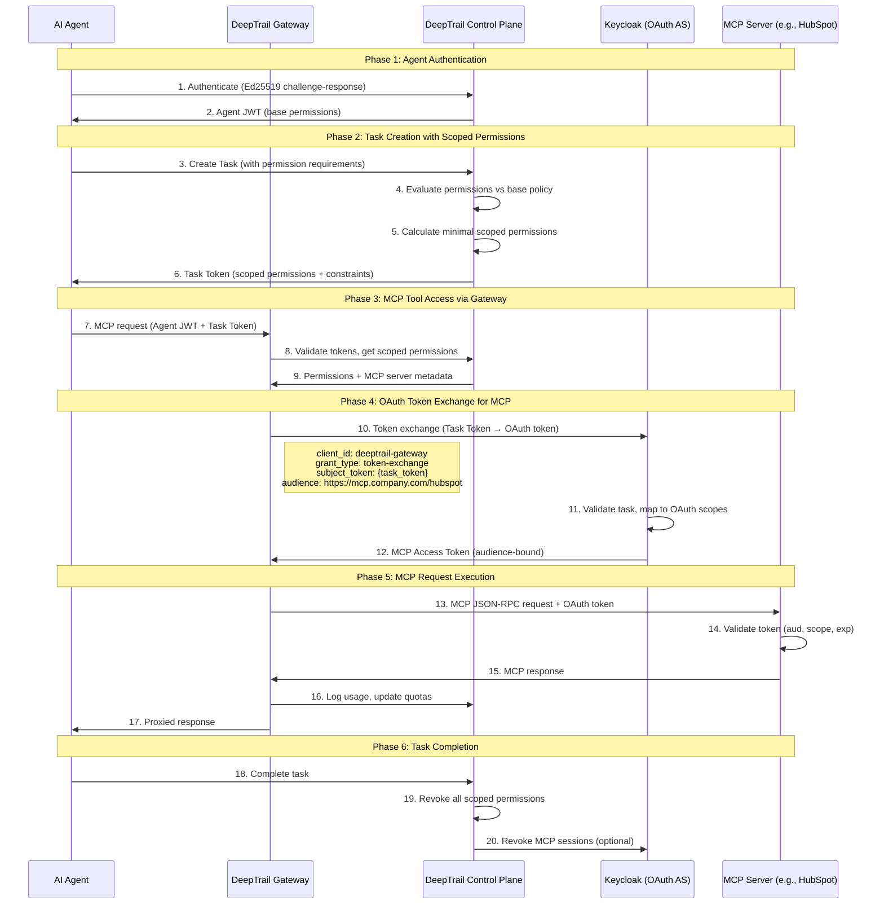

# DeepTrail AI Gateway Evolution: From HTTP Proxy to MCP Governance Platform

> **Design Document** | Version 1.0 | January 2026

---

## Executive Summary

This document captures the strategic design evolution of the DeepTrail AI Gateway from a basic HTTP proxy with policy enforcement to a comprehensive **MCP (Model Context Protocol) Gateway and Governance Platform**. The evolution addresses six key capability areas:

1. **Competitive Analysis**: DeepTrail vs. Alibaba Higress and Solo.io kgateway
2. **Envoy Integration Strategy**: Combining DeepSecure's identity/policy layer with Envoy's high-performance data plane
3. **Per-Task Scoped Permissions**: Dynamic, minimal permissions bound to task lifecycle
4. **Action Control & Enforcement**: Fine-grained control at the gateway layer
5. **Session Hierarchy**: User Session → Agent Session → MCP Session flow
6. **MCP Gateway Transformation**: Converting from HTTP proxy to native MCP gateway and governance layer

---

## Table of Contents

1. [Design Overview & Architecture Tradeoffs](#1-design-overview--architecture-tradeoffs)
2. [Competitive Analysis: DeepTrail vs Higress vs kgateway](#2-competitive-analysis-deeptrail-vs-higress-vs-kgateway)
3. [Envoy Integration Strategy](#3-envoy-integration-strategy)
4. [Per-Task Scoped Permissions](#4-per-task-scoped-permissions)
5. [Action Control & Enforcement](#5-action-control--enforcement)
6. [Session Hierarchy & Flows](#6-session-hierarchy--flows)
7. [MCP Gateway & Governance Layer](#7-mcp-gateway--governance-layer)
8. [Use Cases](#8-use-cases)
9. [Implementation Roadmap](#9-implementation-roadmap)

---

## 1. Design Overview & Architecture Tradeoffs

### 1.1 Why This Evolution Is Needed

AI agents represent a fundamental paradigm shift in software architecture—from passive programs that respond to explicit user commands to **autonomous systems** that can:

- **Plan and execute** multi-step workflows independently
- **Access external resources** (APIs, databases, file systems)
- **Delegate tasks** to other agents or sub-systems
- **Make decisions** that have real-world consequences

Traditional API gateways and even AI gateways like Higress/kgateway treat callers as "services" or "consumers" with static permissions. DeepTrail's evolution recognizes that **AI agents need dynamic, task-scoped permissions** that adapt to what they're doing, not just who they are.

### 1.2 Core Architectural Principles

| Principle | Description | Why It Matters |
|-----------|-------------|----------------|
| **Agent-Native Identity** | Cryptographic Ed25519 identities for agents | Agents are first-class entities, not just API consumers |
| **Per-Task Least Privilege** | Permissions scoped to current task only | Limits blast radius of compromised agents |
| **Zero-Trust for Agents** | Agents never see raw secrets | Secrets are injected at gateway, not held by agents |
| **Monotonic Attenuation** | Delegated permissions can only decrease | Prevents privilege escalation in delegation chains |
| **Session Hierarchy** | User → Agent → MCP session inheritance | Clear trust boundaries and audit trails |
| **Native MCP Protocol** | Gateway acts AS an MCP server | True MCP governance, not just HTTP proxying |

### 1.3 Key Architectural Tradeoffs

| Decision | Tradeoff | Rationale |
|----------|----------|-----------|
| **Envoy as Data Plane** | Adds deployment complexity | Gains production-proven performance, streaming, K8s native features |
| **Keycloak for MCP OAuth** | Additional infrastructure dependency | Standards-compliant MCP authorization, enterprise SSO integration |
| **Session-Based Permissions** | Higher latency per request | Enables dynamic scoping, automatic revocation on task completion |
| **Native MCP Protocol** | Significant development effort | True governance (capability filtering, result inspection) vs HTTP-level only |
| **Split-Key Secrets** | More complex secret management | Secrets never stored whole anywhere; defense in depth |

### 1.4 Capabilities Enabled by This Evolution

```
┌─────────────────────────────────────────────────────────────────────────────────────────┐
│                        CAPABILITIES ENABLED BY EVOLUTION                                  │
├─────────────────────────────────────────────────────────────────────────────────────────┤
│                                                                                          │
│  PHASE 1: Competitive Parity                                                            │
│  ┌────────────────────────────────────────────────────────────────────────────────┐     │
│  │  ✓ Multi-model LLM routing with failover                                       │     │
│  │  ✓ Native streaming (SSE/gRPC)                                                 │     │
│  │  ✓ Kubernetes Gateway API support                                              │     │
│  │  ✓ Wasm plugin extensibility                                                   │     │
│  │  ✓ Production scalability                                                      │     │
│  └────────────────────────────────────────────────────────────────────────────────┘     │
│                                                                                          │
│  PHASE 2: DeepSecure Differentiators (Strengthened)                                     │
│  ┌────────────────────────────────────────────────────────────────────────────────┐     │
│  │  ✓ Cryptographic agent identity at scale                                       │     │
│  │  ✓ Split-key secrets with JIT injection                                        │     │
│  │  ✓ Macaroon-based delegation with attenuation                                  │     │
│  │  ✓ Four-party agent trust model (1st, 2nd-managed, 2nd-integrated, 3rd)       │     │
│  └────────────────────────────────────────────────────────────────────────────────┘     │
│                                                                                          │
│  PHASE 3: Per-Task Governance (New)                                                     │
│  ┌────────────────────────────────────────────────────────────────────────────────┐     │
│  │  ✓ Permission tree with hierarchical inheritance                               │     │
│  │  ✓ Task lifecycle management with automatic revocation                         │     │
│  │  ✓ Constraint-based access (time, volume, data, context)                       │     │
│  │  ✓ Approval workflows for high-risk permissions                                │     │
│  └────────────────────────────────────────────────────────────────────────────────┘     │
│                                                                                          │
│  PHASE 4: MCP Governance Platform (New)                                                 │
│  ┌────────────────────────────────────────────────────────────────────────────────┐     │
│  │  ✓ Native MCP protocol handling                                                │     │
│  │  ✓ Tool/resource visibility filtering per agent                                │     │
│  │  ✓ Parameter validation and sanitization                                       │     │
│  │  ✓ Prompt injection detection                                                  │     │
│  │  ✓ MCP-level audit trail                                                       │     │
│  │  ✓ Multi-server aggregation with unified view                                  │     │
│  └────────────────────────────────────────────────────────────────────────────────┘     │
│                                                                                          │
└─────────────────────────────────────────────────────────────────────────────────────────┘
```

---

## 2. Competitive Analysis: DeepTrail vs Higress vs kgateway

### 2.1 Feature Comparison Matrix

| Capability | DeepTrail (Current) | DeepTrail (Evolved) | Higress | kgateway |
|-----------|---------------------|---------------------|---------|----------|
| **Agent Identity & Cryptographic Keys** | ✅ Strong (Ed25519) | ✅ Strong | ❌ Consumer auth only | ❌ Standard auth |
| **Delegation & Chaining** | ✅ Macaroon-based | ✅ Enhanced | ❌ Not supported | ❌ Not supported |
| **Split-Key Secret Management** | ✅ Shamir's SSS | ✅ Session-aware | ❌ External secrets | ❌ External secrets |
| **Policy Enforcement** | ✅ Domain/method | ✅ Per-task scoped | ✅ Comprehensive | ✅ Comprehensive |
| **Multi-Model LLM Routing** | ❌ Not implemented | ✅ Via Envoy | ✅ Multi-provider fallback | ✅ A/B, canary, failover |
| **Prompt Guards** | ❌ Not implemented | ✅ Via Envoy | ✅ Content inspection | ✅ Strong |
| **Streaming (SSE)** | ⚠️ Basic | ✅ Via Envoy | ✅ True streaming | ✅ Chat streaming |
| **MCP Server Hosting** | ⚠️ Designed only | ✅ Native MCP Gateway | ✅ Via plugins | ✅ MCP federation |
| **MCP Governance** | ❌ Not implemented | ✅ Full governance | ⚠️ Basic auth | ⚠️ Basic auth |
| **Semantic Caching** | ❌ Not implemented | ✅ Via Envoy | ✅ Response caching | ✅ Caching support |
| **Token Rate Limiting** | ❌ Not implemented | ✅ Per-agent quotas | ✅ Built-in | ✅ Per-model limits |
| **Kubernetes Gateway API** | ❌ Docker only | ✅ Via Envoy | ✅ Native | ✅ Native + hybrid |
| **Plugin Extensibility** | ⚠️ Python middleware | ✅ Wasm via Envoy | ✅ Wasm (Go/Rust/JS) | ✅ Envoy filters |
| **Per-Task Least Privilege** | ⚠️ Designed | ✅ Full implementation | ❌ Not supported | ❌ Not supported |

### 2.2 Unique DeepSecure Differentiators

**Neither Higress nor kgateway provides:**

1. **Cryptographic Agent Identity**: They assume callers are services, not autonomous agents with their own cryptographic identity.

2. **Split-Key Secret Architecture**: Secrets are never stored whole anywhere. Other gateways expect secrets from config or external vault.

3. **Macaroon-Based Delegation**: Agent-to-agent delegation with attenuation is not available in competitors.

4. **Per-Task Least Privilege**: Dynamic permission scoping to task context and duration.

5. **Four-Party Trust Model**: Classification of agents into 1st party, 2nd party (managed/integrated), and 3rd party with different enforcement rules.

### 2.3 Where Competitors Excel

| Capability | Gap in DeepTrail | Solution via Envoy Integration |
|-----------|------------------|-------------------------------|
| **Multi-Model Routing** | Single target per request | Envoy's weighted routing, failover |
| **True Streaming** | Basic support | Envoy's native SSE/gRPC |
| **Production Scale** | Python/FastAPI | Envoy's C++ performance |
| **Kubernetes Native** | Docker Compose | Envoy Gateway API |
| **Wasm Plugins** | Python only | Envoy's Wasm support |

### 2.4 Strategic Positioning

```
┌─────────────────────────────────────────────────────────────────────┐
│                     AI GATEWAY MARKET POSITIONING                    │
├─────────────────────────────────────────────────────────────────────┤
│                                                                      │
│  Generic API Gateway ────────────────────────► AI-Native Gateway    │
│        (Kong, NGINX)                              (Higress, kgateway)│
│                                                                      │
│                              │                                       │
│                              │                                       │
│                              ▼                                       │
│                                                                      │
│                    DeepSecure + Envoy                                │
│                    ══════════════════                                │
│                                                                      │
│    "The only AI gateway that treats agents as first-class           │
│     cryptographic identities with zero-trust secret management       │
│     AND native MCP governance"                                       │
│                                                                      │
│    Unique Differentiators:                                           │
│    ✓ Agent identity (not just "caller auth")                        │
│    ✓ Split-key secrets (not just "vault integration")               │
│    ✓ Delegation with attenuation (not just "RBAC")                  │
│    ✓ Per-task least privilege (not just "role-based")               │
│    ✓ Native MCP governance (not just "MCP proxy")                   │
│                                                                      │
│    PLUS all Envoy capabilities:                                      │
│    ✓ Multi-model routing                                            │
│    ✓ True streaming                                                 │
│    ✓ Production scale                                               │
│    ✓ Kubernetes native                                              │
│                                                                      │
└─────────────────────────────────────────────────────────────────────┘
```

---

## 3. Envoy Integration Strategy

### 3.1 The Integration Thesis

DeepSecure and Envoy-based gateways are **complementary, not competitive**:

| Layer | DeepSecure Strength | Envoy Strength |
|-------|---------------------|----------------|
| **Identity & Trust** | ✅ First-class agent identity, delegation | ❌ Generic consumer auth |
| **Policy & Secrets** | ✅ Fine-grained, dynamic, split-key | ⚠️ Static config-based |
| **Traffic & Performance** | ⚠️ Python/FastAPI | ✅ C++ native, battle-tested |
| **Extensibility** | ⚠️ Python middleware | ✅ Wasm plugins (Go/Rust/JS) |
| **AI Features** | ⚠️ Not implemented | ✅ LLM routing, streaming, caching |

**The integration thesis**: Use Envoy as the high-performance **data plane** while DeepSecure serves as the authoritative **Policy Decision Point (PDP)** for AI agent identity, authorization, and secrets.

### 3.2 Integrated Architecture

```
┌─────────────────────────────────────────────────────────────────────────────────┐
│                              AI AGENT ECOSYSTEM                                  │
├─────────────────────────────────────────────────────────────────────────────────┤
│                                                                                  │
│  ┌─────────────┐     ┌─────────────┐     ┌─────────────┐                        │
│  │ Agent A     │     │ Agent B     │     │ Agent C     │    AI Agents           │
│  │ (LangChain) │     │ (CrewAI)    │     │ (Custom)    │                        │
│  └──────┬──────┘     └──────┬──────┘     └──────┬──────┘                        │
│         │                   │                   │                                │
│         └───────────────────┼───────────────────┘                                │
│                             │                                                    │
│                             ▼                                                    │
│  ┌──────────────────────────────────────────────────────────────────────────┐   │
│  │                    ENVOY DATA PLANE (High Performance)                    │   │
│  │  ┌─────────────────────────────────────────────────────────────────────┐ │   │
│  │  │                         ext_authz Filter                             │ │   │
│  │  │  ┌───────────────────────────────────────────────────────────────┐  │ │   │
│  │  │  │ For every request:                                             │  │ │   │
│  │  │  │ 1. Extract agent JWT + request context                         │  │ │   │
│  │  │  │ 2. Call DeepSecure Control Plane → /authorize                  │  │ │   │
│  │  │  │ 3. Receive: allow/deny + injected headers + secrets            │  │ │   │
│  │  │  └───────────────────────────────────────────────────────────────┘  │ │   │
│  │  └─────────────────────────────────────────────────────────────────────┘ │   │
│  │                                                                           │   │
│  │  ┌──────────────┐  ┌──────────────┐  ┌──────────────┐  ┌──────────────┐  │   │
│  │  │ LLM Router   │  │ Streaming    │  │ Rate Limit   │  │ Observability│  │   │
│  │  │ (multi-model)│  │ (SSE/gRPC)   │  │ (token-based)│  │ (Prometheus) │  │   │
│  │  └──────────────┘  └──────────────┘  └──────────────┘  └──────────────┘  │   │
│  └────────────────────────────────────────────┬─────────────────────────────┘   │
│                                               │                                  │
│              ┌────────────────────────────────┼────────────────────────────┐    │
│              │                                │                             │    │
│              ▼                                ▼                             ▼    │
│  ┌──────────────────┐           ┌──────────────────┐           ┌────────────┐   │
│  │ OpenAI API       │           │ Anthropic API    │           │ MCP Server │   │
│  └──────────────────┘           └──────────────────┘           └────────────┘   │
│                                                                                  │
├─────────────────────────────────────────────────────────────────────────────────┤
│                                                                                  │
│  ┌──────────────────────────────────────────────────────────────────────────┐   │
│  │              DEEPSECURE CONTROL PLANE (Identity & Policy Authority)       │   │
│  │                                                                           │   │
│  │  ┌─────────────────┐  ┌─────────────────┐  ┌─────────────────┐           │   │
│  │  │ Agent Registry  │  │ Policy Engine   │  │ Secret Manager  │           │   │
│  │  │ - Ed25519 keys  │  │ - RBAC/ABAC     │  │ - Shamir shares │           │   │
│  │  │ - Attestation   │  │ - Delegation    │  │ - JIT assembly  │           │   │
│  │  │ - Lifecycle     │  │ - Least priv    │  │ - Audit trail   │           │   │
│  │  └─────────────────┘  └─────────────────┘  └─────────────────┘           │   │
│  │                                                                           │   │
│  │  ┌─────────────────┐  ┌─────────────────┐  ┌─────────────────┐           │   │
│  │  │ Audit Service   │  │ Delegation      │  │ Authorization   │           │   │
│  │  │ - All actions   │  │ - Macaroons     │  │ - /authorize    │           │   │
│  │  │ - Compliance    │  │ - TTL + scope   │  │ - Ext authz API │           │   │
│  │  │ - Analytics     │  │ - Attenuation   │  │ - Secret inject │           │   │
│  │  └─────────────────┘  └─────────────────┘  └─────────────────┘           │   │
│  │                                                                           │   │
│  └──────────────────────────────────────────────────────────────────────────┘   │
│                                                                                  │
└─────────────────────────────────────────────────────────────────────────────────┘
```

### 3.3 Capabilities Enabled by Integration

#### Zero-Trust Secret Injection at Scale

```
┌─────────────┐      ┌─────────────┐      ┌─────────────┐      ┌─────────────┐
│   Agent     │      │   Envoy     │      │ DeepSecure  │      │   OpenAI    │
│             │      │   Gateway   │      │ Control     │      │   API       │
└──────┬──────┘      └──────┬──────┘      └──────┬──────┘      └──────┬──────┘
       │                    │                    │                    │
       │ 1. Request with    │                    │                    │
       │    agent JWT       │                    │                    │
       │───────────────────>│                    │                    │
       │                    │                    │                    │
       │                    │ 2. ext_authz call  │                    │
       │                    │    (agent_id,      │                    │
       │                    │     target, method)│                    │
       │                    │───────────────────>│                    │
       │                    │                    │                    │
       │                    │                    │ 3. Policy check    │
       │                    │                    │    + Shamir        │
       │                    │                    │    reassembly      │
       │                    │                    │                    │
       │                    │ 4. Response:       │                    │
       │                    │    allow=true      │                    │
       │                    │    inject_headers: │                    │
       │                    │      Authorization:│                    │
       │                    │        Bearer sk-* │                    │
       │                    │<───────────────────│                    │
       │                    │                    │                    │
       │                    │ 5. Forward with    │                    │
       │                    │    injected secret │                    │
       │                    │────────────────────────────────────────>│
       │                    │                    │                    │
       │                    │ 6. LLM Response    │                    │
       │                    │    (streaming)     │                    │
       │<───────────────────────────────────────────────────────────────
       │                    │                    │                    │
```

**Benefits:**
- Secrets never touch the agent - injected at the gateway edge
- Sub-millisecond enforcement - Envoy's ext_authz is optimized for this
- Cacheable decisions - Envoy can cache authz decisions for identical requests
- Audit everything - DeepSecure logs every secret access with agent context

#### Identity-Aware Prompt Guards

```yaml
# Different prompt guards per agent trust level
prompt_guards:
  - agent_pattern: "agent-internal-*"
    trust_level: high
    guards:
      - type: "pii_detection"
        action: "warn_and_log"  # Log but allow
        
  - agent_pattern: "agent-external-*"
    trust_level: low
    guards:
      - type: "pii_detection"
        action: "block"  # Hard block
      - type: "prompt_injection"
        action: "block"
      - type: "jailbreak_detection"
        action: "block"
```

### 3.4 Why This Is a Good Strategy

| Advantage | Explanation |
|-----------|-------------|
| **Don't Reinvent the Wheel** | Envoy handles HTTP/2, gRPC, WebSocket, TLS, load balancing - mature, production-proven |
| **Focus on Differentiators** | 100% focus on agent identity, delegation, split-key secrets |
| **Faster Time to Market** | Multi-model routing: 1-2 weeks config vs 2-3 months build |
| **Enterprise Credibility** | "DeepSecure provides AI-native identity and policy on top of Envoy, the industry standard proxy" |
| **Community & Ecosystem** | Leverage Envoy's plugin ecosystem, Kubernetes operators, observability |

---

## 4. Per-Task Scoped Permissions

### 4.1 Core Principle

> **Per-Task Least Privilege**: An agent should receive only the permissions required for its current task, scoped to the specific resources needed, valid only for the duration of that task, and automatically revoked upon completion.

### 4.2 Task Definition Schema

```yaml
task:
  id: "task-sales-summary-q3-2026"
  name: "Summarize Q3 Sales Performance"
  agent_id: "agent-sales-assistant-001"
  
  intent:
    description: "Generate Q3 sales summary from CRM and documentation"
    output_type: "report"
    output_destination: "notion://pages/sales-reports/q3-2026"
  
  required_permissions:
    # LLM access
    - permission: "urn:deepsecure:service:openai:chat_completions"
      constraints:
        model: "gpt-4"
        max_tokens: 8000
      justification: "Generate natural language summary"
    
    # HubSpot CRM access
    - permission: "urn:deepsecure:mcp:hubspot:contacts:read"
      constraints:
        filter: "created_at >= 2026-07-01"
      justification: "Get Q3 customer data"
    
    # Notion documentation
    - permission: "urn:deepsecure:mcp:notion:pages:read"
      constraints:
        workspace: "sales-docs"
      justification: "Access sales playbooks"
  
  deadline: "2026-01-15T12:00:00Z"
  
  on_completion:
    revoke_permissions: true
    revoke_mcp_sessions: true
    generate_audit_report: true
```

### 4.3 Permission Scoping Pipeline

```
┌─────────────────────────────────────────────────────────────────────────────────────────┐
│                           PERMISSION SCOPING PIPELINE                                    │
├─────────────────────────────────────────────────────────────────────────────────────────┤
│                                                                                          │
│  ┌─────────────────────────────────────────────────────────────────────────────────┐    │
│  │  STEP 1: Permission Request                                                      │    │
│  │                                                                                   │    │
│  │  Agent: "I need to read HubSpot contacts to summarize Q3 sales"                  │    │
│  │                                                                                   │    │
│  │  Requested: urn:deepsecure:mcp:hubspot:contacts:read                             │    │
│  │  Constraints: { filter: "created_at >= 2026-07-01" }                             │    │
│  └─────────────────────────────────────────────────────────────────────────────────┘    │
│                                      │                                                   │
│                                      ▼                                                   │
│  ┌─────────────────────────────────────────────────────────────────────────────────┐    │
│  │  STEP 2: Base Policy Check                                                        │    │
│  │                                                                                   │    │
│  │  Agent's Standing Permissions:                                                    │    │
│  │  ├── urn:deepsecure:mcp:hubspot:* (READ)                                         │    │
│  │  ├── urn:deepsecure:mcp:notion:* (READ, WRITE)                                   │    │
│  │  └── urn:deepsecure:service:openai:* (max_tokens: 10000)                         │    │
│  │                                                                                   │    │
│  │  Result: REQUEST IS WITHIN BASE PERMISSIONS ✓                                    │    │
│  └─────────────────────────────────────────────────────────────────────────────────┘    │
│                                      │                                                   │
│                                      ▼                                                   │
│  ┌─────────────────────────────────────────────────────────────────────────────────┐    │
│  │  STEP 3: Party-Type Enforcement                                                   │    │
│  │                                                                                   │    │
│  │  Agent Party Type: first_party                                                   │    │
│  │  ├── Trust Level: high                                                           │    │
│  │  ├── Delegation Allowed: true                                                    │    │
│  │  ├── Secret Access: direct                                                       │    │
│  │  └── Audit Level: standard                                                       │    │
│  │                                                                                   │    │
│  │  Result: PARTY-TYPE ALLOWS OPERATION ✓                                           │    │
│  └─────────────────────────────────────────────────────────────────────────────────┘    │
│                                      │                                                   │
│                                      ▼                                                   │
│  ┌─────────────────────────────────────────────────────────────────────────────────┐    │
│  │  STEP 4: Constraint Intersection                                                  │    │
│  │                                                                                   │    │
│  │  Base Constraints:    { any HubSpot contacts }                                   │    │
│  │  Requested Constraints: { created_at >= 2026-07-01 }                             │    │
│  │                                                                                   │    │
│  │  Applied Constraints: { created_at >= 2026-07-01 }  ← More restrictive wins     │    │
│  └─────────────────────────────────────────────────────────────────────────────────┘    │
│                                      │                                                   │
│                                      ▼                                                   │
│  ┌─────────────────────────────────────────────────────────────────────────────────┐    │
│  │  STEP 5: Scoped Permission Issued                                                │    │
│  │                                                                                   │    │
│  │  Scoped Permission:                                                               │    │
│  │  ├── permission_urn: urn:deepsecure:mcp:hubspot:contacts:read                    │    │
│  │  ├── task_id: task-sales-summary-q3-2026                                         │    │
│  │  ├── constraints: { filter: "created_at >= 2026-07-01" }                         │    │
│  │  ├── valid_until: 2026-01-15T12:00:00Z                                           │    │
│  │  └── max_usage: 100 requests                                                      │    │
│  └─────────────────────────────────────────────────────────────────────────────────┘    │
│                                                                                          │
└─────────────────────────────────────────────────────────────────────────────────────────┘
```

### 4.4 Control Plane Components for Per-Task Permissions

#### New Services Required

| Service | Purpose | Key Responsibilities |
|---------|---------|---------------------|
| **Permission Tree Service** | Manage hierarchical permission definitions | CRUD, inheritance resolution, constraint validation |
| **Task Service** | Manage task lifecycle | Creation, approval, completion, timeout handling |
| **Dynamic Scoping Engine** | Evaluate and minimize permissions | Policy intersection, constraint application |
| **Party Type Registry** | Classify agents | Enforce party-specific rules |
| **Capability Token Service** | Issue tokens for 2nd/3rd party | Cryptographic binding, validation |

#### New Database Tables

```sql
-- Permission Tree
CREATE TABLE permission_nodes (
    id UUID PRIMARY KEY,
    parent_id UUID REFERENCES permission_nodes(id),
    urn VARCHAR(512) UNIQUE NOT NULL,
    name VARCHAR(256) NOT NULL,
    risk_level VARCHAR(20) DEFAULT 'medium',
    requires_approval BOOLEAN DEFAULT FALSE,
    applicable_constraints JSONB DEFAULT '[]'
);

-- Tasks
CREATE TABLE tasks (
    id UUID PRIMARY KEY,
    agent_id VARCHAR(256) NOT NULL,
    name VARCHAR(512) NOT NULL,
    status VARCHAR(50) DEFAULT 'pending',
    deadline TIMESTAMP,
    initiated_by VARCHAR(256) NOT NULL
);

-- Scoped Permissions (per-task grants)
CREATE TABLE scoped_permissions (
    id UUID PRIMARY KEY,
    task_id UUID REFERENCES tasks(id) ON DELETE CASCADE,
    permission_urn VARCHAR(512) NOT NULL,
    constraints JSONB DEFAULT '{}',
    valid_until TIMESTAMP NOT NULL,
    usage_count INTEGER DEFAULT 0,
    max_usage INTEGER,
    revoked BOOLEAN DEFAULT FALSE
);
```

---

## 5. Action Control & Enforcement

### 5.1 Layers of Action Control

```
┌─────────────────────────────────────────────────────────────────────────────────────────┐
│                           ACTION CONTROL LAYERS                                          │
├─────────────────────────────────────────────────────────────────────────────────────────┤
│                                                                                          │
│  LAYER 1: HTTP Level (Basic)                                                            │
│  ┌────────────────────────────────────────────────────────────────────────────────┐     │
│  │  • Method: GET, POST, PUT, DELETE                                               │     │
│  │  • Path: /v1/chat/completions, /api/contacts                                    │     │
│  │  • Domain: api.openai.com, api.hubspot.com                                      │     │
│  └────────────────────────────────────────────────────────────────────────────────┘     │
│                                                                                          │
│  LAYER 2: Request Content Level (Intermediate)                                          │
│  ┌────────────────────────────────────────────────────────────────────────────────┐     │
│  │  • Model selection: gpt-4 vs gpt-3.5-turbo                                      │     │
│  │  • Max tokens: limit output size                                                 │     │
│  │  • Query parameters: filter, limit, offset                                       │     │
│  └────────────────────────────────────────────────────────────────────────────────┘     │
│                                                                                          │
│  LAYER 3: MCP Protocol Level (Advanced)                                                 │
│  ┌────────────────────────────────────────────────────────────────────────────────┐     │
│  │  • Tool visibility: agent only sees allowed tools                               │     │
│  │  • Tool call validation: parameter constraints                                   │     │
│  │  • Resource access: specific URIs only                                           │     │
│  │  • Result filtering: mask/remove sensitive fields                                │     │
│  └────────────────────────────────────────────────────────────────────────────────┘     │
│                                                                                          │
│  LAYER 4: Semantic Level (Future)                                                       │
│  ┌────────────────────────────────────────────────────────────────────────────────┐     │
│  │  • Prompt injection detection                                                    │     │
│  │  • PII detection and masking                                                     │     │
│  │  • Intent classification                                                         │     │
│  │  • Content policy enforcement                                                    │     │
│  └────────────────────────────────────────────────────────────────────────────────┘     │
│                                                                                          │
└─────────────────────────────────────────────────────────────────────────────────────────┘
```

### 5.2 Gateway Middleware Stack

```python
# deeptrail-gateway/app/main.py (evolved)

# Core PEP: Essential middleware stack
# Order matters - outermost middleware listed first

# 1. Authentication
app.add_middleware(JWTValidationMiddleware, control_plane_url=config.control_plane_url)

# 2. Task Context (NEW)
app.add_middleware(TaskContextMiddleware, control_plane_url=config.control_plane_url)

# 3. Party-Aware Enforcement (NEW)
app.add_middleware(PartyAwareEnforcementMiddleware, control_plane_url=config.control_plane_url)

# 4. MCP Session Management (NEW)
app.add_middleware(MCPSessionMiddleware, control_plane_url=config.control_plane_url)

# 5. Scoped Permission Validation (NEW)
app.add_middleware(ScopedPermissionValidatorMiddleware, control_plane_url=config.control_plane_url)

# 6. OAuth Token Exchange for MCP (NEW)
app.add_middleware(
    OAuthTokenExchangeMiddleware,
    keycloak_url=config.keycloak_url,
    keycloak_realm=config.keycloak_realm,
    client_id=config.keycloak_client_id,
    client_secret=config.keycloak_client_secret
)

# 7. MCP Action Control (NEW)
app.add_middleware(MCPActionControlMiddleware, control_plane_url=config.control_plane_url)

# 8. Policy Enforcement (existing, enhanced)
app.add_middleware(PolicyEnforcementMiddleware, enforcement_mode=config.policy.enforcement_mode)

# 9. Secret Injection (existing, enhanced for MCP OAuth)
app.add_middleware(SecretInjectionMiddleware, control_plane_url=config.control_plane_url)

# 10. Usage Tracking (NEW)
app.add_middleware(UsageTrackingMiddleware, redis_url=config.redis_url)
```

### 5.3 Constraint Types Supported

| Constraint Type | Examples | Enforcement Point |
|-----------------|----------|-------------------|
| **Temporal** | `valid_from`, `valid_until`, `max_duration` | Task Context Middleware |
| **Volume** | `max_usage`, `rate_limit`, `token_budget` | Usage Tracking Middleware |
| **Data** | `allowed_fields`, `masked_fields`, `blocked_patterns` | Response Filtering |
| **Contextual** | `allowed_models`, `allowed_tools`, `parameter_constraints` | Action Control Middleware |
| **Approval** | `requires_human_approval`, `approval_threshold` | Task Service (Control Plane) |

---

## 6. Session Hierarchy & Flows

### 6.1 Three-Layer Session Model

```
┌─────────────────────────────────────────────────────────────────────────────┐
│                          TOKEN/SESSION HIERARCHY                             │
├─────────────────────────────────────────────────────────────────────────────┤
│                                                                              │
│  LAYER 1: AGENT SESSION (Standing Permissions)                              │
│  ┌─────────────────────────────────────────────────────────────────────┐    │
│  │  Agent JWT Token (issued by DeepTrail Control Plane)                 │    │
│  │                                                                      │    │
│  │  • agent_id: "agent-sales-assistant-001"                            │    │
│  │  • party_type: "first_party"                                        │    │
│  │  • base_permissions: [...] (standing permissions)                   │    │
│  │  • delegation_chain: [...] (if delegated)                           │    │
│  │  • expires_at: "2026-01-16T12:00:00Z"                               │    │
│  │                                                                      │    │
│  │  Lifetime: Hours to days (configurable)                             │    │
│  └─────────────────────────────────────────────────────────────────────┘    │
│                              │                                               │
│                              ▼                                               │
│  LAYER 2: TASK SESSION (Scoped Permissions)                                 │
│  ┌─────────────────────────────────────────────────────────────────────┐    │
│  │  Task Token (issued by DeepTrail Control Plane)                      │    │
│  │                                                                      │    │
│  │  • task_id: "task-summarize-sales-q3"                               │    │
│  │  • agent_id: "agent-sales-assistant-001"                            │    │
│  │  • scoped_permissions: [                                            │    │
│  │      "urn:deepsecure:mcp:hubspot:contacts:read",                    │    │
│  │      "urn:deepsecure:mcp:notion:pages:read",                        │    │
│  │      "urn:deepsecure:service:openai:chat_completions"               │    │
│  │    ]                                                                │    │
│  │  • constraints: { rate_limit: 100/min, max_tokens: 4000 }           │    │
│  │  • purpose: "Summarize Q3 sales from CRM and documentation"        │    │
│  │  • expires_at: "2026-01-15T11:00:00Z" (task deadline)              │    │
│  │                                                                      │    │
│  │  Lifetime: Minutes to hours (task duration)                         │    │
│  └─────────────────────────────────────────────────────────────────────┘    │
│                              │                                               │
│                              ▼                                               │
│  LAYER 3: MCP SESSION (per tool/resource server)                            │
│  ┌─────────────────────────────────────────────────────────────────────┐    │
│  │  MCP OAuth Access Token (issued by Keycloak)                         │    │
│  │                                                                      │    │
│  │  • iss: "https://auth.company.com/realms/mcp"                       │    │
│  │  • sub: "agent-sales-assistant-001"                                 │    │
│  │  • aud: "https://mcp.company.com/hubspot-server"                    │    │
│  │  • scope: "mcp:tools mcp:resources hubspot:contacts:read"           │    │
│  │  • task_id: "task-summarize-sales-q3" (custom claim)                │    │
│  │  • exp: 1736938800 (short-lived, 5-15 minutes)                      │    │
│  │                                                                      │    │
│  │  Lifetime: Minutes (MCP spec requires short-lived tokens)           │    │
│  └─────────────────────────────────────────────────────────────────────┘    │
│                                                                              │
│  KEY PRINCIPLE: Each layer is scoped ≤ its parent layer                     │
│  (Monotonic Attenuation)                                                    │
│                                                                              │
└─────────────────────────────────────────────────────────────────────────────┘
```

### 6.2 End-to-End Authorization Flow



### 6.3 Authorization Server Roles

| Component | Role | Protocol | Responsibility |
|-----------|------|----------|----------------|
| **DeepTrail Control Plane** | Agent Authorization Server | Custom JWT | Issues Agent JWTs, Task Tokens, manages agent identity & policies |
| **Keycloak** | MCP Authorization Server | OAuth 2.0/2.1 | Issues OAuth access tokens for MCP servers, per RFC 8414/7591/8707 |
| **DeepTrail Gateway** | Policy Enforcement Point | HTTP Proxy + MCP | Enforces all policies, token exchange, request proxying |

---

## 7. MCP Gateway & Governance Layer

### 7.1 Current State vs True MCP Gateway

The current design has DeepTrail Gateway acting as an **HTTP proxy with MCP-aware middleware** — it routes requests TO MCP servers but does **not** function as a true MCP Gateway.

```
┌─────────────────────────────────────────────────────────────────────────────────────────┐
│              CURRENT DESIGN vs TRUE MCP GATEWAY/GOVERNANCE                               │
├─────────────────────────────────────────────────────────────────────────────────────────┤
│                                                                                          │
│  WHAT THE CURRENT DESIGN DOES:                                                          │
│  ┌────────────────────────────────────────────────────────────────────────────────┐     │
│  │  ✓ Proxies HTTP requests to MCP servers                                        │     │
│  │  ✓ Validates agent JWT and task tokens                                         │     │
│  │  ✓ Exchanges tokens for OAuth (via Keycloak)                                   │     │
│  │  ✓ Basic MCP action control (tool name matching)                               │     │
│  │  ✓ Injects secrets into requests                                               │     │
│  │  ⚠ Treats MCP as "just another HTTP API"                                       │     │
│  └────────────────────────────────────────────────────────────────────────────────┘     │
│                                                                                          │
│  WHAT A TRUE MCP GATEWAY MUST DO (MISSING):                                             │
│  ┌────────────────────────────────────────────────────────────────────────────────┐     │
│  │  ✗ Native MCP protocol handling (JSON-RPC lifecycle)                           │     │
│  │  ✗ MCP session management (initialize, capability negotiation)                 │     │
│  │  ✗ MCP server aggregation (single endpoint → multiple servers)                 │     │
│  │  ✗ Dynamic tool/resource/prompt discovery with policy filtering                │     │
│  │  ✗ MCP-native authorization flow (RFC 9728 discovery)                          │     │
│  │  ✗ Policy-based capability filtering (hide unauthorized tools)                 │     │
│  │  ✗ MCP message transformation and enrichment                                   │     │
│  │  ✗ Streaming support for MCP (SSE, notifications)                              │     │
│  └────────────────────────────────────────────────────────────────────────────────┘     │
│                                                                                          │
│  WHAT MCP GOVERNANCE LAYER MUST DO (MISSING):                                           │
│  ┌────────────────────────────────────────────────────────────────────────────────┐     │
│  │  ✗ Per-agent tool visibility (agent sees only allowed tools)                   │     │
│  │  ✗ Parameter validation and sanitization                                       │     │
│  │  ✗ Output inspection and filtering                                             │     │
│  │  ✗ Prompt injection detection                                                  │     │
│  │  ✗ Cost/token attribution per MCP call                                         │     │
│  │  ✗ MCP-level audit trail (not just HTTP)                                       │     │
│  │  ✗ Real-time policy updates without reconnection                               │     │
│  │  ✗ Cross-server tool orchestration policies                                    │     │
│  └────────────────────────────────────────────────────────────────────────────────┘     │
│                                                                                          │
└─────────────────────────────────────────────────────────────────────────────────────────┘
```

### 7.2 True MCP Gateway Architecture

```
┌─────────────────────────────────────────────────────────────────────────────────────────┐
│                          TRUE MCP GATEWAY ARCHITECTURE                                   │
├─────────────────────────────────────────────────────────────────────────────────────────┤
│                                                                                          │
│  ┌───────────────────────────────────────────────────────────────────────────────────┐  │
│  │                                 AI AGENT                                           │  │
│  │                                                                                    │  │
│  │  Agent sees DeepTrail Gateway AS a single MCP Server                              │  │
│  │  (not as a proxy to multiple servers)                                             │  │
│  │                                                                                    │  │
│  └────────────────────────────────────────┬──────────────────────────────────────────┘  │
│                                           │                                              │
│                                           │ MCP Protocol (JSON-RPC over HTTP/SSE)       │
│                                           ▼                                              │
│  ┌───────────────────────────────────────────────────────────────────────────────────┐  │
│  │                      DEEPTRAIL MCP GATEWAY (Virtual MCP Server)                    │  │
│  │                                                                                    │  │
│  │  The Gateway ACTS AS an MCP Server to agents:                                     │  │
│  │                                                                                    │  │
│  │  ┌──────────────────────────────────────────────────────────────────────────────┐ │  │
│  │  │  MCP PROTOCOL LAYER                                                           │ │  │
│  │  │                                                                               │ │  │
│  │  │  • Handles initialize/initialized handshake                                   │ │  │
│  │  │  • Manages MCP sessions per agent                                             │ │  │
│  │  │  • Aggregates capabilities from backend servers                               │ │  │
│  │  │  • Responds to tools/list, resources/list, prompts/list                      │ │  │
│  │  │  • Routes tools/call to appropriate backend server                            │ │  │
│  │  │  • Handles notifications and SSE streaming                                    │ │  │
│  │  └──────────────────────────────────────────────────────────────────────────────┘ │  │
│  │                                                                                    │  │
│  │  ┌──────────────────────────────────────────────────────────────────────────────┐ │  │
│  │  │  MCP GOVERNANCE LAYER                                                         │ │  │
│  │  │                                                                               │ │  │
│  │  │  • Filters tools/list response based on agent permissions                     │ │  │
│  │  │  • Validates tool call parameters against constraints                         │ │  │
│  │  │  • Inspects and filters tool call results                                     │ │  │
│  │  │  • Detects prompt injection in tool inputs/outputs                            │ │  │
│  │  │  • Enforces rate limits per tool/resource                                     │ │  │
│  │  │  • Generates MCP-level audit events                                           │ │  │
│  │  └──────────────────────────────────────────────────────────────────────────────┘ │  │
│  │                                                                                    │  │
│  │  ┌──────────────────────────────────────────────────────────────────────────────┐ │  │
│  │  │  MCP AUTHORIZATION LAYER                                                      │ │  │
│  │  │                                                                               │ │  │
│  │  │  • Implements MCP Authorization spec (RFC 9728 metadata)                      │ │  │
│  │  │  • Exposes /.well-known/oauth-protected-resource                              │ │  │
│  │  │  • Integrates with Keycloak for token issuance                                │ │  │
│  │  │  • Validates incoming OAuth tokens                                             │ │  │
│  │  │  • Maps OAuth scopes to MCP capabilities                                       │ │  │
│  │  └──────────────────────────────────────────────────────────────────────────────┘ │  │
│  │                                                                                    │  │
│  └────────────────────────────────────────┬──────────────────────────────────────────┘  │
│                                           │                                              │
│              ┌────────────────────────────┼────────────────────────────┐                │
│              │                            │                            │                │
│              ▼                            ▼                            ▼                │
│  ┌────────────────────┐    ┌────────────────────┐    ┌────────────────────┐            │
│  │  HubSpot MCP       │    │  Notion MCP        │    │  Google Drive      │            │
│  │  Server (Backend)  │    │  Server (Backend)  │    │  MCP Server        │            │
│  │                    │    │                    │    │                    │            │
│  │  • Real tools      │    │  • Real tools      │    │  • Real tools      │            │
│  │  • Real resources  │    │  • Real resources  │    │  • Real resources  │            │
│  └────────────────────┘    └────────────────────┘    └────────────────────┘            │
│                                                                                          │
└─────────────────────────────────────────────────────────────────────────────────────────┘
```

### 7.3 New MCP Gateway Components

#### MCP Protocol Handler

```python
# NEW: deeptrail-gateway/app/mcp/protocol_handler.py

class MCPProtocolHandler:
    """
    Native MCP protocol handler.
    
    The gateway acts AS an MCP Server, aggregating multiple backend servers
    and applying governance policies.
    """
    
    handlers = {
        "initialize": _handle_initialize,
        "tools/list": _handle_tools_list,
        "tools/call": _handle_tools_call,
        "resources/list": _handle_resources_list,
        "resources/read": _handle_resources_read,
        "prompts/list": _handle_prompts_list,
        "prompts/get": _handle_prompts_get,
        "ping": _handle_ping,
    }
    
    async def _handle_tools_list(self, message, agent_context):
        """
        Returns aggregated tools from all backend servers,
        filtered by agent permissions.
        """
        # Get all tools from backend servers
        all_tools = await self.capability_aggregator.get_all_tools()
        
        # GOVERNANCE: Filter to only show tools agent can access
        visible_tools = await self.governance.filter_tools(
            tools=all_tools,
            agent_context=agent_context
        )
        
        return {"tools": visible_tools}
    
    async def _handle_tools_call(self, message, agent_context):
        """
        Handle tools/call with full governance:
        1. Validate tool access permission
        2. Validate parameters against constraints
        3. Check for prompt injection
        4. Route to backend
        5. Filter response
        6. Audit
        """
        # ... implementation
```

#### MCP Governance Engine

```python
# NEW: deeptrail-gateway/app/mcp/governance_engine.py

class MCPGovernanceEngine:
    """
    MCP Governance Engine - enforces policies on MCP operations.
    
    Responsibilities:
    1. Filter capabilities based on agent permissions
    2. Validate tool/resource access
    3. Validate parameters against constraints
    4. Detect and prevent prompt injection
    5. Filter sensitive data from responses
    6. Generate audit events
    """
    
    async def filter_tools(self, tools, agent_context):
        """
        Filter tools list to only include tools agent can access.
        
        This is critical for governance - agents should only SEE tools
        they're allowed to use, preventing enumeration attacks.
        """
        # ...
    
    async def sanitize_arguments(self, tool_name, arguments):
        """
        Sanitize tool arguments to prevent prompt injection.
        """
        # ...
    
    async def filter_tool_result(self, tool_name, result, agent_context):
        """
        Filter sensitive data from tool results.
        """
        # ...
```

#### Capability Aggregator

```python
# NEW: deeptrail-gateway/app/mcp/capability_aggregator.py

class CapabilityAggregator:
    """
    Aggregates tools, resources, and prompts from multiple backend MCP servers.
    
    Maintains a unified view that the gateway presents to agents.
    Tools are prefixed with server name: "hubspot.get_contacts"
    """
    
    async def get_all_tools(self):
        """Get all tools from all registered backend servers."""
        # ...
    
    async def get_all_resources(self):
        """Get all resources from all backend servers."""
        # ...
```

---

## 8. Use Cases

### 8.1 AI GTM/SDR Agent - Delegated Permission Scenario

This use case demonstrates how a human user delegates specific permissions to an AI GTM/SDR (Go-To-Market/Sales Development Representative) agent for automated outreach.

#### Scenario Overview

**Sarah** (Sales Manager) wants to use an **AI SDR Agent** to:
1. Research leads from HubSpot
2. Generate personalized outreach emails using GPT-4
3. Schedule follow-up tasks in her calendar
4. Log activities back to HubSpot

Sarah has full access to HubSpot, Google Calendar, and GPT-4. She wants to delegate **only what the agent needs** for this specific task.

#### End-to-End Flow

```
┌─────────────────────────────────────────────────────────────────────────────────────────┐
│              AI GTM/SDR AGENT - DELEGATED PERMISSION FLOW                                │
├─────────────────────────────────────────────────────────────────────────────────────────┤
│                                                                                          │
│  STEP 1: Sarah's User Session                                                           │
│  ┌────────────────────────────────────────────────────────────────────────────────┐     │
│  │  Sarah authenticates via SSO (Okta/Azure AD)                                    │     │
│  │                                                                                  │     │
│  │  User Session Token:                                                             │     │
│  │  ├── user_id: "sarah@company.com"                                               │     │
│  │  ├── permissions: [                                                              │     │
│  │  │     "hubspot:*:*",                                                           │     │
│  │  │     "gcal:*:*",                                                              │     │
│  │  │     "openai:*:*"                                                             │     │
│  │  │   ]                                                                           │     │
│  │  └── delegate_allowed: true                                                      │     │
│  └────────────────────────────────────────────────────────────────────────────────┘     │
│                                      │                                                   │
│                                      ▼                                                   │
│  STEP 2: Sarah Delegates to AI SDR Agent                                                │
│  ┌────────────────────────────────────────────────────────────────────────────────┐     │
│  │  Via DeepTrail UI/API, Sarah creates a delegation:                              │     │
│  │                                                                                  │     │
│  │  Delegation Request:                                                             │     │
│  │  ├── delegate_to: "agent-sdr-outreach-001"                                      │     │
│  │  ├── purpose: "Q1 2026 Lead Outreach Campaign"                                  │     │
│  │  ├── permissions: [                                                              │     │
│  │  │     "hubspot:contacts:read" (with filter: lead_status = 'new')              │     │
│  │  │     "hubspot:contacts:update" (fields: ['last_contacted', 'notes'])         │     │
│  │  │     "gcal:events:create" (duration: max 30min)                               │     │
│  │  │     "openai:chat:completions" (model: gpt-4, max_tokens: 1000)              │     │
│  │  │   ]                                                                           │     │
│  │  ├── ttl: "7 days"                                                               │     │
│  │  └── max_actions_per_day: 100                                                    │     │
│  │                                                                                  │     │
│  │  Control Plane validates:                                                        │     │
│  │  ✓ Sarah has these permissions to delegate                                      │     │
│  │  ✓ Delegated permissions ≤ Sarah's permissions (attenuation)                   │     │
│  │  ✓ Agent exists and is active                                                   │     │
│  │                                                                                  │     │
│  │  Result: Macaroon-based Delegation Token issued                                  │     │
│  └────────────────────────────────────────────────────────────────────────────────┘     │
│                                      │                                                   │
│                                      ▼                                                   │
│  STEP 3: AI SDR Agent Creates Task Session                                              │
│  ┌────────────────────────────────────────────────────────────────────────────────┐     │
│  │  Agent creates a task for the first lead:                                       │     │
│  │                                                                                  │     │
│  │  Task Definition:                                                                │     │
│  │  ├── task_id: "task-outreach-lead-12345"                                        │     │
│  │  ├── name: "Personalized outreach to John Smith at Acme Corp"                   │     │
│  │  ├── required_permissions: [                                                     │     │
│  │  │     "hubspot:contacts:read" (id: 12345),                                     │     │
│  │  │     "openai:chat:completions" (max_tokens: 500),                             │     │
│  │  │     "gcal:events:create" (max 1 event)                                       │     │
│  │  │   ]                                                                           │     │
│  │  └── deadline: "2026-01-15T18:00:00Z"                                           │     │
│  │                                                                                  │     │
│  │  Scoping Engine evaluates:                                                       │     │
│  │  ✓ Requested permissions within delegation scope                                │     │
│  │  ✓ Constraints applied (single contact, limited tokens)                         │     │
│  │                                                                                  │     │
│  │  Result: Task Token with scoped permissions                                      │     │
│  └────────────────────────────────────────────────────────────────────────────────┘     │
│                                      │                                                   │
│                                      ▼                                                   │
│  STEP 4: MCP Tool Calls via Gateway                                                     │
│  ┌────────────────────────────────────────────────────────────────────────────────┐     │
│  │  Agent makes MCP tool calls, routed through DeepTrail Gateway:                  │     │
│  │                                                                                  │     │
│  │  CALL 1: hubspot.get_contact(id=12345)                                          │     │
│  │  ├── Gateway validates: task has hubspot:contacts:read for id=12345 ✓          │     │
│  │  ├── Token exchange: Task Token → HubSpot OAuth token                           │     │
│  │  ├── Gateway calls HubSpot MCP server                                           │     │
│  │  └── Result: Contact data (filtered per data constraints)                        │     │
│  │                                                                                  │     │
│  │  CALL 2: openai.chat_completions(prompt="Write personalized email...")          │     │
│  │  ├── Gateway validates: task has openai:chat:completions ✓                      │     │
│  │  ├── Prompt guard: no PII in output, no jailbreak patterns ✓                    │     │
│  │  ├── Secret injection: OpenAI API key injected                                  │     │
│  │  └── Result: Generated email content                                             │     │
│  │                                                                                  │     │
│  │  CALL 3: gcal.create_event(title="Follow-up: John Smith", duration=30min)      │     │
│  │  ├── Gateway validates: task has gcal:events:create, max 1 event ✓             │     │
│  │  ├── Token exchange: Task Token → Google OAuth token                            │     │
│  │  └── Result: Calendar event created                                              │     │
│  │                                                                                  │     │
│  │  CALL 4: hubspot.update_contact(id=12345, notes="Outreach email sent")         │     │
│  │  ├── Gateway validates: task has hubspot:contacts:update for fields ✓           │     │
│  │  └── Result: Contact updated                                                     │     │
│  └────────────────────────────────────────────────────────────────────────────────┘     │
│                                      │                                                   │
│                                      ▼                                                   │
│  STEP 5: Task Completion & Permission Revocation                                        │
│  ┌────────────────────────────────────────────────────────────────────────────────┐     │
│  │  Agent marks task complete:                                                      │     │
│  │                                                                                  │     │
│  │  POST /tasks/task-outreach-lead-12345/complete                                  │     │
│  │  ├── result: { email_sent: true, meeting_scheduled: true }                      │     │
│  │                                                                                  │     │
│  │  Control Plane automatically:                                                    │     │
│  │  ├── Revokes all scoped permissions for this task                               │     │
│  │  ├── Revokes MCP sessions (HubSpot, GCal OAuth tokens)                          │     │
│  │  ├── Generates audit report                                                      │     │
│  │  └── Updates usage counters (99 actions remaining today)                        │     │
│  │                                                                                  │     │
│  │  Agent can no longer access contact 12345 or create events                       │     │
│  └────────────────────────────────────────────────────────────────────────────────┘     │
│                                      │                                                   │
│                                      ▼                                                   │
│  STEP 6: Audit Trail                                                                    │
│  ┌────────────────────────────────────────────────────────────────────────────────┐     │
│  │  Sarah can view complete audit trail in DeepTrail UI:                           │     │
│  │                                                                                  │     │
│  │  Audit Log:                                                                       │     │
│  │  ├── 10:00:01 - Delegation created by sarah@company.com                         │     │
│  │  ├── 10:15:23 - Task created: task-outreach-lead-12345                          │     │
│  │  ├── 10:15:24 - MCP call: hubspot.get_contact(12345) → success                  │     │
│  │  ├── 10:15:26 - MCP call: openai.chat_completions → 487 tokens used             │     │
│  │  ├── 10:15:28 - MCP call: gcal.create_event → success                           │     │
│  │  ├── 10:15:29 - MCP call: hubspot.update_contact(12345) → success               │     │
│  │  ├── 10:15:30 - Task completed                                                   │     │
│  │  └── 10:15:30 - Permissions revoked                                              │     │
│  │                                                                                  │     │
│  │  All actions attributed to Sarah (delegator) for compliance                      │     │
│  └────────────────────────────────────────────────────────────────────────────────┘     │
│                                                                                          │
└─────────────────────────────────────────────────────────────────────────────────────────┘
```

#### Key Governance Properties Demonstrated

| Property | How It's Achieved |
|----------|-------------------|
| **User Consent** | Sarah explicitly creates delegation with specific permissions |
| **Least Privilege** | Agent gets only what's needed for each task, not full HubSpot access |
| **Time-Bound** | Delegation expires in 7 days; task permissions revoke immediately on completion |
| **Auditability** | Every action logged with user attribution |
| **Attenuation** | Agent cannot escalate beyond Sarah's permissions |
| **Constraint Enforcement** | Token limits, action counts, field restrictions all enforced |

### 8.2 Additional Use Cases

#### Multi-Agent Workflow with Delegation Chain

```
User (Sarah)
    └── Delegates to: Research Agent
            └── Delegates to: Writing Agent
                    └── Delegates to: Review Agent

Each delegation can only attenuate (reduce) permissions from parent.
```

#### Third-Party Integration (External Vendor Agent)

```
Enterprise Policy:
  - 3rd party agents: sandbox_required=true, secret_access=never
  - All actions proxied through capability tokens
  - Full audit logging required
  
Vendor's "Analytics Agent" can:
  - Read anonymized sales data (via capability token)
  - Call approved analytics APIs
  - CANNOT access raw CRM data or internal APIs
```

---

## 9. Implementation Roadmap

### Phase 1: Envoy Integration & Core Infrastructure (6-8 weeks)

| Component | Location | Effort |
|-----------|----------|--------|
| gRPC ext_authz endpoint | Control Plane | 2 weeks |
| Secret injection via response headers | Control Plane | 1 week |
| Kubernetes Helm charts | DevOps | 2 weeks |
| Token-aware rate limiting | Control Plane | 1 week |
| LLM-specific policy support | Control Plane | 1 week |

### Phase 2: Per-Task Permissions (6-8 weeks)

| Component | Location | Effort |
|-----------|----------|--------|
| Permission Tree Service | Control Plane | 2 weeks |
| Task Management Service | Control Plane | 2 weeks |
| Dynamic Scoping Engine | Control Plane | 2 weeks |
| Task Context Middleware | Gateway | 1 week |
| Scoped Permission Validator | Gateway | 1 week |

### Phase 3: Session Hierarchy & MCP Foundation (4-6 weeks)

| Component | Location | Effort |
|-----------|----------|--------|
| MCP Server Registry | Control Plane | 1 week |
| MCP Session Service | Control Plane | 2 weeks |
| Keycloak Integration | Control Plane | 1 week |
| OAuth Token Exchange Middleware | Gateway | 1 week |
| MCP Session Middleware | Gateway | 1 week |

### Phase 4: Native MCP Gateway (8-10 weeks)

| Component | Location | Effort |
|-----------|----------|--------|
| MCP Protocol Handler | Gateway | 3 weeks |
| Capability Aggregator | Gateway | 2 weeks |
| MCP Governance Engine | Gateway | 3 weeks |
| MCP Backend Router | Gateway | 1 week |
| MCP Audit Logger | Gateway | 1 week |

### Phase 5: Tool Integrations (Ongoing)

| Component | Priority | Effort |
|-----------|----------|--------|
| HubSpot MCP Server | P1 | 1 week |
| Notion MCP Server | P1 | 1 week |
| Google Drive MCP Server | P2 | 1 week |
| Generic MCP Server Template | P2 | 2 weeks |

---

## Appendix A: Trust Boundaries

```
┌─────────────────────────────────────────────────────────────────┐
│                       TRUST BOUNDARIES                           │
├─────────────────────────────────────────────────────────────────┤
│                                                                  │
│  ZONE 1: Agent (Untrusted execution)                            │
│  ┌─────────────────────────────────────────────────────────┐    │
│  │  • Never receives raw secrets                            │    │
│  │  • Only sees scoped task tokens                          │    │
│  │  • Cannot escalate permissions                           │    │
│  │  • All actions proxied through gateway                   │    │
│  └─────────────────────────────────────────────────────────┘    │
│                              │                                   │
│                              ▼                                   │
│  ZONE 2: DeepTrail Gateway (Trusted enforcement)                │
│  ┌─────────────────────────────────────────────────────────┐    │
│  │  • Enforces all policies                                 │    │
│  │  • Performs token exchange                               │    │
│  │  • Injects secrets JIT                                   │    │
│  │  • Logs all actions                                      │    │
│  └─────────────────────────────────────────────────────────┘    │
│                              │                                   │
│                              ▼                                   │
│  ZONE 3: Control Plane + Keycloak (Trusted authority)           │
│  ┌─────────────────────────────────────────────────────────┐    │
│  │  • Issues and validates tokens                           │    │
│  │  • Stores secrets (split-key)                            │    │
│  │  • Manages policies                                      │    │
│  │  • OAuth authorization server                            │    │
│  └─────────────────────────────────────────────────────────┘    │
│                              │                                   │
│                              ▼                                   │
│  ZONE 4: MCP Servers + External APIs (Trusted resources)        │
│  ┌─────────────────────────────────────────────────────────┐    │
│  │  • Validates OAuth tokens (audience, scope)              │    │
│  │  • Enforces resource-level access control                │    │
│  │  • Provides tools, resources, prompts                    │    │
│  └─────────────────────────────────────────────────────────┘    │
│                                                                  │
└─────────────────────────────────────────────────────────────────┘
```

---

## Appendix B: Token Security Matrix

| Token Type | Lifetime | Storage | Revocation |
|------------|----------|---------|------------|
| Agent JWT | Hours-Days | Agent memory | On agent deactivation |
| Task Token | Minutes-Hours | Agent memory | On task completion |
| MCP OAuth Token | 5-15 minutes | Gateway cache | On session revocation |
| Delegation Macaroon | Days-Weeks | Agent config | On delegation revocation |

---

## References

1. **MCP Authorization Specification**: https://modelcontextprotocol.io/specification/2024-11-05/basic/authorization
2. **Keycloak MCP Authorization Server**: https://www.keycloak.org/securing-apps/mcp-authz-server
3. **OAuth 2.0 Token Exchange (RFC 8693)**: https://tools.ietf.org/html/rfc8693
4. **Envoy External Authorization**: https://www.envoyproxy.io/docs/envoy/latest/intro/arch_overview/security/ext_authz_filter
5. **Alibaba Higress**: https://github.com/alibaba/higress
6. **Solo.io kgateway**: https://github.com/kgateway-dev/kgateway

---

*Document generated from design conversations, January 2026*
