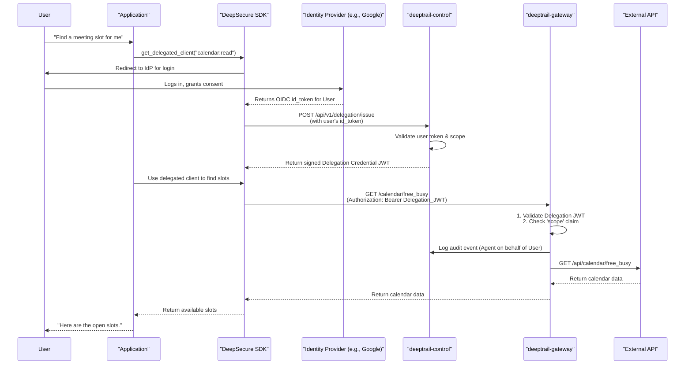
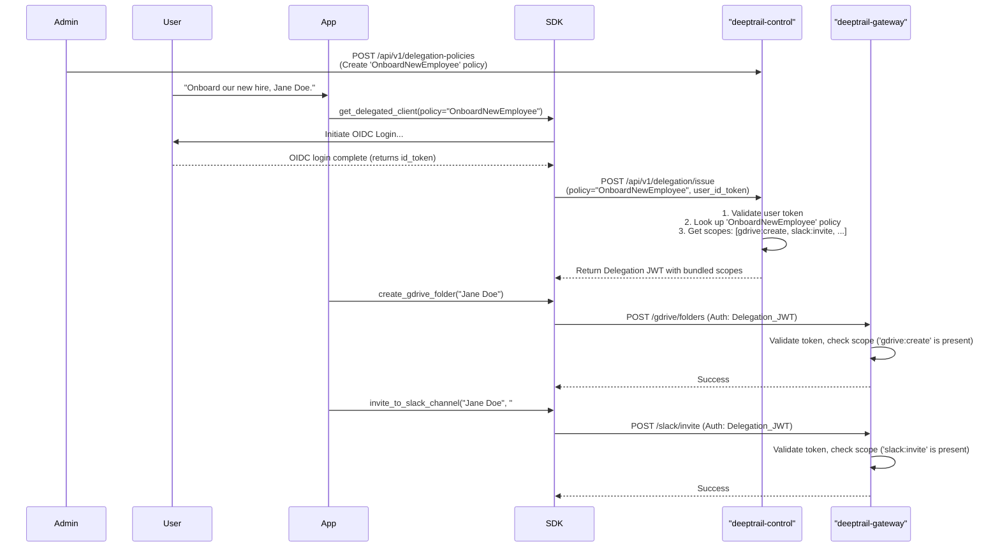
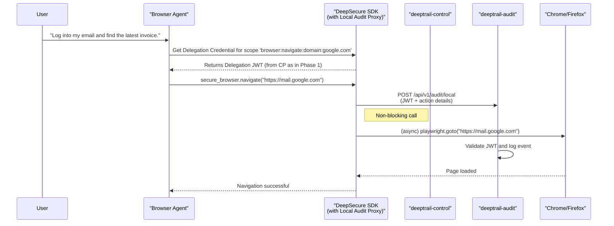

# DeepSecure Delegation Architecture: From User-to-Agent and Beyond

This document outlines the architectural evolution of the DeepSecure platform to support secure, verifiable, and scalable delegation of authority from human users to AI agents.

## The Challenge: True "On-Behalf-Of" Delegation

The current paradigm of agent security often involves agents "impersonating" users by borrowing API keys or service account credentials. This creates significant security and accountability gaps. Inspired by recent academic research in authenticated delegation ([arXiv:2501.09674](https://arxiv.org/abs/2501.09674)), our goal is to build a "trust-native" framework ([arXiv:2507.22077](https://arxiv.org/abs/2507.22077)) where agents can prove their delegated authority while remaining distinct entities.

This document details a phased approach to integrate this capability into the existing DeepSecure architecture.

## Phase 1: Foundational User-to-Agent Delegation

This initial phase focuses on establishing the core "on-behalf-of" flow, where a human user can securely delegate a specific, time-bound set of permissions to an agent.

### 1.1. Core Concepts

This phase introduces a new credential and integrates with existing identity standards.

*   **User Authentication (OIDC):** We will leverage OpenID Connect (OIDC) as the primary standard for authenticating human users. The `deeptrail-control` service will act as an OIDC relying party (client), trusting an external Identity Provider (IdP) like Google, Okta, or a self-hosted one to verify the user's identity.
*   **Agent Authentication (Ed25519):** Agents continue to use their strong, cryptographic identities (Ed25519 key pairs) to authenticate themselves to the `deeptrail-control` plane, as per the existing architecture.
*   **The Delegation Credential (JWT):** The cornerstone of this phase is a new credential, issued as a JSON Web Token (JWT). This token explicitly represents the delegated authority from the user to the agent. It is signed by the Control Plane and contains claims that bind the user's identity, the agent's identity, and the specific, narrowly-defined scope of delegated permissions.

### 1.2. Architectural Modifications

#### 1.2.1. `deeptrail-control` (Control Plane)

The Control Plane will be extended with a new endpoint to manage the creation of delegation credentials.

*   **New Endpoint:** `POST /api/v1/delegation/issue`
*   **Description:** This endpoint is responsible for minting the `Delegation Credential`. It requires the end-user to be authenticated via a standard OIDC `id_token`.
*   **Protection:** The endpoint will be protected by a mechanism that validates the `id_token` from the trusted Identity Provider.

**API Specification: `POST /api/v1/delegation/issue`**

*Request Body:*
```json
{
  "agent_id": "agent-f47ac10b-58cc-4372-a567-0e02b2c3d479",
  "scope": "calendar:read_free_busy file:read:report.docx",
  "user_id_token": "eyJhbGciOiJSUzI1NiIsImtpZCI6..."
}
```

*Response Body (Success):*
```json
{
  "delegation_token": "eyJhbGciOiJFUzI1NiIsInR5cCI6IkpXVCJ9...",
  "expires_in": 3600
}
```

#### 1.2.2. The Delegation Credential JWT Claims

The new JWT will contain specific claims to link the user, agent, and permissions.

```json
{
  "iss": "deeptrail-control",
  "aud": "deeptrail-gateway",
  "sub": "agent-f47ac10b-58cc-4372-a567-0e02b2c3d479", // Subject is the agent
  "exp": 1678886400,
  "iat": 1678882800,
  "jti": "unique-jwt-id",
  "scope": "calendar:read_free_busy file:read:report.docx",
  "delegator": {
    "sub": "1123581321345589", // User's subject claim from their OIDC token
    "iss": "https://accounts.google.com" // Issuer of the user's OIDC token
  }
}
```

#### 1.2.3. `deeptrail-gateway` (Data Plane)

The gateway's logic must be updated to understand and enforce this new credential type.

*   **Credential Validation:** The gateway will be updated to validate the `Delegation Credential` JWT. It will check the signature (using the Control Plane's public key), expiry, and audience.
*   **Policy Enforcement:** It will enforce the `scope` claim within the token, ensuring the agent's request is permitted.
*   **Enhanced Auditing:** The audit log entry generated by the gateway will be enriched to include the `delegator` claims. This creates an unambiguous record: **"Agent X performed action Y on behalf of User Z."**

#### 1.2.4. `DeepSecure SDK` & `CLI`

The developer tools will be updated to make this flow seamless.

*   **New SDK Method:** A new method, `client.delegation.get_token(agent_id, scope)`, will orchestrate the user-facing part of the flow.
    1.  It will initiate a local OIDC login flow (e.g., opening a browser window for the user to log in with their IdP).
    2.  It will handle the OIDC callback to receive the `id_token`.
    3.  It will call the new `POST /api/v1/delegation/issue` endpoint on the Control Plane with the user's `id_token` and the desired scope.
    4.  It will return the `Delegation Credential` to the calling application.
*   The SDK's client will be updated to use this new token for all subsequent requests made through the gateway.

### 1.3. Sequence Diagram: User Delegation Flow

This diagram illustrates the end-to-end process.



### 1.4. Security Analysis (STRIDE)

As suggested by security-driven development practices, let's analyze this phase with STRIDE.

*   **Spoofing:**
    *   **Threat:** An attacker spoofs a user to get a delegated credential for an agent.
    *   **Mitigation:** This is mitigated by relying on a trusted external OIDC provider for user authentication, which should employ strong authentication methods (MFA).
*   **Tampering:**
    *   **Threat:** An attacker tampers with the `Delegation Credential` to escalate privileges (e.g., add more scope).
    *   **Mitigation:** The JWT is digitally signed by the Control Plane using a strong asymmetric algorithm (Ed25519). The gateway verifies this signature on every request, making tampering computationally infeasible.
*   **Repudiation:**
    *   **Threat:** A user or agent denies having performed an action.
    *   **Mitigation:** The audit log, enriched with both agent and delegator identities, provides a non-repudiable record of the action and the authority under which it was performed.
*   **Information Disclosure:**
    *   **Threat:** A stolen `Delegation Credential` is used by an attacker.
    *   **Mitigation:** The credentials are short-lived (e.g., 1 hour), minimizing the window of opportunity. The scopes are narrow, limiting the "blast radius" of a compromised credential. Revocation mechanisms can be added in a future phase.
*   **Denial of Service:**
    *   **Threat:** An attacker floods the `/delegation/issue` endpoint.
    *   **Mitigation:** The endpoint should be rate-limited. Since it relies on a validated token from an external IdP, the ability to generate valid requests is already constrained.
*   **Elevation of Privilege:**
    *   **Threat:** An agent uses a delegated credential to do more than it's allowed.
    *   **Mitigation:** The `scope` claim is strictly enforced by the gateway, which acts as a non-bypassable Policy Enforcement Point. The agent cannot exceed the permissions explicitly granted in the token.

This completes the detailed proposal for Phase 1. I will now proceed with designing Phase 2.

## Phase 2: Advanced Delegation Scenarios

This phase builds on the foundational flow to address more complex, real-world use cases: agents acting on behalf of teams and mitigating user consent fatigue through pre-defined authorization policies.

### 2.1. Use Case 1: Team-Based Delegation

Modern workflows are collaborative. An agent might be tasked with summarizing a discussion from a shared chat channel or updating a project plan accessible to a team. In these cases, the agent acts on behalf of a collective, not a single user.

#### 2.1.1. Architectural Modifications

*   **Group Claims from IdP:** We will leverage the `groups` claim, a common (though not standard) claim provided by many OIDC Identity Providers. During the user's login, the `id_token` will contain information about the groups or teams the user belongs to.
*   **New `delegator_context` Claim:** The `Delegation Credential` JWT will be enhanced with a new `delegator_context` claim. This object will house the `groups` information.
*   **Policy Engine Enhancement:** The `deeptrail-control` policy engine (and by extension, the gateway) will be updated to understand group-based policies. Policies can now be written to grant permissions to a `group` instead of just an `agent_id` or `role`.

#### 2.1.2. Updated Delegation Credential JWT

The JWT now includes the group context.

```json
{
  "iss": "deeptrail-control",
  "aud": "deeptrail-gateway",
  "sub": "agent-support-ticket-analyzer",
  "exp": 1678886400,
  "scope": "jira:read:project-alpha",
  "delegator": {
    "sub": "user-id-42",
    "iss": "https://idp.mycompany.com"
  },
  "delegator_context": {
    "groups": ["engineering-team", "support-tier-2"]
  }
}
```

#### 2.1.3. Example Group-Based Policy

This policy, stored in `deeptrail-control`, allows any agent acting on behalf of a member of the `engineering-team` to access a specific resource.

```yaml
# policy.yml
- resource: "api.github.com/repos/my-org/my-repo"
  permissions:
    - group: "engineering-team"
      actions: ["read", "write"]
    - group: "support-tier-2"
      actions: ["read"]
```

The gateway, when presented with the `Delegation Credential`, can now make an authorization decision by checking if the agent's requested action is permitted for any of the groups listed in the `delegator_context`.

### 2.2. Use Case 2: Mitigating Consent Fatigue with "Delegation Policies"

As agents become more capable, they may require dozens of permissions, leading to overwhelming consent screens that users approve without reading. To counter this, we introduce the concept of a **Delegation Policy**.

A Delegation Policy is a pre-authorized, human-readable "intent" or "task" that bundles a set of scopes. A security administrator or team lead can define these policies, and users can then grant these high-level permissions to agents in a single action.

#### 2.2.1. Architectural Modifications

*   **New API Endpoints in `deeptrail-control`:**
    *   `POST /api/v1/delegation-policies`: Allows an admin to create a new Delegation Policy.
    *   `GET /api/v1/delegation-policies/{policy_name}`: Retrieves a policy's details.
*   **Delegation Policy Object:** A new object will be stored in the Control Plane's database.

**Delegation Policy Object Example:**
```json
{
  "name": "OnboardNewEmployee",
  "description": "Allows an agent to perform all necessary tasks to onboard a new employee.",
  "allowed_scopes": [
    "gdrive:create:folder",
    "gdrive:share:folder",
    "slack:invite:channel",
    "jira:create:ticket"
  ],
  "max_duration": "8h" // Maximum time this delegation can be valid for
}
```

*   **Updated `delegation/issue` Endpoint:** The `/api/v1/delegation/issue` endpoint will now accept a `delegation_policy` name in place of `scope`.

**API Specification: `POST /api/v1/delegation/issue` (Policy-based)**

*Request Body:*
```json
{
  "agent_id": "agent-hr-onboarding",
  "delegation_policy": "OnboardNewEmployee",
  "user_id_token": "eyJhbGciOiJSUzI1NiIsImtpZCI6..."
}
```

When the Control Plane receives this request, it will look up the `OnboardNewEmployee` policy and embed the associated `allowed_scopes` into the `scope` claim of the outgoing `Delegation Credential` JWT.

### 2.3. Sequence Diagram: Policy-Based Delegation



### 2.4. Security Analysis (STRIDE)

*   **Spoofing:**
    *   **Threat:** An attacker creates a malicious `Delegation Policy`.
    *   **Mitigation:** Creating and managing Delegation Policies is a privileged operation, restricted to administrators via RBAC in the `deeptrail-control` plane.
*   **Tampering:**
    *   **Threat:** An attacker tries to associate a request with a different, more permissive policy.
    *   **Mitigation:** The final set of scopes is baked into the signed JWT. The agent cannot change the policy after the token is issued.
*   **Repudiation:** Remains the same as Phase 1.
*   **Information Disclosure:** Remains the same as Phase 1.
*   **Denial of Service:** Remains the same as Phase 1.
*   **Elevation of Privilege:**
    *   **Threat:** A user is tricked into approving a policy that is overly permissive.
    *   **Mitigation:** This is a UX and administrative challenge. The UI/CLI must clearly display the full scope list when a user is asked to approve a policy-based delegation. The policies themselves should be auditable and subject to review by security teams.

## Phase 3: Securing Agents Beyond APIs

This phase tackles the difficult problem of agents that operate "on the glass," controlling a user's browser or desktop directly, thus bypassing the API-centric `deeptrail-gateway`. The goal is to extend DeepSecure's audit and control capabilities to these interactions.

### 3.1. The Challenge: The Unproxied Agent

When an agent uses a library like Playwright or Selenium to control a browser, its actions (navigating to websites, clicking buttons) do not flow through our gateway. How can we maintain visibility and enforce policy?

The solution is to shift from *enforcement* at a network chokepoint to *attestation* and *auditing* at the source. We introduce a new component: the **DeepSecure Audit Service** and a corresponding **Local Audit Proxy**.

### 3.2. Architectural Modifications

#### 3.2.1. New Component: Local Audit Proxy

This is a lightweight process that runs on the user's local machine alongside the browser/desktop agent. It can be implemented as a separate process or integrated directly into the `DeepSecure SDK`.

*   **Function:** Its primary job is to intercept high-level commands from the agent (e.g., "navigate to X," "click element Y"), bundle them with the active `Delegation Credential`, and forward them to the new Audit Service for logging *before* the action is executed.
*   **Instrumentation:** This requires instrumenting the agent's code. Instead of calling `browser.goto(url)`, the developer would call `deepsecure_browser.goto(url)`. The SDK wrapper performs the audit logging before passing the call to the underlying browser automation library.

#### 3.2.2. New Service: `deeptrail-audit`

This is a new, highly available service in the control plane, designed for high-throughput ingestion of audit events.

*   **New Endpoint:** `POST /api/v1/audit/local`
*   **Function:** It receives audit bundles from the Local Audit Proxy. It validates the `Delegation Credential` within the bundle to ensure the action is being logged against a valid, non-expired delegation session. It then writes a detailed event to the central audit database.

**Audit Event Structure:**
```json
{
  "event_id": "evt_12345",
  "timestamp": "2023-10-27T10:00:00Z",
  "delegation_token": "eyJhbGciOiJFUzI1NiIsImtpZCI6...", // The active delegation JWT
  "agent_action": {
    "type": "browser.navigate",
    "details": {
      "url": "https://mail.google.com/u/0/#inbox"
    }
  }
}
```

#### 3.2.3. Scopes for UI Actions

We introduce new scope definitions for UI-level actions, which will be included in the `Delegation Credential`.

*   `browser:navigate:domain:google.com`
*   `browser:click:css-selector:#login-button`
*   `desktop:execute:app:/usr/bin/calculator`

While the Local Audit Proxy may not *enforce* these in real-time (to avoid high-latency blocking calls to the control plane), it allows for powerful *post-facto* analysis and alerting.

### 3.3. Sequence Diagram: Auditing a Local Browser Agent



### 3.4. From Auditing to "Soft" Enforcement

While real-time, blocking enforcement for every UI action is likely too slow, this architecture enables "soft" or near-real-time enforcement for critical actions.

*   **Alerting:** The audit service can trigger real-time alerts if an agent performs an action outside the scope of its delegation (e.g., navigating to a disallowed domain).
*   **Session Termination:** Upon detecting a clear violation, the `deeptrail-control` plane could be instructed to revoke the agent's `Delegation Credential`, effectively terminating its authority for any future API-based actions and preventing it from logging further audited actions.

### 3.5. Security Analysis (STRIDE)

*   **Spoofing:**
    *   **Threat:** An attacker spoofs audit events.
    *   **Mitigation:** Each audit event is tied to a valid, signed `Delegation Credential`. The audit service will reject any events that do not contain a valid token.
*   **Tampering:**
    *   **Threat:** An agent performs an action locally but doesn't log it to the audit service.
    *   **Mitigation:** This is the primary trade-off. We are trusting the instrumented SDK on the client-side. This can be hardened by running the agent in a controlled environment where the SDK's logging cannot be bypassed. For highly sensitive tasks, this may not be sufficient, and a fully sandboxed, instrumented environment (like a VDI) would be required.
*   **Repudiation:**
    *   **Threat:** An agent denies performing a UI action.
    *   **Mitigation:** The audit log, signed by a valid delegation from the user, provides a strong (though not infallible) record of the intended action.
*   **Information Disclosure:** The threat model shifts to the local machine's security. The focus is on ensuring the agent itself is not compromised.
*   **Denial of Service:** The `deeptrail-audit` service must be built for high-scale ingestion to handle logs from a large fleet of agents.
*   **Elevation of Privilege:**
    *   **Threat:** An agent with a valid token for one site uses it to perform actions on another.
    *   **Mitigation:** While not blocked in real-time, this is immediately detectable via the audit trail, which would show a scope violation. This can trigger alerts and session revocation.


