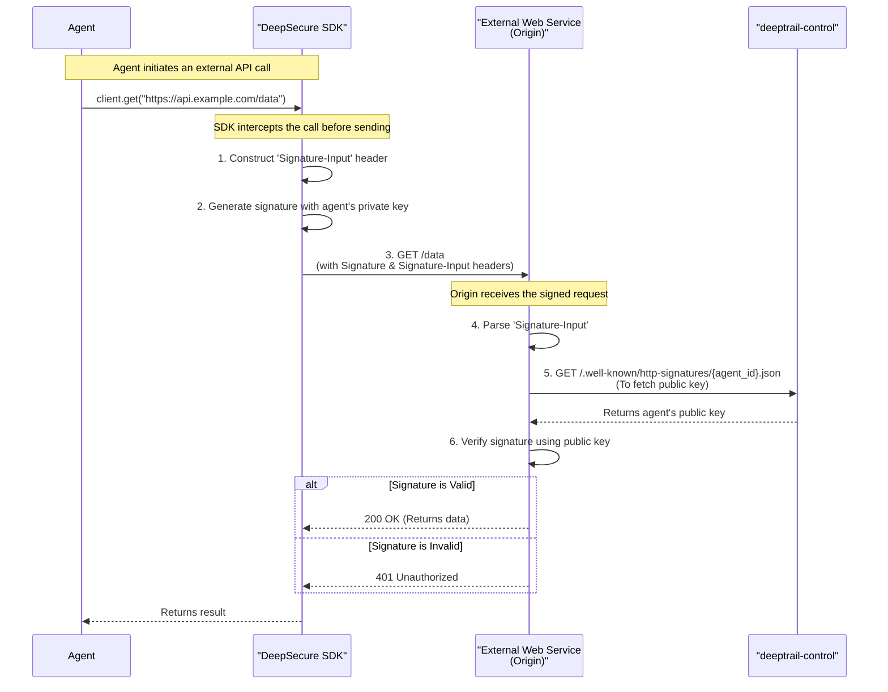

# DeepSecure Architecture Evolution: Web Bot Authentication via HTTP Message Signatures

This document proposes an architectural evolution for the DeepSecure platform to support the emerging IETF standards for Web Bot Authentication using HTTP Message Signatures (RFC 9421). This will enable DeepSecure-managed agents to cryptographically prove their identity to any external service on the web, enhancing trust, transparency, and security beyond the confines of the DeepSecure gateway.

## 1. Executive Summary

The current DeepSecure architecture excels at securing agent actions within its ecosystem by routing traffic through the `deeptrail-gateway`. However, as agents increasingly interact with the open web, a standardized, decentralized method of identity verification is needed.

This proposal outlines modifications to the DeepSecure SDK, Control Plane, and CLI to implement request signing at the source (the SDK), based on the agent's existing cryptographic identity (Ed25519 key pair). The gateway's role remains largely unchanged for outbound traffic, preserving its lightweight nature.

This evolution will:
- **Enable Verifiable Identity:** Allow any web service to verify that a request genuinely comes from a specific DeepSecure agent.
- **Align with Web Standards:** Future-proof the platform by adopting the `Web Bot Authentication` and `HTTP Message Signatures` standards.
- **Enhance Security:** Move from bearer tokens to cryptographically signed requests for external interactions, preventing token theft and replay attacks.
- **Improve Auditability:** Create a non-repudiable, cryptographic link between an agent and the requests it makes.

## 2. Core Concepts & Design

The design is centered on two key principles:

1.  **Signing at the Source:** The `DeepSecure SDK`, which has access to the agent's private key, will be responsible for signing all outbound HTTP requests destined for external services. This is more secure and scalable than attempting to sign at the gateway, as it doesn't require the gateway to manage agent private keys.
2.  **Decentralized Verification:** The `deeptrail-control` plane will expose a public, well-known endpoint for any external service ("origin") to fetch an agent's public key. This allows for stateless, decentralized verification without requiring the origin to have a pre-existing relationship with DeepSecure.

### High-Level Flow: Signing and Verification



## 3. Architectural Modifications

### 3.1. `DeepSecure SDK` (Primary Change)

The bulk of the logic will be implemented here. We will introduce an HTTP middleware or a custom `httpx` transport into the SDK's client.

-   **Responsibility:** Intercept outgoing HTTP requests made by the agent's code.
-   **Signing Logic:**
    1.  Access the agent's private key, which is already managed by the SDK's `IdentityManager`.
    2.  For each request, construct the `Signature-Input` header. This header declaratively specifies which parts of the request are included in the signature calculation (e.g., method, path, authority, headers like `Date` or `Digest`).
    3.  Generate the signature using the agent's Ed25519 private key over the components specified in `Signature-Input`.
    4.  Add the `Signature` and `Signature-Input` headers to the request before sending it.
-   **Configuration:** This feature will be opt-in via a client configuration setting, e.g., `deepsecure.init(sign_external_requests=True)`.
-   **Dependency:** We will leverage a library that implements RFC 9421, such as `http-message-signatures`.

### 3.2. `deeptrail-control` (Control Plane)

The Control Plane's role is to act as the public key directory.

-   **New Endpoint:** `GET /.well-known/http-signatures/{agent_id}.json`
    -   **Authentication:** This endpoint will be public and unauthenticated, as per the standard's requirements for discoverability.
    -   **Function:** It will retrieve the specified agent's public key from the `agents` database table.
    -   **Response:** It will return a JSON object containing the agent's public key in a format compliant with the `draft-meunier-http-message-signatures-directory` specification.

**Example Response for `/.well-known/http-signatures/agent-abc.json`:**
```json
{
  "keys": [
    {
      "key": "base64-encoded-ed25519-public-key",
      "alg": "ed25519",
      "kid": "agent-abc",
      "created": "1678882800"
    }
  ],
  "contact": "security@deepsecure.com"
}
```

### 3.3. `deeptrail-gateway` (Data Plane)

The gateway's role is mostly unchanged for traffic to the public internet.

-   **Outbound Traffic:** It will simply proxy the requests, which have already been signed by the SDK. The signature headers will pass through transparently.
-   **Inbound Validation (Optional Enhancement):** For agent-to-agent communication *within* the DeepSecure ecosystem, the gateway can be enhanced to *validate* the signature of incoming requests. This would provide an additional layer of security, ensuring the request was not tampered with between the SDK and the gateway.

### 3.4. `DeepSecure CLI`

The CLI will be updated for managing and debugging this new capability.

-   **New Command:** `deepsecure agent get-key --agent-id <id> --format web-bot-auth`
    -   **Function:** This command will display the agent's public key in the same JSON format served by the new `.well-known` endpoint, making it easy for developers to inspect and verify.
-   **Configuration:** We can add a CLI command to manage the signing setting for the local environment: `deepsecure config set sdk.sign_requests true`.

## 4. Implementation Plan

The following is a high-level plan to implement this architecture.

-   **Phase 1: Control Plane Enhancement**
    -   [ ] Create the new `/.well-known/http-signatures/{agent_id}.json` endpoint in `deeptrail-control`.
    -   [ ] Add logic to fetch the agent's public key and format it as a compliant JSON response.
    -   [ ] Add unit and integration tests for the new endpoint.

-   **Phase 2: SDK Signing Middleware**
    -   [ ] Add `http-message-signatures` as a dependency to the SDK.
    -   [ ] Implement a request middleware/transport for the SDK's HTTP client.
    -   [ ] Integrate the signing logic using the agent's `IdentityManager` to access the private key.
    -   [ ] Add configuration options to enable/disable signing.
    -   [ ] Write extensive tests to verify that signatures are correctly generated for various request types.

-   **Phase 3: CLI and Documentation**
    -   [ ] Implement the new `deepsecure agent get-key` command.
    -   [ ] Update the official documentation to explain the new feature, its benefits, and how to use it.
    -   [ ] Provide examples for external services on how to verify signatures from a DeepSecure agent.

This phased approach ensures that the foundational components are in place before building the client-side logic, leading to a more robust and testable implementation.
