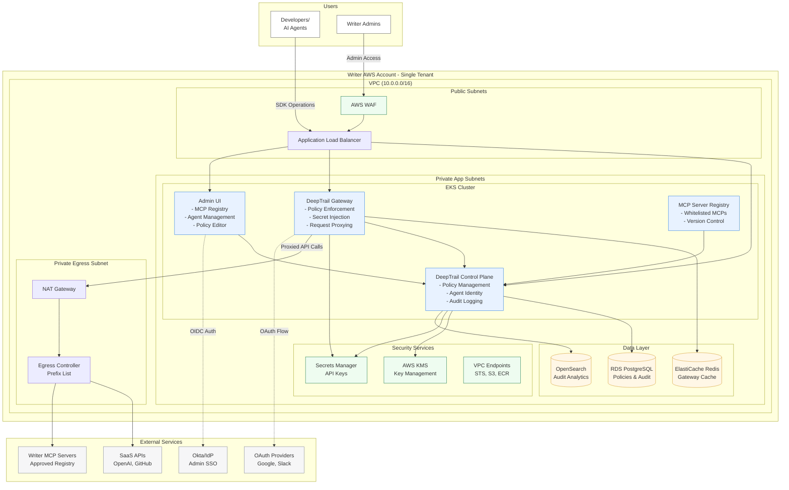

# Writer AWS Single-Tenant Deployment Architecture

## DeepSecure Integration for Writer's MCP Platform

## Key Architectural Features for Writer

### 1. **MCP Registry & Management**
- **Centralized MCP allowlist** - Only Writer-approved MCP servers
- **Version control** for MCP server deployments
- **Security scanning** before MCP approval

### 2. **Multi-Level Security**
- **WAF** for web protection
- **Network isolation** with private subnets
- **Egress control** with prefix lists for approved destinations
- **KMS encryption** for all secrets

### 3. **Admin UI Features**
- **MCP Server Management**
  - Add/remove MCP servers
  - Configure MCP permissions
  - Monitor MCP usage
- **Agent Management**
  - Create agent identities
  - View agent sessions
  - Manage agent lifecycle
- **Policy Editor**
  - Visual policy creation
  - Test policy effects
  - Apply policies to agents/MCPs
- **Delegation Trail**
  - Real-time delegation visualization
  - Complete audit trail
  - Session replay capability

### 4. **Deployment Considerations**

#### Trade-offs to Consider:

1. **OpenSearch vs S3+Athena for Audit**
   - **OpenSearch**: Real-time search, higher cost
   - **S3+Athena**: Cost-effective, slight query delay
   - **Recommendation**: Start with S3+Athena, migrate if needed

2. **Redis Deployment**
   - **ElastiCache**: Managed, automatic failover
   - **Self-managed**: More control, higher operational burden
   - **Recommendation**: Use ElastiCache for production

3. **MCP Communication Pattern**
   - **Direct Gateway-to-MCP**: Lower latency
   - **Via Control Plane**: Better policy control
   - **Recommendation**: Direct with policy caching

#### Key Assumptions:

1. **Single-tenant per AWS account** for isolation
2. **EKS for container orchestration** (vs ECS)
3. **PostgreSQL for policy/audit** (vs DynamoDB)
4. **Okta for admin SSO** (configurable)
5. **Writer manages the MCP allowlist**

### 5. **Security & Compliance**

- **Zero-trust architecture** - Every request authenticated
- **Ephemeral credentials** - No long-lived API keys
- **Complete audit trail** - Every action logged
- **Policy enforcement** - Granular control over agent capabilities
- **Secure MCP integration** - Only approved servers, encrypted communication

### 6. **Scalability Patterns**

- **Horizontal scaling** of gateway pods
- **Read replicas** for policy database
- **CDN integration** for static assets
- **Auto-scaling groups** for compute resources

This architecture provides Writer with:
- ✅ Complete control over MCP ecosystem
- ✅ Enterprise-grade security
- ✅ Full visibility and auditability
- ✅ Scalable to thousands of agents
- ✅ Integration with existing Writer infrastructure
